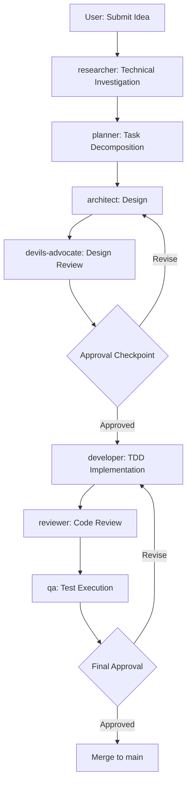
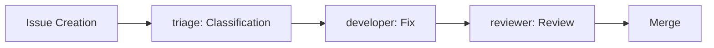
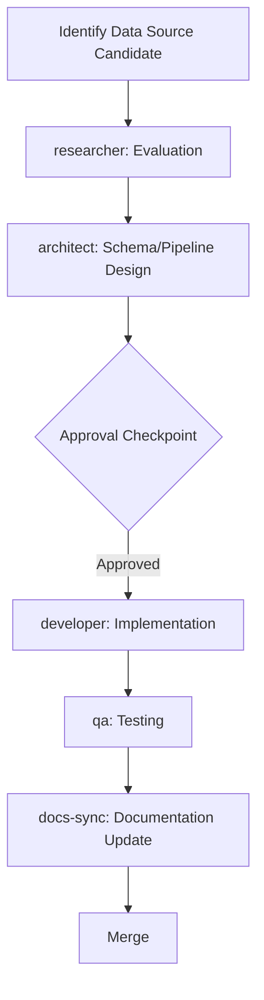
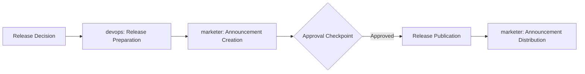
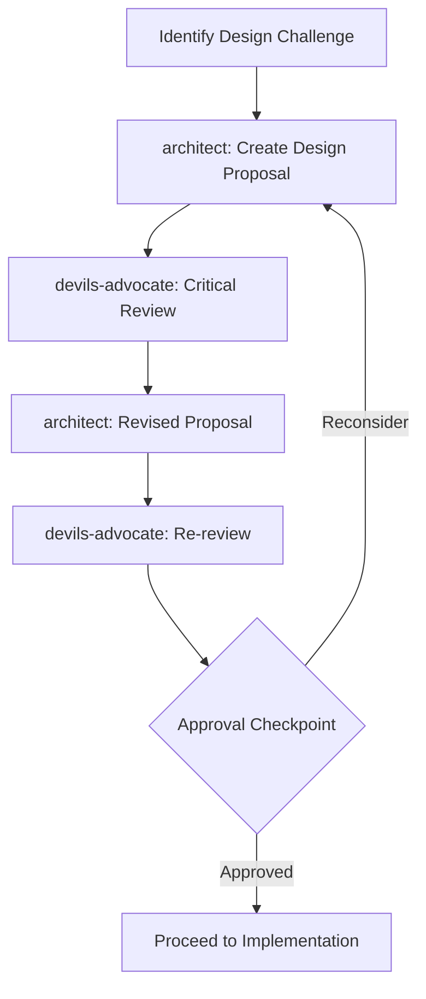
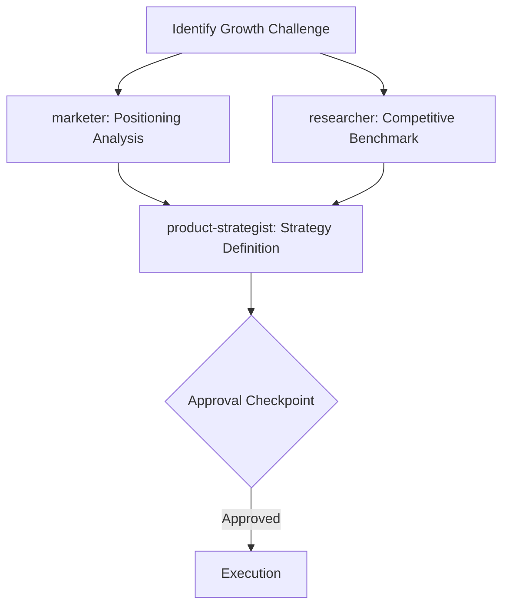

# Agent Workflows - Concrete Workflow Examples

> **When to read this:** When you want to see concrete examples of development flows using agents

## 1. New Feature Workflow

Complete flow from a user's idea through implementation to merge.

### Flow Diagram



### Step by Step

**Example: Adding CycloneDX 1.7 support to SBOM auditing**

#### Step 1: Idea Submission (User)

Create a GitHub Issue:
```
Title: Support new CycloneDX 1.7 fields (formulation, modelCard)
```

-> `agent-triage.yml` automatically applies labels and priority

#### Step 2: Technical Investigation

```bash
# CLI
kiro-cli chat --agent researcher
> Investigate the specification changes in CycloneDX 1.7. In particular, analyze the
> structure of the formulation and modelCard fields and the impact on the existing
> internal/sbom/ parser.

# GitHub Issue
/kiro @researcher Investigate CycloneDX 1.7 spec changes and impact on mayu
```

#### Step 3: Task Decomposition

```bash
# CLI
kiro-cli chat --agent planner
> Based on the researcher's findings, decompose the CycloneDX 1.7 support into tasks.
> Also organize dependencies between test creation, parser modification, and API changes.

# GitHub Issue
/kiro @planner Create task decomposition and execution plan for CycloneDX 1.7 support
```

#### Step 4: Design

```bash
# CLI
kiro-cli chat --agent architect
> Design structural changes to the internal/sbom/ package to support the new CycloneDX 1.7
> fields. Propose Go struct definitions and JSON parsing strategy.

# GitHub Issue
/kiro @architect Create design proposal for CycloneDX 1.7 support (struct definitions, parsing strategy)
```

#### Step 5: Critical Design Review

```bash
# CLI
kiro-cli chat --agent devils-advocate
> Review architect's CycloneDX 1.7 support design.
> Identify issues from the perspectives of backward compatibility, performance impact,
> and testability.

# GitHub Issue
/kiro @devils-advocate Critically review the above design proposal for issues
```

#### Step 6: **[Approval Checkpoint]**

User reviews the design proposal and devils-advocate's feedback, then makes Go/No-Go decision.

#### Step 7: Implementation

```bash
# CLI
kiro-cli chat --agent developer
> Implement CycloneDX 1.7 support based on the approved design.
> Use TDD and also add test fixtures to testdata/.

# GitHub Issue
/kiro @developer Implement the CycloneDX 1.7 parser based on the approved design
```

#### Step 8: Review

After PR creation, `agent-review.yml` runs automatically. Additionally:

```markdown
# PR comment
/kiro @reviewer Review with emphasis on security and backward compatibility
```

#### Step 9: Testing

```bash
# CLI
kiro-cli chat --agent qa
> Verify test coverage for the CycloneDX 1.7 parser.
> Add tests for edge cases (empty fields, invalid JSON, mixed versions).

# GitHub Issue
/kiro @qa Please verify test coverage and add edge case tests
```

#### Step 10: **[Final Approval]**

User verifies `make test && make lint` results and confirms review issues are resolved, then merges.

---

## 2. Bug Fix Workflow

Short-cycle flow for quick fixes.

### Flow Diagram



### Step by Step

**Example: EPSS CSV parsing panics on empty lines**

#### Step 1: Issue Triage

`agent-triage.yml` runs automatically on Issue creation:
- Labeling: `bug`, `priority:high`, `area:fetcher`
- Initial impact analysis

#### Step 2: Fix Implementation

```bash
# CLI
kiro-cli chat --agent developer
> Issue #42: Parsing a CSV with empty lines in internal/fetcher/epss/epss.go causes
> an index out of range panic. Fix it.

# GitHub Issue
/kiro @developer Fix this Issue's bug. Also add tests.
```

The developer executes:
1. Create a reproduction test (Red)
2. Implement the fix (Green)
3. Verify with `make test && make lint`

#### Step 3: Review

After PR creation:
```markdown
/kiro @reviewer Verify this fix doesn't affect CSV parsing in other data sources
```

#### Step 4: Merge

Merge when `make test` passes + reviewer LGTM.

---

## 3. Data Source Addition Workflow

Flow for adding a new vulnerability data source.

### Flow Diagram



### Step by Step

**Example: Adding CISA KEV (Known Exploited Vulnerabilities)**

#### Step 1: Data Source Evaluation

```bash
# CLI
kiro-cli chat --agent researcher
> Evaluate the CISA Known Exploited Vulnerabilities (KEV) catalog.
> Investigate API specifications, data format, update frequency, license,
> and integration method for mayu.

# GitHub Issue
/kiro @researcher Please provide a technical evaluation of the CISA KEV catalog
```

**Researcher's investigation scope:**
- Data format (JSON/CSV/XML)
- API endpoint and rate limits
- Update frequency and data volume
- License compatibility (alignment with MIT project)
- Mapping feasibility to existing OSV schema

#### Step 2: Schema/Pipeline Design

```bash
# CLI
kiro-cli chat --agent architect
> Based on researcher's CISA KEV findings, design the following:
> 1. internal/fetcher/kev/ package structure
> 2. DB schema (migration)
> 3. Integration method into the ingest pipeline
> 4. API endpoint (if needed)

# GitHub Issue
/kiro @architect Please create the system design for KEV integration
```

#### Step 3: **[Approval Checkpoint]**

Verification items:
- Validity of DB schema changes
- Impact on existing pipeline
- No license issues

#### Step 4: Implementation

```bash
# CLI
kiro-cli chat --agent developer
> Implement CISA KEV integration based on the approved design.
> Create/modify the following files:
> - internal/fetcher/kev/ (new)
> - migrations/ (new migration)
> - internal/ingest/ (pipeline integration)
> - cmd/mayu/ (CLI integration)

# GitHub Issue
/kiro @developer Begin implementing the KEV data source
```

#### Step 5: Testing

```bash
/kiro @qa Run tests for KEV integration. Specifically verify:
- Error handling on API failure
- Resilience to invalid JSON responses
- Coexistence with existing ingest pipeline
```

#### Step 6: Documentation Update

`agent-docs-sync.yml` triggers automatically to update the README's Data Sources section, etc.
Can also be executed manually:

```markdown
/kiro @developer Add KEV to the Data Sources section in README.md and README_ja.md
```

---

## 4. Release Workflow

Flow for version release and announcements.

### Flow Diagram



### Step by Step

**Example: v0.5.0 Release**

#### Step 1: Release Preparation

```bash
# CLI
kiro-cli chat --agent devops
> Prepare the v0.5.0 release. Execute the following:
> 1. Update CHANGELOG.md (summarize changes since last release)
> 2. Update version number
> 3. Confirm release tag creation procedure
> 4. Document migration steps (if there are breaking changes)

# GitHub Issue
/kiro @devops Please prepare the v0.5.0 release
```

#### Step 2: Announcement Creation

```bash
# CLI
kiro-cli chat --agent marketer
> Create the release announcement for v0.5.0. Include:
> - Highlights of major new features
> - Breaking change notices
> - Release notes for GitHub Releases
> - Short announcement text for Twitter/X

# GitHub Issue
/kiro @marketer Create the v0.5.0 release announcement
```

#### Step 3: **[Approval Checkpoint]**

Verification items:
- Is the CHANGELOG content accurate?
- Does the version number follow semver?
- Is the migration guide for breaking changes complete?
- Is the announcement content appropriate?

#### Step 4: Release Publication

```bash
# devops executes the release flow
/kiro @devops Approved, please release v0.5.0
```

Release process:
1. `git tag v0.5.0`
2. Create GitHub Release (with release notes)
3. `.github/workflows/release.yml` triggers the build

#### Step 5: Announcement

```bash
/kiro @marketer Release is published, please distribute the announcements
```

---

## 5. Design Challenge Workflow

Flow for obtaining multiple perspectives on important design decisions.

### Flow Diagram



### Step by Step

**Example: Cache strategy for search performance improvement**

#### Step 1: Design Proposal Creation

```bash
# CLI
kiro-cli chat --agent architect
> The search API (/api/v1/search) response time is slow.
> Design a caching strategy. Candidates:
> 1. Application level (in-memory)
> 2. Redis
> 3. PostgreSQL materialized view
> Include trade-offs for each approach.

# GitHub Issue
/kiro @architect Design a caching strategy for the search API (compare multiple options)
```

#### Step 2: Critical Review (Round 1)

```bash
# CLI
kiro-cli chat --agent devils-advocate
> Review the 3 caching strategy proposals from architect.
> Identify issues especially from scalability, operational burden,
> and failure mode perspectives.

# GitHub Issue
/kiro @devils-advocate Critically review the above caching design proposals
```

#### Step 3: Design Revision

```bash
/kiro @architect Revise the design based on devils-advocate's feedback.
Specifically address the single point of failure and operational cost concerns.
```

#### Step 4: Re-review (if needed)

```bash
/kiro @devils-advocate Re-review the revised design proposal. Confirm the previous concerns have been adequately addressed.
```

#### Step 5: **[Approval Checkpoint]**

User approves the final design proposal and proceeds to implementation instructions for developer.

---

## 6. OSS Growth Workflow

Flow for improving project visibility and building community.

### Flow Diagram



### Step by Step

**Example: Increasing mayu's GitHub Stars and expanding community**

#### Step 1: Positioning Analysis (can run in parallel)

```bash
# CLI
kiro-cli chat --agent marketer
> Analyze the OSS marketing strategy for mayu. Include:
> - Current positioning (position in the vulnerability intelligence tool market)
> - Target user personas
> - Differentiation points (8 data source integration, CLI+API+WebUI)
> - Areas for improvement (README, documentation, demo)

# GitHub Issue
/kiro @marketer Please provide an OSS marketing analysis for mayu
```

#### Step 2: Competitive Benchmark (can run in parallel)

```bash
# CLI
kiro-cli chat --agent researcher
> Benchmark vulnerability management tools competing with mayu.
> Comparison targets: OSV-Scanner, Grype, Trivy, vulnerability-lookup
> Comparison axes: data source count, supported ecosystems, features, performance, community size

# GitHub Issue
/kiro @researcher Please provide a competitive benchmark of vulnerability management tools
```

#### Step 3: Strategy Definition

```bash
# CLI
kiro-cli chat --agent product-strategist
> Based on the analysis from marketer and researcher, define a 3-month
> growth strategy for mayu. Include:
> - Features to focus on (for differentiation)
> - Community initiatives (documentation improvement, contribution onboarding)
> - Marketing initiatives (blog, conferences, social media)

# GitHub Issue
/kiro @product-strategist Define a 3-month growth strategy
```

#### Step 4: **[Approval Checkpoint]**

User approves the strategy and determines priority for each initiative.

#### Step 5: Execution

Based on the approved strategy, each agent executes their assigned tasks:
- developer: Implement differentiating features
- marketer: Create content
- devops: Build demo environment

---

## Quick Reference: Command List

| Purpose | Command |
|---------|---------|
| Request technical research | `/kiro @researcher <research topic>` |
| Request task decomposition | `/kiro @planner <target feature>` |
| Request design | `/kiro @architect <design target>` |
| Request implementation | `/kiro @developer <implementation details>` |
| Request review | `/kiro @reviewer <review focus>` |
| Request testing | `/kiro @qa <test target>` |
| Request critical review | `/kiro @devils-advocate <review target>` |
| Request release preparation | `/kiro @devops <release version>` |
| Request marketing | `/kiro @marketer <initiative details>` |
| Request strategy | `/kiro @product-strategist <strategy theme>` |
| Issue triage | Automatic (`agent-triage.yml`) |

## Tips

### Agent Combinations

- **Quick bug fix**: developer + reviewer (2 agents)
- **Careful new feature**: researcher + planner + architect + devils-advocate + developer + reviewer + qa (full cycle)
- **Design decision**: architect + devils-advocate (iterative)
- **Release**: devops + marketer (parallel)

### Effective Prompting Tips

1. **Be explicit about context**: Include relevant file paths and Issue numbers
2. **Specify expected output format**: "In table format", "As Go structs"
3. **Limit scope**: "Only targeting internal/fetcher/"
4. **Communicate constraints**: "Do not add external dependencies", "Maintain backward compatibility"

### Recovery on Failure

- When CI breaks: `agent-ci-fix.yml` automatically attempts a fix
- When review finds major issues: Request design reconsideration from architect
- When devils-advocate identifies High risk: Return to design phase
