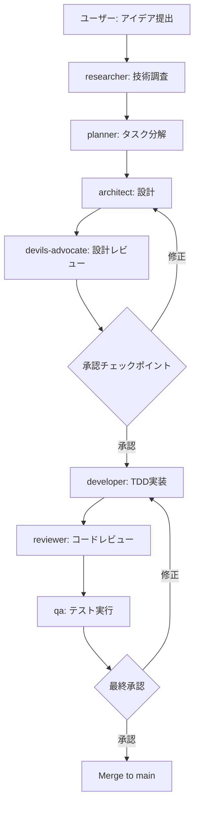
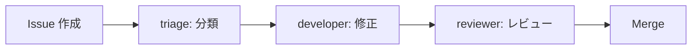
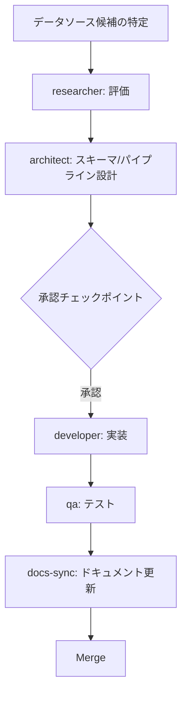
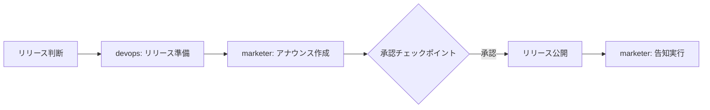
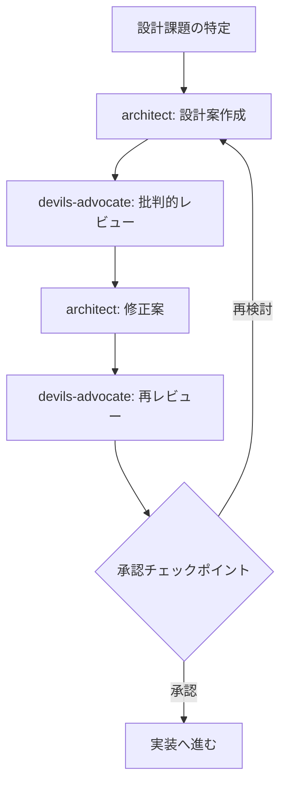
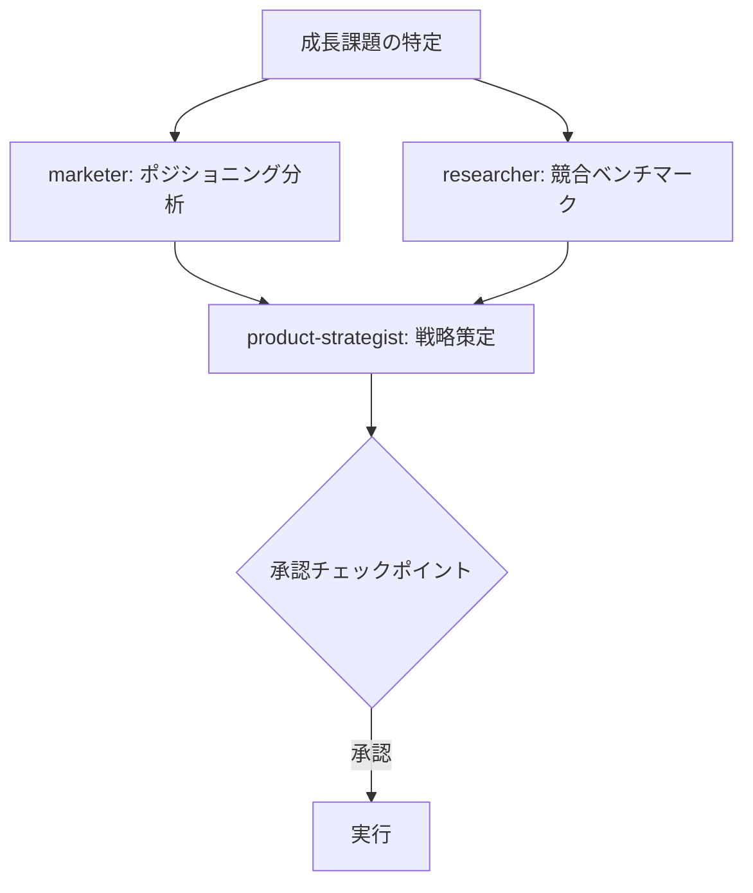

# Agent Workflows - 具体的なワークフロー例

> **When to read this:** エージェントを使った開発フローの具体例を確認したい時

## 1. New Feature Workflow (新機能開発)

ユーザーのアイデアから実装、マージまでの完全なフロー。

### フロー図



### ステップバイステップ

**例: SBOM 監査に CycloneDX 1.7 サポートを追加する**

#### Step 1: アイデア提出 (ユーザー)

GitHub Issue を作成:
```
タイトル: CycloneDX 1.7 の新フィールド (formulation, modelCard) をサポートしたい
```

→ `agent-triage.yml` が自動でラベル付け・優先度設定

#### Step 2: 技術調査

```bash
# CLI
kiro-cli chat --agent researcher
> CycloneDX 1.7 の仕様変更点を調査して。特に formulation と modelCard フィールドの構造と、
> 既存の internal/sbom/ パーサーへの影響を分析してほしい。

# GitHub Issue
/kiro @researcher CycloneDX 1.7 の仕様変更と mayu への影響を調査して
```

#### Step 3: タスク分解

```bash
# CLI
kiro-cli chat --agent planner
> researcher の調査結果を元に、CycloneDX 1.7 対応のタスクを分解して。
> テスト作成、パーサー修正、API 変更の依存関係も整理してほしい。

# GitHub Issue
/kiro @planner CycloneDX 1.7 対応のタスク分解と実行計画を作成して
```

#### Step 4: 設計

```bash
# CLI
kiro-cli chat --agent architect
> CycloneDX 1.7 の新フィールドに対応するため、internal/sbom/ パッケージの
> 構造変更を設計して。Go の struct 定義と JSON パース方針を提案してほしい。

# GitHub Issue
/kiro @architect CycloneDX 1.7 対応の設計案を作成して (struct定義、パース方針)
```

#### Step 5: 設計の批判的レビュー

```bash
# CLI
kiro-cli chat --agent devils-advocate
> architect の CycloneDX 1.7 対応設計をレビューして。
> 後方互換性、パフォーマンスへの影響、テスト容易性の観点で問題点を指摘して。

# GitHub Issue
/kiro @devils-advocate 上記の設計案に問題点はないか批判的にレビューして
```

#### Step 6: **[承認チェックポイント]**

ユーザーが設計案と devils-advocate の指摘を確認し、Go/No-Go を判断。

#### Step 7: 実装

```bash
# CLI
kiro-cli chat --agent developer
> 承認された設計に基づいて CycloneDX 1.7 対応を実装して。
> TDD で進めて、testdata/ にテストフィクスチャも追加すること。

# GitHub Issue
/kiro @developer 承認済み設計に基づいて CycloneDX 1.7 パーサーを実装して
```

#### Step 8: レビュー

PR 作成後、`agent-review.yml` が自動実行。追加で:

```markdown
# PR コメント
/kiro @reviewer セキュリティ面と後方互換性を重点的にレビューして
```

#### Step 9: テスト

```bash
# CLI
kiro-cli chat --agent qa
> CycloneDX 1.7 パーサーのテストカバレッジを確認して。
> エッジケース (空フィールド、不正な JSON、旧バージョンとの混在) のテストを追加して。

# GitHub Issue
/kiro @qa テストカバレッジの確認とエッジケーステストの追加をお願いします
```

#### Step 10: **[最終承認]**

ユーザーが `make test && make lint` の結果とレビュー指摘の解決を確認し、マージ。

---

## 2. Bug Fix Workflow (バグ修正)

短いサイクルで素早く修正するフロー。

### フロー図



### ステップバイステップ

**例: EPSS CSV パースで空行がパニックする問題**

#### Step 1: Issue トリアージ

Issue 作成時に `agent-triage.yml` が自動実行:
- ラベル付け: `bug`, `priority:high`, `area:fetcher`
- 影響範囲の初期分析

#### Step 2: 修正実装

```bash
# CLI
kiro-cli chat --agent developer
> Issue #42: internal/fetcher/epss/epss.go で空行を含む CSV をパースすると
> index out of range パニックが発生する。修正して。

# GitHub Issue
/kiro @developer この Issue のバグを修正して。テストも追加すること。
```

developer は以下を実行:
1. 再現テストを作成 (Red)
2. 修正を実装 (Green)
3. `make test && make lint` で確認

#### Step 3: レビュー

PR 作成後:
```markdown
/kiro @reviewer この修正が他のデータソースの CSV パースに影響しないか確認して
```

#### Step 4: マージ

`make test` パス + reviewer LGTM でマージ。

---

## 3. Data Source Addition Workflow (データソース追加)

新しい脆弱性データソースを追加する際のフロー。

### フロー図



### ステップバイステップ

**例: CISA KEV (Known Exploited Vulnerabilities) の追加**

#### Step 1: データソース評価

```bash
# CLI
kiro-cli chat --agent researcher
> CISA Known Exploited Vulnerabilities (KEV) カタログを評価して。
> API 仕様、データ形式、更新頻度、ライセンス、mayu への統合方法を調査して。

# GitHub Issue
/kiro @researcher CISA KEV カタログの技術評価をお願いします
```

**researcher の調査観点:**
- データフォーマット (JSON/CSV/XML)
- API エンドポイントとレート制限
- 更新頻度とデータ量
- ライセンスの互換性 (MIT プロジェクトとの整合)
- 既存の OSV スキーマとのマッピング可否

#### Step 2: スキーマ/パイプライン設計

```bash
# CLI
kiro-cli chat --agent architect
> researcher の CISA KEV 調査結果を元に、以下を設計して:
> 1. internal/fetcher/kev/ パッケージ構造
> 2. DB スキーマ (マイグレーション)
> 3. ingest パイプラインへの統合方法
> 4. API エンドポイント (必要なら)

# GitHub Issue
/kiro @architect KEV 統合のシステム設計をお願いします
```

#### Step 3: **[承認チェックポイント]**

確認事項:
- DB スキーマ変更の妥当性
- 既存パイプラインへの影響
- ライセンス問題がないこと

#### Step 4: 実装

```bash
# CLI
kiro-cli chat --agent developer
> 承認された設計に基づいて CISA KEV 統合を実装して。
> 以下のファイルを作成/変更:
> - internal/fetcher/kev/ (新規)
> - migrations/ (新規マイグレーション)
> - internal/ingest/ (パイプライン統合)
> - cmd/mayu/ (CLI 統合)

# GitHub Issue
/kiro @developer KEV データソースの実装を開始して
```

#### Step 5: テスト

```bash
/kiro @qa KEV 統合のテストを実施して。特に以下を確認:
- API 障害時のエラーハンドリング
- 不正な JSON レスポンスへの耐性
- 既存の ingest パイプラインとの共存
```

#### Step 6: ドキュメント更新

`agent-docs-sync.yml` が自動トリガーされ、README の Data Sources セクション等を更新。
手動でも実行可能:

```markdown
/kiro @developer README.md と README_ja.md の Data Sources セクションに KEV を追加して
```

---

## 4. Release Workflow (リリース)

バージョンリリースとアナウンスのフロー。

### フロー図



### ステップバイステップ

**例: v0.5.0 リリース**

#### Step 1: リリース準備

```bash
# CLI
kiro-cli chat --agent devops
> v0.5.0 のリリースを準備して。以下を実施:
> 1. CHANGELOG.md の更新 (前回リリースからの変更をまとめる)
> 2. バージョン番号の更新
> 3. リリースタグの作成手順の確認
> 4. マイグレーション手順の文書化 (破壊的変更がある場合)

# GitHub Issue
/kiro @devops v0.5.0 リリース準備をお願いします
```

#### Step 2: アナウンス作成

```bash
# CLI
kiro-cli chat --agent marketer
> v0.5.0 のリリースアナウンスを作成して。以下を含む:
> - 主要な新機能のハイライト
> - 破壊的変更の注意事項
> - GitHub Releases 用のリリースノート
> - Twitter/X 用の短い告知文

# GitHub Issue
/kiro @marketer v0.5.0 のリリースアナウンスを作成して
```

#### Step 3: **[承認チェックポイント]**

確認事項:
- CHANGELOG の内容が正確か
- バージョン番号が semver に従っているか
- 破壊的変更のマイグレーションガイドが完備しているか
- アナウンス文の内容が適切か

#### Step 4: リリース公開

```bash
# devops がリリースフローを実行
/kiro @devops 承認されたので v0.5.0 をリリースして
```

リリースプロセス:
1. `git tag v0.5.0`
2. GitHub Release 作成 (リリースノート付き)
3. `.github/workflows/release.yml` がトリガーされビルド実行

#### Step 5: 告知

```bash
/kiro @marketer リリースが公開されたので告知を実行して
```

---

## 5. Design Challenge Workflow (設計チャレンジ)

重要な設計判断に対して複数の視点を得るためのフロー。

### フロー図



### ステップバイステップ

**例: 検索パフォーマンス改善のためのキャッシュ戦略**

#### Step 1: 設計案作成

```bash
# CLI
kiro-cli chat --agent architect
> 検索 API (/api/v1/search) のレスポンスタイムが遅い。
> キャッシュ戦略を設計して。候補:
> 1. アプリケーションレベル (in-memory)
> 2. Redis
> 3. PostgreSQL materialized view
> 各アプローチのトレードオフも含めて。

# GitHub Issue
/kiro @architect 検索APIのキャッシュ戦略を設計して (複数案比較)
```

#### Step 2: 批判的レビュー (1回目)

```bash
# CLI
kiro-cli chat --agent devils-advocate
> architect が提案したキャッシュ戦略3案をレビューして。
> 特にスケーラビリティ、運用負荷、障害モードの観点で問題点を指摘して。

# GitHub Issue
/kiro @devils-advocate 上記のキャッシュ設計案を批判的にレビューして
```

#### Step 3: 設計修正

```bash
/kiro @architect devils-advocate の指摘を踏まえて設計を修正して。
特に単一障害点と運用コストの懸念に対処してほしい。
```

#### Step 4: 再レビュー (必要に応じて)

```bash
/kiro @devils-advocate 修正された設計案を再レビューして。前回の指摘が適切に対処されているか確認して。
```

#### Step 5: **[承認チェックポイント]**

ユーザーが最終設計案を承認し、developer への実装指示に進む。

---

## 6. OSS Growth Workflow (OSS 成長戦略)

プロジェクトの知名度向上とコミュニティ構築のフロー。

### フロー図



### ステップバイステップ

**例: mayu のGitHub Star 数とコミュニティ拡大**

#### Step 1: ポジショニング分析 (並列実行可能)

```bash
# CLI
kiro-cli chat --agent marketer
> mayu の OSS マーケティング戦略を分析して。以下を含む:
> - 現在のポジショニング (脆弱性インテリジェンスツール市場での位置)
> - ターゲットユーザーペルソナ
> - 差別化ポイント (8データソース統合、CLI+API+WebUI)
> - 改善すべき点 (README、ドキュメント、デモ)

# GitHub Issue
/kiro @marketer mayu の OSS マーケティング分析をお願いします
```

#### Step 2: 競合ベンチマーク (並列実行可能)

```bash
# CLI
kiro-cli chat --agent researcher
> mayu と競合する脆弱性管理ツールをベンチマークして。
> 比較対象: OSV-Scanner, Grype, Trivy, vulnerability-lookup
> 比較軸: データソース数、対応エコシステム、機能、パフォーマンス、コミュニティサイズ

# GitHub Issue
/kiro @researcher 脆弱性管理ツールの競合ベンチマークをお願いします
```

#### Step 3: 戦略策定

```bash
# CLI
kiro-cli chat --agent product-strategist
> marketer と researcher の分析結果を踏まえて、今後3ヶ月の
> mayu 成長戦略を策定して。以下を含む:
> - 注力すべき機能 (差別化のため)
> - コミュニティ施策 (ドキュメント充実、コントリビューション導線)
> - マーケティング施策 (ブログ、カンファレンス、SNS)

# GitHub Issue
/kiro @product-strategist 3ヶ月間の成長戦略を策定して
```

#### Step 4: **[承認チェックポイント]**

ユーザーが戦略を承認し、各施策の優先順位を決定。

#### Step 5: 実行

承認された戦略に基づいて各エージェントが担当タスクを実行:
- developer: 差別化機能の実装
- marketer: コンテンツ作成
- devops: デモ環境の構築

---

## クイックリファレンス: コマンド一覧

| 目的 | コマンド |
|------|---------|
| 技術調査を依頼 | `/kiro @researcher <調査内容>` |
| タスク分解を依頼 | `/kiro @planner <対象機能>` |
| 設計を依頼 | `/kiro @architect <設計対象>` |
| 実装を依頼 | `/kiro @developer <実装内容>` |
| レビューを依頼 | `/kiro @reviewer <レビュー観点>` |
| テストを依頼 | `/kiro @qa <テスト対象>` |
| 批判的レビュー | `/kiro @devils-advocate <レビュー対象>` |
| リリース準備 | `/kiro @devops <リリースバージョン>` |
| マーケティング | `/kiro @marketer <施策内容>` |
| 戦略策定 | `/kiro @product-strategist <戦略テーマ>` |
| Issue トリアージ | 自動 (`agent-triage.yml`) |

## Tips

### エージェントの組み合わせ

- **素早いバグ修正**: developer + reviewer (2エージェント)
- **慎重な新機能**: researcher + planner + architect + devils-advocate + developer + reviewer + qa (フルサイクル)
- **設計判断**: architect + devils-advocate (繰り返し)
- **リリース**: devops + marketer (並列)

### 効果的なプロンプトのコツ

1. **コンテキストを明示する**: 関連ファイルのパス、Issue 番号を含める
2. **期待する出力形式を指定する**: 「テーブル形式で」「Go の struct で」
3. **スコープを限定する**: 「internal/fetcher/ のみ対象」
4. **制約を伝える**: 「外部依存は追加しない」「後方互換性を維持する」

### 失敗時のリカバリ

- CI が壊れた場合: `agent-ci-fix.yml` が自動で修正を試みる
- レビューで大きな問題が見つかった場合: architect に設計の再検討を依頼
- devils-advocate が High リスクを指摘した場合: 設計フェーズに戻る
