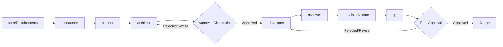

# Multi-Agent Development System

> **When to read this:** When you want to understand the mayu project's AI agent development system, or when adding/modifying agents

## Overview

The mayu project uses a multi-agent development system combining 11 specialized agents. Each agent has a clearly defined scope of responsibility, and they collaborate through the development cycle with human approval checkpoints.

## Agent List

| Agent | Definition File | Role |
|-------|----------------|------|
| **product-strategist** | `.kiro/agents/product-strategist.json` | Roadmap definition, feature prioritization, product strategy |
| **researcher** | `.kiro/agents/researcher.json` | Technical research, competitive analysis, data source investigation |
| **planner** | `.kiro/agents/planner.json` | Task decomposition, dependency management, execution planning |
| **architect** | `.kiro/agents/architect.json` | System design, API design, DB schema design, package structure |
| **developer** | `.kiro/agents/developer.json` | TDD code implementation, mayu coding convention compliance |
| **reviewer** | `.kiro/agents/reviewer.json` | Code quality, security, and performance review |
| **qa** | `.kiro/agents/qa.json` | Test strategy definition, comprehensive test creation and execution |
| **devops** | `.kiro/agents/devops.json` | CI/CD, Docker, release process, infrastructure management |
| **triage** | `.kiro/agents/triage.json` | Issue/PR classification, priority labeling, assignment |
| **marketer** | `.kiro/agents/marketer.json` | OSS marketing, community strategy, promotion |
| **devils-advocate** | `.kiro/agents/devils-advocate.json` | Contrarian review, challenging assumptions, finding blind spots |

## Development Lifecycle



### Stage Details

| Stage | Responsible Agent | Primary Deliverables |
|-------|-------------------|---------------------|
| Research & Analysis | researcher | Technical research reports, competitive analysis, data source evaluation |
| Planning | planner | Task list, dependency graph, schedule |
| Design | architect | API specification, DB schema, package structure diagram |
| **[Approval]** | **Human** | **Design review, Go/No-Go decision** |
| Implementation | developer | Code with tests, migrations |
| Review | reviewer | Review comments, fix proposals |
| Critical Review | devils-advocate | Risk identification, alternative proposals |
| Testing | qa | Test plans, test execution results |
| **[Final Approval]** | **Human** | **Merge decision** |
| Release | devops | Release tag, changelog |
| Announcement | marketer | Release notes, social media post drafts |

## How to Invoke Agents

### 1. Kiro CLI (Local Development)

```bash
# Interact with a specific agent
kiro-cli chat --agent architect

# Example: Request API design from architect
kiro-cli chat --agent architect
> Design adding a CVSS score range filter to the /search endpoint

# Example: Request a bug fix from developer
kiro-cli chat --agent developer
> Fix the issue where empty lines cause an error in CSV parsing in internal/fetcher/epss.go
```

### 2. GitHub Issues/PRs (`/kiro` command)

Write `/kiro @<agent-name> <instruction>` in an Issue or PR comment, and `.github/workflows/kiro.yml` will be triggered, executing the specified agent.

```markdown
# Issue comment example
/kiro @researcher Investigate the changes in NVD's CVE JSON 5.1 format

# PR comment example
/kiro @reviewer Review this PR with emphasis on security aspects

# Without specifying an agent (default behavior)
/kiro Investigate the cause of this error and propose a fix
```

**Automatic Triggers (GitHub Actions):**

| Workflow | Trigger | Agent |
|----------|---------|-------|
| `agent-triage.yml` | Issue creation | triage |
| `agent-review.yml` | PR creation | reviewer |
| `agent-security-review.yml` | Security-related path changes | reviewer (security focus) |
| `agent-ci-fix.yml` | CI failure | developer |
| `agent-docs-sync.yml` | Source code changes | developer (docs) |
| `agent-dependency-audit.yml` | Weekly schedule | devops |

### 3. Kiro Web Session

Interact with agents through the Kiro Web chat interface.

- Select an agent at the start of a session
- Connect the mayu repository as context
- Steering files from `.kiro/steering/` are automatically loaded

## Approval Checkpoints

The multi-agent system requires **human approval** at the following points.

### Required Approval Points

1. **Design Approval** (after architect output)
   - Designs involving DB schema changes
   - Introduction of new external dependencies
   - Breaking API changes
   - Package structure changes

2. **Implementation Merge Approval** (after qa completion)
   - All tests pass
   - All reviewer / devils-advocate issues resolved
   - `make build && make test && make lint` succeeds

3. **Release Approval** (after devops release preparation)
   - CHANGELOG content verification
   - Version number validity
   - Migration procedure confirmation

### Optional Approval Points

- Before passing researcher results to planner
- Before passing planner's plan to architect
- Before publishing marketer's announcement content

## Devil's Advocate Integration Points

It is recommended to invoke the devils-advocate agent at the following times:

### Recommended Timing

| Timing | Target | Expected Benefit |
|--------|--------|-----------------|
| After design completion | architect's design proposal | Discover overlooked risks |
| Before plan finalization | planner's execution plan | Correct optimistic estimates |
| During technology selection | researcher's recommendation | Verify lock-in risks |
| After review | After reviewer's LGTM | Find missed edge cases |

### Invocation Examples

```bash
# Review a design proposal via CLI
kiro-cli chat --agent devils-advocate
> Review the EPSS data caching design proposed by architect.
> It's a proposal to add Redis cache to internal/fetcher/epss/.

# Via GitHub Issue
/kiro @devils-advocate Identify problems with this design: [design link or content]
```

### Utilizing Output

Handle devils-advocate findings as follows:

1. **High risk**: Reconsider the design, request revisions from architect
2. **Medium risk**: Human decides whether to proceed with documented mitigations
3. **Low risk**: Record only (leave as Issue comment)

## Agent Collaboration Patterns

### Output Flow

```
product-strategist (strategy)
    | roadmap, priorities
researcher (research)
    | technical report, feasibility
planner (planning)
    | task list, schedule
architect (design)
    | design document, API specification
developer (implementation)
    | code, tests, PR
reviewer (review)
    | review comments
devils-advocate (criticism)
    | risk identification, alternatives
qa (testing)
    | test result report
devops (release)
    | release tag, deployment
marketer (announcement)
    | announcements, community updates
```

### Context Sharing

Agents share context through the following mechanisms:

- **Steering files** (`.kiro/steering/`): Project-wide conventions and policies
- **Issue/PR comments**: Deliverable handoff between agents
- **The codebase itself**: Code reflecting existing design decisions
- **`.agents/tasks/`**: Task state management and deliverable records

### Cases Where Parallel Execution Is Possible

- researcher and marketer (competitive analysis and positioning analysis)
- reviewer and qa (code review and test execution)
- devops and marketer (release preparation and announcement drafting)

## How to Modify Agent Definitions

To change an agent's behavior:

```bash
# Edit the agent definition file
vim .kiro/agents/<agent-name>.json

# JSON structure:
# {
#   "name": "Display Name",
#   "description": "Brief description",
#   "instructions": "Detailed system prompt (markdown format)"
# }
```

**Notes:**
- The `instructions` field is markdown written inside a JSON string
- Including project-specific paths, commands, and conventions improves accuracy
- Content from `.kiro/steering/` is also automatically loaded, so avoid duplication

## Related Files

- Agent definitions: `.kiro/agents/*.json`
- Steering files: `.kiro/steering/*.md`
- GitHub Actions: `.github/workflows/kiro.yml` (main router)
- Automation workflows: `.github/workflows/agent-*.yml`
- Workflow examples: `.kiro/steering/agent-workflows.md`
