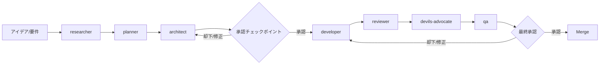

# Multi-Agent Development System

> **When to read this:** mayu プロジェクトの AI エージェント開発システムを理解したい時、または新しいエージェントを追加・変更する時

## Overview

mayu プロジェクトでは 11 の専門エージェントを組み合わせたマルチエージェント開発システムを採用しています。各エージェントは明確な責任範囲を持ち、人間の承認を挟みながら協調して開発サイクルを回します。

## エージェント一覧

| Agent | 定義ファイル | 役割 |
|-------|-------------|------|
| **product-strategist** | `.kiro/agents/product-strategist.json` | ロードマップ策定、機能の優先順位付け、プロダクト戦略 |
| **researcher** | `.kiro/agents/researcher.json` | 技術リサーチ、競合分析、データソース調査 |
| **planner** | `.kiro/agents/planner.json` | タスク分解、依存関係の整理、実行計画の立案 |
| **architect** | `.kiro/agents/architect.json` | システム設計、API設計、DB スキーマ設計、パッケージ構成 |
| **developer** | `.kiro/agents/developer.json` | TDD によるコード実装、mayu コーディング規約の遵守 |
| **reviewer** | `.kiro/agents/reviewer.json` | コード品質、セキュリティ、パフォーマンスのレビュー |
| **qa** | `.kiro/agents/qa.json` | テスト戦略の策定、包括的なテスト作成と実行 |
| **devops** | `.kiro/agents/devops.json` | CI/CD、Docker、リリースプロセス、インフラ管理 |
| **triage** | `.kiro/agents/triage.json` | Issue/PR の分類、優先度ラベリング、アサイン |
| **marketer** | `.kiro/agents/marketer.json` | OSS マーケティング、コミュニティ戦略、プロモーション |
| **devils-advocate** | `.kiro/agents/devils-advocate.json` | 逆説的レビュー、仮定への挑戦、盲点の発見 |

## 開発ライフサイクル



### 各ステージの詳細

| ステージ | 担当エージェント | 主な成果物 |
|---------|----------------|-----------|
| 調査・分析 | researcher | 技術調査レポート、競合分析、データソース評価 |
| 計画 | planner | タスク一覧、依存関係グラフ、スケジュール |
| 設計 | architect | API 仕様、DB スキーマ、パッケージ構成図 |
| **[承認]** | **人間** | **設計レビュー、Go/No-Go 判断** |
| 実装 | developer | テスト付きコード、マイグレーション |
| レビュー | reviewer | レビューコメント、修正提案 |
| 批判的レビュー | devils-advocate | リスク指摘、代替案提示 |
| テスト | qa | テスト計画、テスト実行結果 |
| **[最終承認]** | **人間** | **マージ可否の判断** |
| リリース | devops | リリースタグ、変更履歴 |
| 告知 | marketer | リリースノート、SNS 投稿案 |

## エージェントの呼び出し方法

### 1. Kiro CLI (ローカル開発)

```bash
# 特定のエージェントと対話
kiro-cli chat --agent architect

# 例: architect に API 設計を依頼
kiro-cli chat --agent architect
> /search エンドポイントに CVSS スコア範囲フィルタを追加する設計をしてください

# 例: developer にバグ修正を依頼
kiro-cli chat --agent developer
> internal/fetcher/epss.go の CSV パースで空行がエラーになる問題を修正して
```

### 2. GitHub Issues/PRs (`/kiro` コマンド)

Issue または PR のコメントに `/kiro @<agent-name> <instruction>` と記述すると、`.github/workflows/kiro.yml` がトリガーされ、指定エージェントが実行されます。

```markdown
# Issue コメントの例
/kiro @researcher NVD の CVE JSON 5.1 フォーマットの変更点を調査して

# PR コメントの例
/kiro @reviewer このPRのセキュリティ面を重点的にレビューして

# エージェント指定なし (デフォルト動作)
/kiro このエラーの原因を調べて修正案を出して
```

**自動トリガー (GitHub Actions):**

| Workflow | トリガー | エージェント |
|----------|---------|------------|
| `agent-triage.yml` | Issue 作成時 | triage |
| `agent-review.yml` | PR 作成時 | reviewer |
| `agent-security-review.yml` | セキュリティ関連パス変更時 | reviewer (security focus) |
| `agent-ci-fix.yml` | CI 失敗時 | developer |
| `agent-docs-sync.yml` | ソースコード変更時 | developer (docs) |
| `agent-dependency-audit.yml` | 週次スケジュール | researcher |

### 3. Kiro Web セッション

Kiro Web のチャットインターフェースでエージェントを選択して対話します。

- セッション開始時にエージェントを選択
- コンテキストとして mayu リポジトリを接続
- `.kiro/steering/` のステアリングファイルが自動的に読み込まれる

## 承認チェックポイント

マルチエージェントシステムでは、以下のポイントで**人間の承認**が必要です。

### 必須承認ポイント

1. **設計承認** (architect の出力後)
   - DB スキーマ変更を含む設計
   - 新しい外部依存の導入
   - API の破壊的変更
   - パッケージ構成の変更

2. **実装マージ承認** (qa 完了後)
   - 全テストがパスしていること
   - reviewer / devils-advocate の指摘が解決済みであること
   - `make build && make test && make lint` が成功すること

3. **リリース承認** (devops のリリース準備後)
   - CHANGELOG の内容確認
   - バージョン番号の妥当性
   - マイグレーション手順の確認

### 任意承認ポイント

- researcher の調査結果を planner に渡す前
- planner の計画を architect に渡す前
- marketer の告知内容を公開する前

## Devil's Advocate の統合ポイント

devils-advocate エージェントは以下のタイミングで呼び出すことを推奨します:

### 推奨タイミング

| タイミング | 対象 | 期待する効果 |
|-----------|------|------------|
| 設計完了後 | architect の設計案 | 見落としたリスクの発見 |
| 計画確定前 | planner の実行計画 | 楽観的見積もりの是正 |
| 技術選定時 | researcher の推薦 | ロックインリスクの検証 |
| レビュー後 | reviewer のLGTM後 | 見逃されたエッジケースの発見 |

### 呼び出し例

```bash
# CLI で設計案をレビュー
kiro-cli chat --agent devils-advocate
> architect が提案した EPSS データのキャッシュ設計をレビューして。
> internal/fetcher/epss/ に Redis キャッシュを追加する案です。

# GitHub Issue で
/kiro @devils-advocate この設計の問題点を指摘して: [設計案のリンクまたは内容]
```

### 出力の活用

devils-advocate の指摘は以下のように処理します:

1. **High リスク**: 設計を再検討し、architect に修正を依頼
2. **Medium リスク**: 対応策を明記した上で進行可否を人間が判断
3. **Low リスク**: 記録のみ (Issue のコメントに残す)

## エージェント間の連携パターン

### 出力の流れ

```
product-strategist (戦略) 
    ↓ ロードマップ、優先順位
researcher (調査)
    ↓ 技術レポート、実現可能性
planner (計画)
    ↓ タスクリスト、スケジュール
architect (設計)
    ↓ 設計ドキュメント、API 仕様
developer (実装)
    ↓ コード、テスト、PR
reviewer (レビュー)
    ↓ レビューコメント
devils-advocate (批判)
    ↓ リスク指摘、代替案
qa (テスト)
    ↓ テスト結果レポート
devops (リリース)
    ↓ リリースタグ、デプロイ
marketer (告知)
    ↓ アナウンス、コミュニティ更新
```

### コンテキスト共有

各エージェントは以下のメカニズムでコンテキストを共有します:

- **ステアリングファイル** (`.kiro/steering/`): プロジェクト全体の規約と方針
- **Issue/PR のコメント**: エージェント間の成果物の受け渡し
- **コードベース自体**: 既存の設計判断が反映されたコード
- **`.agents/tasks/`**: タスクの状態管理と成果物の記録

### 並列実行が可能なケース

- researcher と marketer (競合分析とポジショニング分析)
- reviewer と qa (コードレビューとテスト実行)
- devops と marketer (リリース準備とアナウンス下書き)

## エージェント定義の変更方法

エージェントの振る舞いを変更する場合:

```bash
# エージェント定義ファイルを編集
vim .kiro/agents/<agent-name>.json

# JSON 構造:
# {
#   "name": "表示名",
#   "description": "簡潔な説明",
#   "instructions": "詳細なシステムプロンプト (markdown形式)"
# }
```

**注意事項:**
- `instructions` フィールドは JSON 文字列内に markdown を記述する形式
- プロジェクト固有のパス、コマンド、規約を含めることで精度が向上する
- `.kiro/steering/` の内容も自動的に読み込まれるため、重複は避ける

## 関連ファイル

- エージェント定義: `.kiro/agents/*.json`
- ステアリングファイル: `.kiro/steering/*.md`
- GitHub Actions: `.github/workflows/kiro.yml` (メインルーター)
- 自動化ワークフロー: `.github/workflows/agent-*.yml`
- ワークフロー例: `.kiro/steering/agent-workflows.md`
