```mermaid
erDiagram
    vulnerabilities {
        TEXT id PK "Canonical ID (CVE-xxx or source-specific ID)"
        TEXT source "osv / nvd / kev / epss / lev"
        TEXT summary
        TEXT details
        TIMESTAMPTZ published
        TIMESTAMPTZ modified
        TIMESTAMPTZ withdrawn
    }

    vulnerability_aliases {
        BIGINT id PK
        TEXT vulnerability_id FK
        TEXT alias "e.g. GHSA-xxxx, GO-2024-0001"
        INT ordering "0-indexed position"
        TEXT source_osv_id "OSV entry that contributed this alias"
    }

    osv_entries {
        TEXT osv_id PK "Original OSV ID"
        TEXT vulnerability_id FK
        TEXT schema_version
        JSONB raw_json
        JSONB database_specific
    }

    osv_affected_packages {
        BIGINT id PK
        TEXT osv_entry_id FK "References osv_entries.osv_id"
        TEXT ecosystem
        TEXT name
        TEXT purl
        TEXT[] versions
        JSONB ecosystem_specific
        JSONB database_specific
    }

    osv_affected_ranges {
        BIGINT id PK
        BIGINT affected_package_id FK
        TEXT range_type
        TEXT repo
        JSONB events
        JSONB database_specific
    }

    osv_severity {
        BIGINT id PK
        TEXT osv_entry_id FK "References osv_entries.osv_id"
        BIGINT affected_package_id FK "nullable"
        TEXT severity_type
        TEXT score
        TEXT source
    }

    osv_references {
        BIGINT id PK
        TEXT osv_entry_id FK "References osv_entries.osv_id"
        TEXT reference_type
        TEXT url
    }

    osv_credits {
        BIGINT id PK
        TEXT osv_entry_id FK "References osv_entries.osv_id"
        TEXT name
        TEXT[] contact
        TEXT credit_type
    }

    nvd_entries {
        BIGINT id PK "GENERATED ALWAYS AS IDENTITY"
        TEXT cve_id UK "CVE-YYYY-NNNNN"
        TEXT vulnerability_id FK "→ vulnerabilities(id)"
        TEXT source_identifier "e.g. cve@mitre.org"
        TEXT vuln_status "Analyzed, Modified, Rejected, etc."
        TIMESTAMPTZ published
        TIMESTAMPTZ last_modified
        JSONB raw_json "Full cve object (reversibility)"
    }

    nvd_descriptions {
        BIGINT id PK
        BIGINT nvd_entry_id FK "→ nvd_entries(id)"
        TEXT lang "en, es, etc."
        TEXT value
    }

    nvd_metrics {
        BIGINT id PK
        BIGINT nvd_entry_id FK "→ nvd_entries(id)"
        TEXT version "v2, v31, v40"
        TEXT source "nvd@nist.gov, etc."
        TEXT type "Primary / Secondary"
        JSONB cvss_data "CVSS vector details"
        FLOAT8 base_score
        TEXT base_severity
        FLOAT8 exploitability_score
        FLOAT8 impact_score
    }

    nvd_weaknesses {
        BIGINT id PK
        BIGINT nvd_entry_id FK "→ nvd_entries(id)"
        TEXT source
        TEXT type "Primary / Secondary"
        TEXT cwe_id "CWE-79, etc."
    }

    nvd_configurations {
        BIGINT id PK
        BIGINT nvd_entry_id FK "→ nvd_entries(id)"
        TEXT operator "AND / OR"
        BOOLEAN negate
        JSONB raw_nodes "Full node tree (reversibility)"
    }

    nvd_cpe_matches {
        BIGINT id PK
        BIGINT configuration_id FK "→ nvd_configurations(id)"
        BOOLEAN vulnerable
        TEXT criteria "CPE 2.3 URI"
        TEXT match_criteria_id "UUID"
        TEXT version_start_including
        TEXT version_start_excluding
        TEXT version_end_including
        TEXT version_end_excluding
    }

    nvd_references {
        BIGINT id PK
        BIGINT nvd_entry_id FK "→ nvd_entries(id)"
        TEXT url
        TEXT source
        TEXT[] tags
    }

    mitre_entries {
        BIGINT id PK "GENERATED ALWAYS AS IDENTITY"
        TEXT cve_id UK "CVE-YYYY-NNNNN"
        TEXT vulnerability_id FK "→ vulnerabilities(id)"
        TEXT data_version "5.0, 5.1, 5.2"
        TEXT state "PUBLISHED, REJECTED"
        TEXT assigner_org_id
        TEXT assigner_short_name
        TIMESTAMPTZ date_reserved
        TIMESTAMPTZ date_published
        TIMESTAMPTZ date_updated
        JSONB raw_json "Full CVE Record (reversibility)"
    }

    mitre_containers {
        BIGINT id PK "GENERATED ALWAYS AS IDENTITY"
        BIGINT mitre_entry_id FK "→ mitre_entries(id) CASCADE"
        TEXT container_type "cna or adp"
        TEXT title "nullable"
        TEXT provider_org_id
        TEXT provider_short_name
        TIMESTAMPTZ date_updated
    }

    mitre_affected {
        BIGINT id PK "GENERATED ALWAYS AS IDENTITY"
        BIGINT container_id FK "→ mitre_containers(id) CASCADE"
        TEXT vendor
        TEXT product
        TEXT default_status
        TEXT[] platforms
        TEXT[] modules
        TEXT package_url
    }

    mitre_affected_versions {
        BIGINT id PK "GENERATED ALWAYS AS IDENTITY"
        BIGINT affected_id FK "→ mitre_affected(id) CASCADE"
        TEXT version
        TEXT version_type
        TEXT status
        TEXT less_than
        TEXT less_than_or_equal
        JSONB changes
    }

    mitre_metrics {
        BIGINT id PK "GENERATED ALWAYS AS IDENTITY"
        BIGINT container_id FK "→ mitre_containers(id) CASCADE"
        TEXT format "CVSS, SSVC, etc."
        TEXT cvss_version "3.1, 4.0, etc."
        FLOAT8 base_score
        TEXT base_severity
        TEXT vector_string
        JSONB cvss_data
        JSONB scenarios
    }

    mitre_problem_types {
        BIGINT id PK "GENERATED ALWAYS AS IDENTITY"
        BIGINT container_id FK "→ mitre_containers(id) CASCADE"
        TEXT cwe_id
        TEXT description
        TEXT lang
    }

    mitre_references {
        BIGINT id PK "GENERATED ALWAYS AS IDENTITY"
        BIGINT container_id FK "→ mitre_containers(id) CASCADE"
        TEXT url
        TEXT name
        TEXT[] tags
    }

    mitre_credits {
        BIGINT id PK "GENERATED ALWAYS AS IDENTITY"
        BIGINT container_id FK "→ mitre_containers(id) CASCADE"
        TEXT credit_type
        TEXT value
        TEXT lang
    }

    sync_state {
        TEXT source PK "e.g. Go, npm, NVD, NVD-native, Debian, MITRE, EPSS"
        TIMESTAMPTZ last_modified_at
        TIMESTAMPTZ last_synced_at
        BIGINT record_count
    }

    epss_scores {
        BIGINT id PK "GENERATED ALWAYS AS IDENTITY"
        TEXT cve_id "CVE-YYYY-NNNNN"
        TEXT vulnerability_id FK "→ vulnerabilities(id)"
        FLOAT8 epss "Exploitation probability (0.0-1.0)"
        FLOAT8 percentile "Relative ranking (0.0-1.0)"
        DATE score_date "Date the score was calculated"
        JSONB raw_json "Original API entry (reversibility)"
    }

    kev_entries {
        BIGINT id PK "GENERATED ALWAYS AS IDENTITY"
        TEXT cve_id UK "CVE-YYYY-NNNNN"
        TEXT vulnerability_id FK "→ vulnerabilities(id)"
        TEXT vendor_project "e.g. Microsoft, Fortinet"
        TEXT product "e.g. SharePoint, FortiSandbox"
        TEXT vulnerability_name "Human-readable vulnerability title"
        DATE date_added "Date added to KEV catalog"
        TEXT short_description "Brief vulnerability description"
        TEXT required_action "Remediation action required"
        DATE due_date "Remediation due date"
        TEXT known_ransomware_campaign_use "Known or Unknown"
        TEXT notes "Additional notes and URLs"
        TEXT_ARRAY cwes "CWE IDs (e.g. CWE-502, CWE-78)"
        JSONB raw_json "Original catalog entry (reversibility)"
    }

    vulnerabilities ||--o{ vulnerability_aliases : "has"
    vulnerabilities ||--o{ osv_entries : "has"
    vulnerabilities ||--o{ nvd_entries : "has"
    vulnerabilities ||--o{ mitre_entries : "has"
    vulnerabilities ||--o{ epss_scores : "has"
    vulnerabilities ||--o{ kev_entries : "has"
    osv_entries ||--o{ osv_affected_packages : "has"
    osv_entries ||--o{ osv_severity : "top-level severity"
    osv_entries ||--o{ osv_references : "has"
    osv_entries ||--o{ osv_credits : "has"
    osv_affected_packages ||--o{ osv_affected_ranges : "has"
    osv_affected_packages ||--o{ osv_severity : "per-package severity"
    nvd_entries ||--o{ nvd_descriptions : "has"
    nvd_entries ||--o{ nvd_metrics : "has"
    nvd_entries ||--o{ nvd_weaknesses : "has"
    nvd_entries ||--o{ nvd_configurations : "has"
    nvd_configurations ||--o{ nvd_cpe_matches : "has"
    nvd_entries ||--o{ nvd_references : "has"
    mitre_entries ||--o{ mitre_containers : "has"
    mitre_containers ||--o{ mitre_affected : "has"
    mitre_containers ||--o{ mitre_metrics : "has"
    mitre_containers ||--o{ mitre_problem_types : "has"
    mitre_containers ||--o{ mitre_references : "has"
    mitre_containers ||--o{ mitre_credits : "has"
    mitre_affected ||--o{ mitre_affected_versions : "has"
```

## Design Principles

### `vulnerabilities` (Unified Master)
Source-agnostic normalized vulnerability records at the granularity displayed in Mayu's vulnerability listing.

- `id`: Uses CVE ID when available (extracted from aliases); otherwise uses the source-specific ID (e.g., GO-2024-XXXX) as-is. Multiple OSV entries sharing the same CVE are grouped under a single row.
- `source`: Identifies the data origin. Future sources (`kev`, `lev`) will be added at this level.
- `modified`: Uses `GREATEST` on upsert so the most recent modification time across all contributing OSV entries is retained.

### `vulnerability_aliases`
Cross-reference table for vulnerability identifiers (CVE ↔ GHSA ↔ OSV ID mappings).
Externalized from an array column into a proper relation to enable fast reverse lookups (e.g., CVE → related OSV entries) via indexed FK joins.

- `source_osv_id`: Tracks which OSV entry contributed each alias. This enables safe per-entry alias cleanup on reimport without affecting aliases contributed by other OSV entries (e.g., Ubuntu reimport does not remove Red Hat's aliases).
- UNIQUE constraint: `(vulnerability_id, alias, source_osv_id)` — the same alias can appear multiple times if contributed by different OSV entries.
- When an OSV entry is reimported, stale aliases (previously contributed by that entry but no longer in its aliases list) are automatically deleted.

### `osv_*` Tables
OSV-specific detail tables. Other data sources (`nvd_*`, `mitre_*`, `epss_scores`) are added as sibling table groups. Future: `kev_entries`, `lev_scores`.

### `nvd_*` Tables
NVD-specific detail tables for CVE data ingested directly from the NVD JSON Feed 2.0. Mirrors the NVD CVE 2.0 schema structure.

- `nvd_entries`: One row per CVE. The `raw_json` column stores the complete `cve` object for reversibility (same pattern as `osv_entries.raw_json`). Linked to `vulnerabilities` via `vulnerability_id` (CVE ID).
- `nvd_descriptions`: Multi-language CVE descriptions (en, es, etc.).
- `nvd_metrics`: CVSS scores from multiple sources (NVD, CNA) and versions (v2, v31, v40). `cvss_data` stores the full CVSS vector as JSONB since the structure varies by version.
- `nvd_weaknesses`: CWE classification with source distinction (Primary/Secondary).
- `nvd_configurations`: CPE applicability statements. `raw_nodes` preserves the full node tree for reversibility; `nvd_cpe_matches` provides a flattened view for efficient CPE-based search.
- `nvd_cpe_matches`: Flattened CPE match criteria extracted from configuration nodes. Enables direct CPE URI search without JSONB traversal.
- `nvd_references`: External references with source attribution and tags (Patch, Third Party Advisory, etc.).
- Upsert strategy: On reimport, existing `nvd_entries` row is deleted (CASCADE removes children) and re-inserted. `vulnerabilities` row uses COALESCE to preserve OSV-contributed data when available.

### `sync_state`
Standalone table (no FK relationships) that tracks per-source delta synchronization state.

### `epss_scores` Table
EPSS (Exploit Prediction Scoring System) scores from the FIRST API. Stores the daily probability that a CVE will be exploited in the next 30 days, along with its relative percentile ranking.

- `epss_scores`: One row per CVE per score_date. The `raw_json` column stores the original API response entry for reversibility (same pattern as `osv_entries.raw_json`, `nvd_entries.raw_json`, and `mitre_entries.raw_json`). Linked to `vulnerabilities` via `vulnerability_id` (CVE ID).
- UNIQUE constraint: `(cve_id, score_date)` — allows storing historical scores if needed, but typical usage stores only the latest day's score.
- Upsert strategy: On reimport for the same date, existing scores are updated in-place (ON CONFLICT DO UPDATE). The `vulnerabilities` row is created with DO NOTHING to avoid overwriting richer data from OSV/NVD/MITRE.
- Delta strategy: EPSS scores are recalculated daily for ALL CVEs. There is no true delta — each day is a complete snapshot. The `--update` flag skips import if already synced today.
- Future extensibility: This table pattern (CVE-linked scoring with raw_json reversibility) is designed to be reusable for future scoring systems such as LEV (Likely Exploited Vulnerabilities, NIST CSWP 41).

### `kev_entries` Table
CISA KEV (Known Exploited Vulnerabilities) catalog entries. Stores CVEs that have been confirmed to be actively exploited in the wild, along with remediation requirements and due dates.

- `kev_entries`: One row per CVE. The `raw_json` column stores the original catalog entry for reversibility (same pattern as `osv_entries.raw_json`, `nvd_entries.raw_json`, `mitre_entries.raw_json`, and `epss_scores.raw_json`). Linked to `vulnerabilities` via `vulnerability_id` (CVE ID).
- UNIQUE constraint: `(cve_id)` — one entry per CVE in the KEV catalog.
- Upsert strategy: On reimport, existing entries are updated in-place (ON CONFLICT DO UPDATE on cve_id). The `vulnerabilities` row is created with DO NOTHING to avoid overwriting richer data from OSV/NVD/MITRE.
- Delta strategy: The KEV catalog is cumulative (entries are never removed, only added). The catalog is small (~1-2 MB, ~1,600 entries) and updates a few times per week. The `--update` flag skips import if already synced within the last hour.
- `known_ransomware_campaign_use`: Indicates whether the vulnerability is known to be used in ransomware campaigns ("Known" or "Unknown").
- `cwes`: CWE classifications as a TEXT[] array (e.g., CWE-502, CWE-78).
- `notes`: Contains URLs and additional context (CISA BOD references, vendor advisories, NVD links).

### `mitre_*` Tables
MITRE CVE-specific detail tables for CVE Records ingested from the CVEProject/cvelistV5 GitHub Releases in CVE JSON 5.x format (5.0, 5.1, 5.2).

- `mitre_entries`: One row per CVE Record. The `raw_json` column stores the complete CVE Record JSON for reversibility (same pattern as `osv_entries.raw_json` and `nvd_entries.raw_json`). Linked to `vulnerabilities` via `vulnerability_id` (CVE ID). Only PUBLISHED records are stored (REJECTED/RESERVED are skipped during ingestion).
- `mitre_containers`: Separates CNA (CVE Numbering Authority) and ADP (Authorized Data Publisher) containers. Each CVE has exactly one CNA container and zero or more ADP containers (e.g., CISA Vulnrichment, CVE Program Container).
- `mitre_affected`: Products/packages affected by the vulnerability. References a container (CNA or ADP can both declare affected products).
- `mitre_affected_versions`: Version ranges for affected products. Uses `less_than`/`less_than_or_equal` for range semantics; `changes` JSONB stores version-level status transitions.
- `mitre_metrics`: CVSS and SSVC scoring. Supports multiple CVSS versions (2.0, 3.0, 3.1, 4.0) via `cvss_version`; SSVC assessments stored with `format="SSVC"` and data in `cvss_data` JSONB.
- `mitre_problem_types`: CWE classifications expanded from nested `problemTypes[].descriptions[]` arrays.
- `mitre_references`: External references with optional name and tags.
- `mitre_credits`: Vulnerability discovery/coordination credits with type classification.
- Upsert strategy: On reimport, existing `mitre_entries` row is deleted (CASCADE removes children) and re-inserted. `vulnerabilities` row uses COALESCE to preserve existing NVD/OSV-contributed data, only filling gaps from MITRE.
- Delta strategy: Uses GitHub Releases hourly delta zips. Fallback to full baseline import if last sync > 24 hours ago.

### CVE Canonicalization Logic
1. On ingest, the first `CVE-*` alias is extracted as the canonical ID.
2. If no CVE exists, the OSV ID is used as canonical ID.
3. When a CVE is assigned later (OSV entry updated with new alias), the old `vulnerabilities` row is migrated to the CVE ID and orphaned rows are cleaned up.
4. The OSV ID itself is stored as an alias when the canonical ID differs (enabling reverse lookups by OSV ID).
