# Entity-Relationship Diagram (Proposed)

```mermaid
erDiagram
    vulnerabilities {
        TEXT id PK "Canonical ID (CVE-xxx or source-specific ID)"
        TEXT summary
        TEXT details
        TIMESTAMPTZ published
        TIMESTAMPTZ modified
        TIMESTAMPTZ withdrawn
    }

    vulnerability_aliases {
        BIGINT id PK "GENERATED ALWAYS AS IDENTITY"
        TEXT vulnerability_id FK "→ vulnerabilities(id) CASCADE"
        TEXT alias "e.g. GHSA-xxxx, GO-2024-0001"
    }

    alias_sources {
        BIGINT id PK "GENERATED ALWAYS AS IDENTITY"
        BIGINT alias_id FK "→ vulnerability_aliases(id) CASCADE"
        TEXT osv_id FK "→ osv_entries(osv_id) CASCADE"
    }

    vulnerability_summary {
        TEXT vulnerability_id PK, FK "→ vulnerabilities(id) CASCADE"
        SMALLINT severity_worst "5=CRITICAL,4=HIGH,3=MED,2=LOW,1=NONE"
        SMALLINT severity_best "same scale"
        JSONB scores_detail "per-source scores array"
        FLOAT8 epss_score "latest EPSS probability"
        FLOAT8 epss_percentile "latest EPSS percentile"
        BOOLEAN in_kev "in CISA KEV catalog"
        FLOAT8 lev_score "LEV probability"
        TEXT_ARRAY ecosystem_list "GIN indexed"
        TEXT_ARRAY cwe_list "GIN indexed"
        TIMESTAMPTZ computed_at
    }

    product_identifiers {
        BIGINT id PK "GENERATED ALWAYS AS IDENTITY"
        TEXT vulnerability_id FK "→ vulnerabilities(id) CASCADE"
        TEXT source "osv, nvd, mitre"
        TEXT purl "pkg:type/namespace/name"
        TEXT cpe "cpe:2.3:..."
        TEXT ecosystem "Go, npm, PyPI..."
        TEXT name "package name"
        TEXT vendor "CPE/MITRE vendor"
        TEXT product "CPE/MITRE product"
        JSONB version_constraint "normalized version ranges"
    }

    purl_cpe_mapping {
        BIGINT id PK "GENERATED ALWAYS AS IDENTITY"
        TEXT purl_type "golang, npm, maven..."
        TEXT purl_name "package name in purl"
        TEXT cpe_vendor "CPE vendor"
        TEXT cpe_product "CPE product"
        FLOAT8 confidence "mapping confidence 0.0-1.0"
        TEXT source "nvd-cpe-dict, heuristic, manual"
    }

    osv_entries {
        TEXT osv_id PK "Normalized (DEBIAN-CVE-* etc.)"
        TEXT vulnerability_id FK "→ vulnerabilities(id) CASCADE"
        TEXT schema_version
        JSONB raw_json "Original OSV JSON (reversibility)"
        JSONB database_specific
    }

    osv_affected_packages {
        BIGINT id PK "GENERATED ALWAYS AS IDENTITY"
        TEXT osv_entry_id FK "→ osv_entries(osv_id) CASCADE"
        TEXT ecosystem
        TEXT name
        TEXT purl
        TEXT_ARRAY versions
        JSONB ecosystem_specific
        JSONB database_specific
    }

    osv_affected_ranges {
        BIGINT id PK "GENERATED ALWAYS AS IDENTITY"
        BIGINT affected_package_id FK "→ osv_affected_packages(id) CASCADE"
        TEXT range_type
        TEXT repo
        JSONB events
        JSONB database_specific
    }

    osv_severity {
        BIGINT id PK "GENERATED ALWAYS AS IDENTITY"
        TEXT osv_entry_id FK "→ osv_entries(osv_id) CASCADE"
        BIGINT affected_package_id FK "nullable → osv_affected_packages(id) CASCADE"
        TEXT severity_type
        TEXT score
        TEXT source
    }

    osv_references {
        BIGINT id PK "GENERATED ALWAYS AS IDENTITY"
        TEXT osv_entry_id FK "→ osv_entries(osv_id) CASCADE"
        TEXT reference_type
        TEXT url
    }

    osv_credits {
        BIGINT id PK "GENERATED ALWAYS AS IDENTITY"
        TEXT osv_entry_id FK "→ osv_entries(osv_id) CASCADE"
        TEXT name
        TEXT_ARRAY contact
        TEXT credit_type
    }

    nvd_entries {
        BIGINT id PK "GENERATED ALWAYS AS IDENTITY"
        TEXT cve_id UK
        TEXT vulnerability_id FK "→ vulnerabilities(id) CASCADE"
        TEXT source_identifier
        TEXT vuln_status
        TIMESTAMPTZ published
        TIMESTAMPTZ last_modified
        JSONB raw_json "Full NVD cve object (reversibility)"
    }

    nvd_descriptions {
        BIGINT id PK "GENERATED ALWAYS AS IDENTITY"
        BIGINT nvd_entry_id FK "→ nvd_entries(id) CASCADE"
        TEXT lang
        TEXT value
    }

    nvd_metrics {
        BIGINT id PK "GENERATED ALWAYS AS IDENTITY"
        BIGINT nvd_entry_id FK "→ nvd_entries(id) CASCADE"
        TEXT version "v2, v31, v40"
        TEXT source
        TEXT type "Primary / Secondary"
        JSONB cvss_data
        FLOAT8 base_score
        TEXT base_severity
        FLOAT8 exploitability_score
        FLOAT8 impact_score
    }

    nvd_weaknesses {
        BIGINT id PK "GENERATED ALWAYS AS IDENTITY"
        BIGINT nvd_entry_id FK "→ nvd_entries(id) CASCADE"
        TEXT source
        TEXT type
        TEXT cwe_id
    }

    nvd_configurations {
        BIGINT id PK "GENERATED ALWAYS AS IDENTITY"
        BIGINT nvd_entry_id FK "→ nvd_entries(id) CASCADE"
        TEXT operator
        BOOLEAN negate
        JSONB raw_nodes
    }

    nvd_cpe_matches {
        BIGINT id PK "GENERATED ALWAYS AS IDENTITY"
        BIGINT configuration_id FK "→ nvd_configurations(id) CASCADE"
        BOOLEAN vulnerable
        TEXT criteria
        TEXT match_criteria_id
        TEXT version_start_including
        TEXT version_start_excluding
        TEXT version_end_including
        TEXT version_end_excluding
    }

    nvd_references {
        BIGINT id PK "GENERATED ALWAYS AS IDENTITY"
        BIGINT nvd_entry_id FK "→ nvd_entries(id) CASCADE"
        TEXT url
        TEXT source
        TEXT_ARRAY tags
    }

    mitre_entries {
        BIGINT id PK "GENERATED ALWAYS AS IDENTITY"
        TEXT cve_id UK
        TEXT vulnerability_id FK "→ vulnerabilities(id) CASCADE"
        TEXT data_version
        TEXT state
        TEXT assigner_org_id
        TEXT assigner_short_name
        TIMESTAMPTZ date_reserved
        TIMESTAMPTZ date_published
        TIMESTAMPTZ date_updated
        JSONB raw_json "Full CVE Record (reversibility)"
    }

    mitre_containers {
        BIGINT id PK "GENERATED ALWAYS AS IDENTITY"
        BIGINT mitre_entry_id FK "→ mitre_entries(id) CASCADE"
        TEXT container_type "cna / adp"
        TEXT title
        TEXT provider_org_id
        TEXT provider_short_name
        TIMESTAMPTZ date_updated
    }

    mitre_affected {
        BIGINT id PK "GENERATED ALWAYS AS IDENTITY"
        BIGINT container_id FK "→ mitre_containers(id) CASCADE"
        TEXT vendor
        TEXT product
        TEXT default_status
        TEXT_ARRAY platforms
        TEXT_ARRAY modules
        TEXT package_url
    }

    mitre_affected_versions {
        BIGINT id PK "GENERATED ALWAYS AS IDENTITY"
        BIGINT affected_id FK "→ mitre_affected(id) CASCADE"
        TEXT version
        TEXT version_type
        TEXT status
        TEXT less_than
        TEXT less_than_or_equal
        JSONB changes
    }

    mitre_metrics {
        BIGINT id PK "GENERATED ALWAYS AS IDENTITY"
        BIGINT container_id FK "→ mitre_containers(id) CASCADE"
        TEXT format
        TEXT cvss_version
        FLOAT8 base_score
        TEXT base_severity
        TEXT vector_string
        JSONB cvss_data
        JSONB scenarios
    }

    mitre_problem_types {
        BIGINT id PK "GENERATED ALWAYS AS IDENTITY"
        BIGINT container_id FK "→ mitre_containers(id) CASCADE"
        TEXT cwe_id
        TEXT description
        TEXT lang
    }

    mitre_references {
        BIGINT id PK "GENERATED ALWAYS AS IDENTITY"
        BIGINT container_id FK "→ mitre_containers(id) CASCADE"
        TEXT url
        TEXT name
        TEXT_ARRAY tags
    }

    mitre_credits {
        BIGINT id PK "GENERATED ALWAYS AS IDENTITY"
        BIGINT container_id FK "→ mitre_containers(id) CASCADE"
        TEXT credit_type
        TEXT value
        TEXT lang
    }

    epss_scores {
        BIGINT id PK "GENERATED ALWAYS AS IDENTITY"
        TEXT cve_id
        TEXT vulnerability_id FK "→ vulnerabilities(id) CASCADE"
        FLOAT8 epss
        FLOAT8 percentile
        DATE score_date
        JSONB raw_json
    }

    kev_entries {
        BIGINT id PK "GENERATED ALWAYS AS IDENTITY"
        TEXT cve_id UK
        TEXT vulnerability_id FK "→ vulnerabilities(id) CASCADE"
        TEXT vendor_project
        TEXT product
        TEXT vulnerability_name
        DATE date_added
        TEXT short_description
        TEXT required_action
        DATE due_date
        TEXT known_ransomware_campaign_use
        TEXT notes
        TEXT_ARRAY cwes
        JSONB raw_json
    }

    sync_state {
        TEXT source PK
        TIMESTAMPTZ last_modified_at
        TIMESTAMPTZ last_synced_at
        BIGINT record_count
    }

    osv_ecosystems {
        TEXT name PK
        TIMESTAMPTZ created_at
    }

    vulnerabilities ||--o{ vulnerability_aliases : "has"
    vulnerabilities ||--|| vulnerability_summary : "has"
    vulnerabilities ||--o{ product_identifiers : "has"
    vulnerabilities ||--o{ osv_entries : "has"
    vulnerabilities ||--o{ nvd_entries : "has"
    vulnerabilities ||--o{ mitre_entries : "has"
    vulnerabilities ||--o{ epss_scores : "has"
    vulnerabilities ||--o{ kev_entries : "has"
    vulnerability_aliases ||--o{ alias_sources : "sourced by"
    osv_entries ||--o{ osv_affected_packages : "has"
    osv_entries ||--o{ osv_severity : "top-level severity"
    osv_entries ||--o{ osv_references : "has"
    osv_entries ||--o{ osv_credits : "has"
    osv_affected_packages ||--o{ osv_affected_ranges : "has"
    osv_affected_packages ||--o{ osv_severity : "per-package severity"
    nvd_entries ||--o{ nvd_descriptions : "has"
    nvd_entries ||--o{ nvd_metrics : "has"
    nvd_entries ||--o{ nvd_weaknesses : "has"
    nvd_entries ||--o{ nvd_configurations : "has"
    nvd_configurations ||--o{ nvd_cpe_matches : "has"
    nvd_entries ||--o{ nvd_references : "has"
    mitre_entries ||--o{ mitre_containers : "has"
    mitre_containers ||--o{ mitre_affected : "has"
    mitre_containers ||--o{ mitre_metrics : "has"
    mitre_containers ||--o{ mitre_problem_types : "has"
    mitre_containers ||--o{ mitre_references : "has"
    mitre_containers ||--o{ mitre_credits : "has"
    mitre_affected ||--o{ mitre_affected_versions : "has"
```

## Design Principles

### `vulnerabilities` (Unified Master)
Source-agnostic normalized vulnerability records at the granularity displayed in Mayu's vulnerability listing.

- `id`: Uses CVE ID when available (extracted from aliases); otherwise uses the source-specific ID (e.g., GO-2024-XXXX) as-is. Multiple OSV entries sharing the same CVE are grouped under a single row.
- `modified`: Uses `GREATEST` on upsert so the most recent modification time across all contributing entries is retained.
- **No `source` column**: Source existence is determined by JOINing/EXISTS against source-specific tables (osv_entries, nvd_entries, mitre_entries, etc.).

### `vulnerability_aliases`
Cross-reference table for vulnerability identifiers (CVE ↔ GHSA ↔ OSV ID mappings).

- UNIQUE constraint: `(vulnerability_id, alias)` — each alias appears once per vulnerability regardless of how many sources contributed it.
- No `ordering` column: insertion order is tracked by the auto-generated `id`.

### `alias_sources` (Junction Table)
Tracks which OSV entry contributed each alias. Enables safe per-entry alias cleanup on reimport.

- When an OSV entry is reimported, its `alias_sources` rows are deleted. Any `vulnerability_aliases` rows with no remaining `alias_sources` are garbage-collected.
- UNIQUE constraint: `(alias_id, osv_id)` — an OSV entry contributes an alias at most once.

### `vulnerability_summary` (Computed Aggregation)
Pre-computed derived data for list views and filtering. Updated synchronously at the end of each import pipeline.

- **`severity_worst` / `severity_best`**: Normalized to a 5-level scale (5=CRITICAL, 4=HIGH, 3=MEDIUM, 2=LOW, 1=NONE). All scoring systems are converted to this scale.
- **`scores_detail`**: JSONB array preserving per-source raw scores. Each entry contains: `src` (source), `system` (scoring system name), `ver` (version), `score` (raw numeric score or null), `sev` (severity label), `normalized` (5-level value).
- **Severity filtering**: Uses range overlap on normalized levels. E.g., "MEDIUM or above" = `severity_worst >= 3`.
- **No `has_osv`/`has_nvd`/`has_mitre` flags**: Source existence is checked via EXISTS subqueries against source tables (adequate performance with indexed FKs).

#### Severity Normalization Rules

| System | Score Range | → Level |
|--------|------------|---------|
| CVSS (v2/v3/v4) | 9.0–10.0 | 5 (CRITICAL) |
| CVSS | 7.0–8.9 | 4 (HIGH) |
| CVSS | 4.0–6.9 | 3 (MEDIUM) |
| CVSS | 0.1–3.9 | 2 (LOW) |
| CVSS | 0.0 | 1 (NONE) |
| NISTIR 7864 (Drupal) | 20–25 | 5 (Highly Critical) |
| NISTIR 7864 | 15–19 | 4 (Critical) |
| NISTIR 7864 | 10–14 | 3 (Moderately Critical) |
| NISTIR 7864 | 5–9 | 2 (Less Critical) |
| NISTIR 7864 | 0–4 | 1 (Not Critical) |
| SSVC | Act | 5 |
| SSVC | Attend | 4 |
| SSVC | Track* | 3 |
| SSVC | Track | 2 |
| Label-only (GHSA etc.) | critical | 5 |
| Label-only | high | 4 |
| Label-only | medium/moderate | 3 |
| Label-only | low | 2 |
| Label-only | none/informational | 1 |

### `product_identifiers` (Unified Package/Product Search)
Aggregates package and product identification from all sources into a single searchable table.

- Populated during each source's import (OSV → purl/ecosystem/name, NVD → cpe/vendor/product, MITRE → vendor/product/package_url).
- Enables cross-source package search: query by purl, CPE, ecosystem+name, or vendor+product.
- `version_constraint`: Normalized version range info as JSONB for future version matching.
- CPE index uses `text_pattern_ops` for prefix-match (LIKE 'cpe:2.3:a:vendor:product:%').

### `purl_cpe_mapping` (Conversion Dictionary)
Bidirectional mapping between purl identifiers and CPE naming. Used to expand searches across naming conventions.

- Populated from: NVD CPE Dictionary (bulk), heuristic matching (OSV+NVD co-occurrence on same CVE), manual curation.
- `confidence`: 1.0 for exact matches from authoritative sources, lower for heuristic/fuzzy matches.

### `osv_entries` + `osv_*` Tables
OSV-specific detail tables.

- **osv_id normalization**: If the raw OSV `id` field is a bare `CVE-*` and the ecosystem has a defined OSV prefix (e.g., Debian → `DEBIAN`), mayu stores it as `{PREFIX}-{id}` (e.g., `DEBIAN-CVE-2024-1234`). The `raw_json` retains the original value for reversibility.
- Guard: if the id already has a non-CVE prefix, it is stored as-is (prevents double-prefixing if upstream fixes their data).

### `nvd_*` Tables
NVD-specific detail tables. Column details (CPE decomposition, CVSS vector parsing) to be refined separately.

- Upsert strategy: DELETE existing entry (CASCADE) + re-INSERT on reimport.
- `raw_json` stores the complete NVD `cve` object for reversibility.

### `mitre_*` Tables
MITRE CVE Record detail tables. Column details (CVSS vector decomposition) to be refined separately.

- Upsert strategy: DELETE existing entry (CASCADE) + re-INSERT on reimport.
- `raw_json` stores the complete CVE Record for reversibility.

### `epss_scores` Table
EPSS scores from the FIRST API.

- UNIQUE: `(cve_id, score_date)`.
- Upsert strategy: ON CONFLICT DO UPDATE for same-date re-import.

### `kev_entries` Table
CISA KEV catalog entries.

- UNIQUE: `(cve_id)`.
- Upsert strategy: ON CONFLICT DO UPDATE.

### `sync_state`
Per-source delta synchronization tracking. No FK relationships.

### CVE Canonicalization Logic
1. On ingest, the first `CVE-*` alias is extracted as the canonical ID.
2. If no CVE exists, the OSV ID (or source-specific ID) is used as canonical ID.
3. When a CVE is assigned later (entry updated with new alias), the old `vulnerabilities` row is migrated to the CVE ID and orphaned rows are cleaned up.
4. The source-specific ID is stored as an alias when the canonical ID differs (enabling reverse lookups).

### Migration Phases

| Phase | Content | Impact |
|-------|---------|--------|
| 1 | Drop `vulnerabilities.source`; add `vulnerability_summary` table + batch population | Additive (new table), minor column drop |
| 2 | Add `product_identifiers` table; populate from each importer | Additive + importer changes |
| 3 | Switch Search/Count queries to use `vulnerability_summary` + `product_identifiers` | Store layer refactor |
| 4 | Add `purl_cpe_mapping`; bulk-load from NVD CPE Dictionary | Additive + batch job |
| 5 | Add `alias_sources` junction table; refactor alias management | Schema change + importer refactor |
| 6 | osv_id normalization (Debian prefix etc.) | Importer change + data migration |
| 7 | Source-specific table column refinement (CPE decomposition, CVSS vector parsing) | Schema evolution |
