```mermaid
erDiagram
    vulnerabilities {
        TEXT id PK "Canonical ID (CVE-xxx or source-specific ID)"
        TEXT source "osv / nvd / kev / epss"
        TEXT summary
        TEXT details
        TIMESTAMPTZ published
        TIMESTAMPTZ modified
        TIMESTAMPTZ withdrawn
    }

    vulnerability_aliases {
        BIGINT id PK
        TEXT vulnerability_id FK
        TEXT alias "e.g. GHSA-xxxx, GO-2024-0001"
        INT ordering "0-indexed position"
        TEXT source_osv_id "OSV entry that contributed this alias"
    }

    osv_entries {
        TEXT osv_id PK "Original OSV ID"
        TEXT vulnerability_id FK
        TEXT schema_version
        JSONB raw_json
        JSONB database_specific
    }

    osv_affected_packages {
        BIGINT id PK
        TEXT osv_entry_id FK "References osv_entries.osv_id"
        TEXT ecosystem
        TEXT name
        TEXT purl
        TEXT[] versions
        JSONB ecosystem_specific
        JSONB database_specific
    }

    osv_affected_ranges {
        BIGINT id PK
        BIGINT affected_package_id FK
        TEXT range_type
        TEXT repo
        JSONB events
        JSONB database_specific
    }

    osv_severity {
        BIGINT id PK
        TEXT osv_entry_id FK "References osv_entries.osv_id"
        BIGINT affected_package_id FK "nullable"
        TEXT severity_type
        TEXT score
        TEXT source
    }

    osv_references {
        BIGINT id PK
        TEXT osv_entry_id FK "References osv_entries.osv_id"
        TEXT reference_type
        TEXT url
    }

    osv_credits {
        BIGINT id PK
        TEXT osv_entry_id FK "References osv_entries.osv_id"
        TEXT name
        TEXT[] contact
        TEXT credit_type
    }

    nvd_entries {
        BIGINT id PK "GENERATED ALWAYS AS IDENTITY"
        TEXT cve_id UK "CVE-YYYY-NNNNN"
        TEXT vulnerability_id FK "→ vulnerabilities(id)"
        TEXT source_identifier "e.g. cve@mitre.org"
        TEXT vuln_status "Analyzed, Modified, Rejected, etc."
        TIMESTAMPTZ published
        TIMESTAMPTZ last_modified
        JSONB raw_json "Full cve object (reversibility)"
    }

    nvd_descriptions {
        BIGINT id PK
        BIGINT nvd_entry_id FK "→ nvd_entries(id)"
        TEXT lang "en, es, etc."
        TEXT value
    }

    nvd_metrics {
        BIGINT id PK
        BIGINT nvd_entry_id FK "→ nvd_entries(id)"
        TEXT version "v2, v31, v40"
        TEXT source "nvd@nist.gov, etc."
        TEXT type "Primary / Secondary"
        JSONB cvss_data "CVSS vector details"
        FLOAT8 base_score
        TEXT base_severity
        FLOAT8 exploitability_score
        FLOAT8 impact_score
    }

    nvd_weaknesses {
        BIGINT id PK
        BIGINT nvd_entry_id FK "→ nvd_entries(id)"
        TEXT source
        TEXT type "Primary / Secondary"
        TEXT cwe_id "CWE-79, etc."
    }

    nvd_configurations {
        BIGINT id PK
        BIGINT nvd_entry_id FK "→ nvd_entries(id)"
        TEXT operator "AND / OR"
        BOOLEAN negate
        JSONB raw_nodes "Full node tree (reversibility)"
    }

    nvd_cpe_matches {
        BIGINT id PK
        BIGINT configuration_id FK "→ nvd_configurations(id)"
        BOOLEAN vulnerable
        TEXT criteria "CPE 2.3 URI"
        TEXT match_criteria_id "UUID"
        TEXT version_start_including
        TEXT version_start_excluding
        TEXT version_end_including
        TEXT version_end_excluding
    }

    nvd_references {
        BIGINT id PK
        BIGINT nvd_entry_id FK "→ nvd_entries(id)"
        TEXT url
        TEXT source
        TEXT[] tags
    }

    sync_state {
        TEXT source PK "e.g. Go, npm, NVD, NVD-native, Debian"
        TIMESTAMPTZ last_modified_at
        TIMESTAMPTZ last_synced_at
        BIGINT record_count
    }

    vulnerabilities ||--o{ vulnerability_aliases : "has"
    vulnerabilities ||--o{ osv_entries : "has"
    vulnerabilities ||--o{ nvd_entries : "has"
    osv_entries ||--o{ osv_affected_packages : "has"
    osv_entries ||--o{ osv_severity : "top-level severity"
    osv_entries ||--o{ osv_references : "has"
    osv_entries ||--o{ osv_credits : "has"
    osv_affected_packages ||--o{ osv_affected_ranges : "has"
    osv_affected_packages ||--o{ osv_severity : "per-package severity"
    nvd_entries ||--o{ nvd_descriptions : "has"
    nvd_entries ||--o{ nvd_metrics : "has"
    nvd_entries ||--o{ nvd_weaknesses : "has"
    nvd_entries ||--o{ nvd_configurations : "has"
    nvd_configurations ||--o{ nvd_cpe_matches : "has"
    nvd_entries ||--o{ nvd_references : "has"
```

## Design Principles

### `vulnerabilities` (Unified Master)
Source-agnostic normalized vulnerability records at the granularity displayed in Mayu's vulnerability listing.

- `id`: Uses CVE ID when available (extracted from aliases); otherwise uses the source-specific ID (e.g., GO-2024-XXXX) as-is. Multiple OSV entries sharing the same CVE are grouped under a single row.
- `source`: Identifies the data origin. Future sources (`nvd`, `kev`, `epss`) will be added at this level.
- `modified`: Uses `GREATEST` on upsert so the most recent modification time across all contributing OSV entries is retained.

### `vulnerability_aliases`
Cross-reference table for vulnerability identifiers (CVE ↔ GHSA ↔ OSV ID mappings).
Externalized from an array column into a proper relation to enable fast reverse lookups (e.g., CVE → related OSV entries) via indexed FK joins.

- `source_osv_id`: Tracks which OSV entry contributed each alias. This enables safe per-entry alias cleanup on reimport without affecting aliases contributed by other OSV entries (e.g., Ubuntu reimport does not remove Red Hat's aliases).
- UNIQUE constraint: `(vulnerability_id, alias, source_osv_id)` — the same alias can appear multiple times if contributed by different OSV entries.
- When an OSV entry is reimported, stale aliases (previously contributed by that entry but no longer in its aliases list) are automatically deleted.

### `osv_*` Tables
OSV-specific detail tables. Future data sources (e.g., `kev_entries`, `epss_scores`) will be added as sibling table groups with their own prefix.

### `nvd_*` Tables
NVD-specific detail tables for CVE data ingested directly from the NVD JSON Feed 2.0. Mirrors the NVD CVE 2.0 schema structure.

- `nvd_entries`: One row per CVE. The `raw_json` column stores the complete `cve` object for reversibility (same pattern as `osv_entries.raw_json`). Linked to `vulnerabilities` via `vulnerability_id` (CVE ID).
- `nvd_descriptions`: Multi-language CVE descriptions (en, es, etc.).
- `nvd_metrics`: CVSS scores from multiple sources (NVD, CNA) and versions (v2, v31, v40). `cvss_data` stores the full CVSS vector as JSONB since the structure varies by version.
- `nvd_weaknesses`: CWE classification with source distinction (Primary/Secondary).
- `nvd_configurations`: CPE applicability statements. `raw_nodes` preserves the full node tree for reversibility; `nvd_cpe_matches` provides a flattened view for efficient CPE-based search.
- `nvd_cpe_matches`: Flattened CPE match criteria extracted from configuration nodes. Enables direct CPE URI search without JSONB traversal.
- `nvd_references`: External references with source attribution and tags (Patch, Third Party Advisory, etc.).
- Upsert strategy: On reimport, existing `nvd_entries` row is deleted (CASCADE removes children) and re-inserted. `vulnerabilities` row uses COALESCE to preserve OSV-contributed data when available.

### `sync_state`
Standalone table (no FK relationships) that tracks per-source delta synchronization state.

### CVE Canonicalization Logic
1. On ingest, the first `CVE-*` alias is extracted as the canonical ID.
2. If no CVE exists, the OSV ID is used as canonical ID.
3. When a CVE is assigned later (OSV entry updated with new alias), the old `vulnerabilities` row is migrated to the CVE ID and orphaned rows are cleaned up.
4. The OSV ID itself is stored as an alias when the canonical ID differs (enabling reverse lookups by OSV ID).
