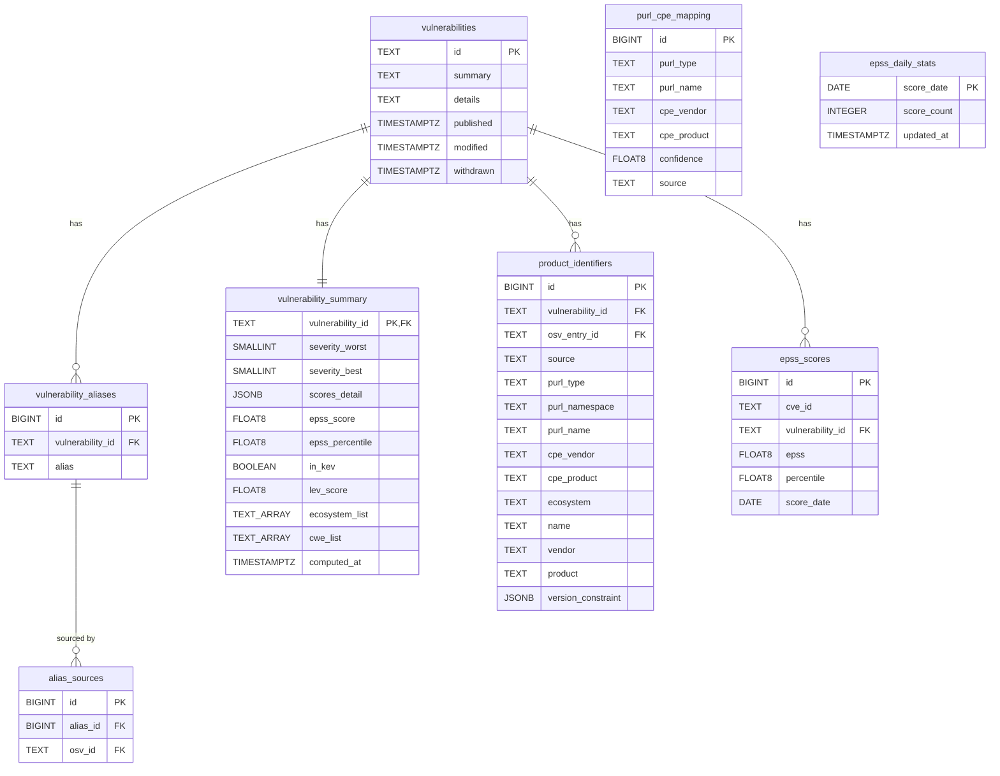
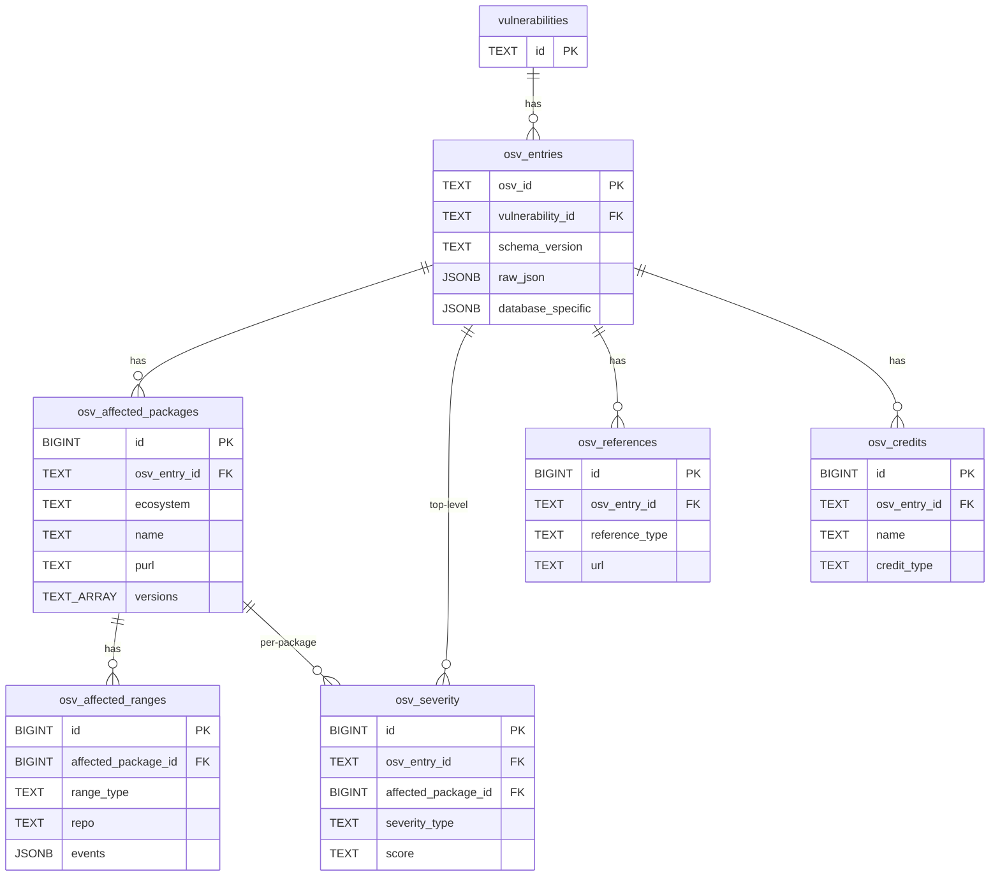
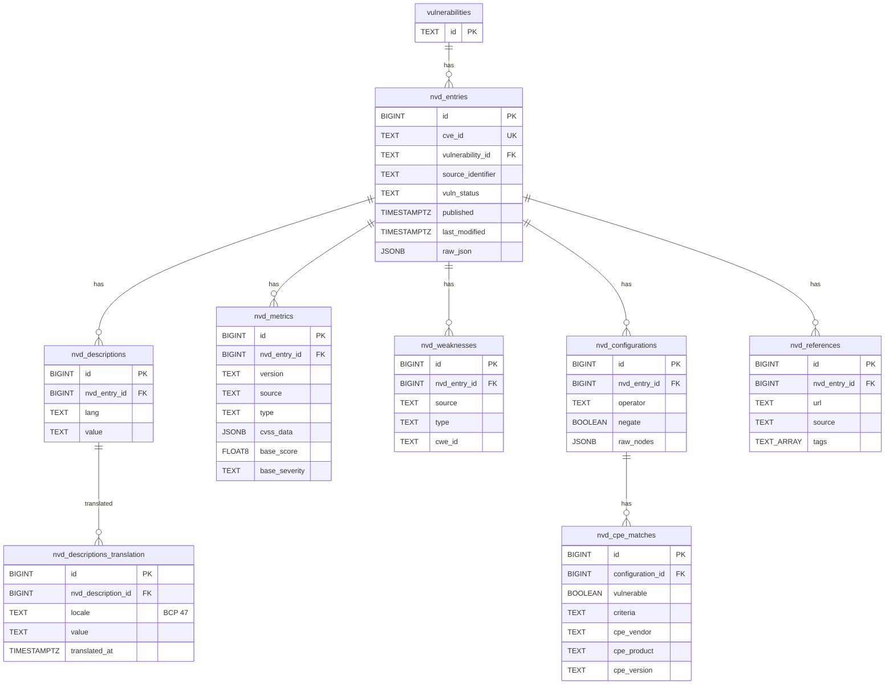
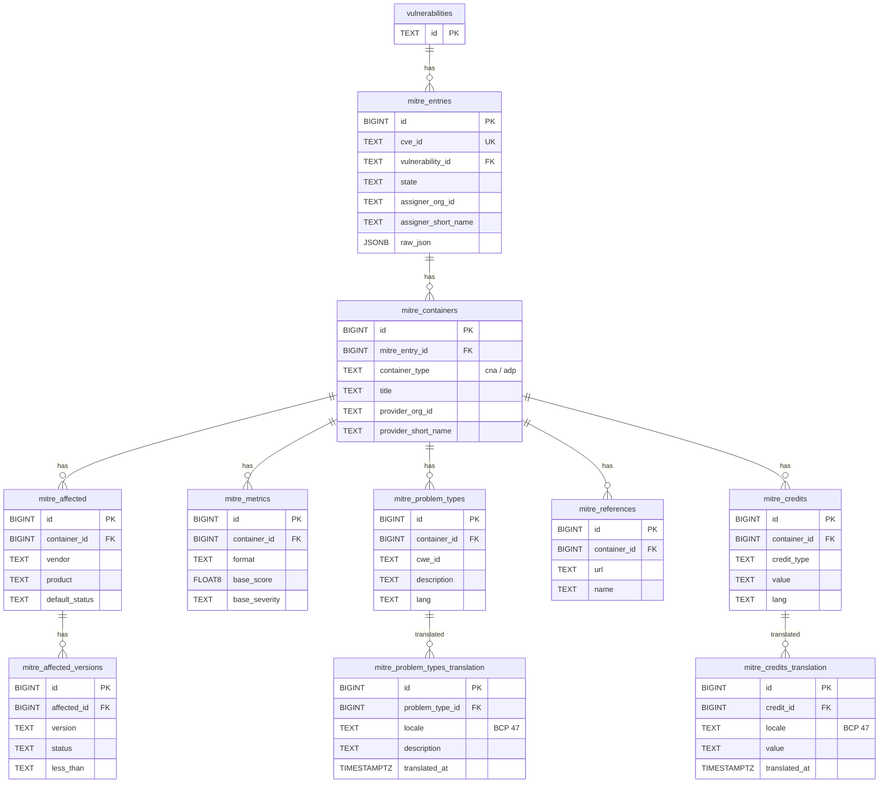
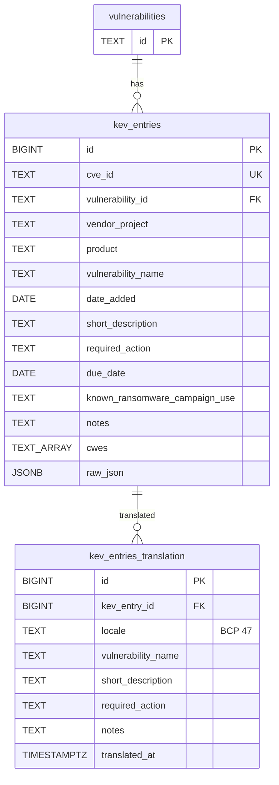
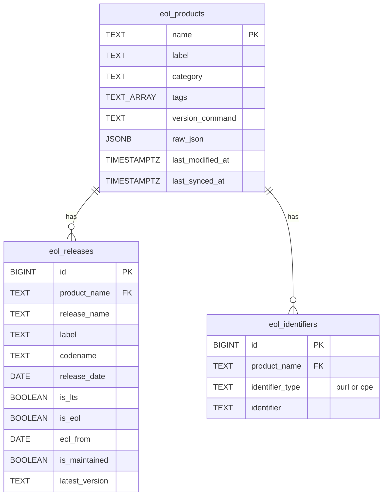
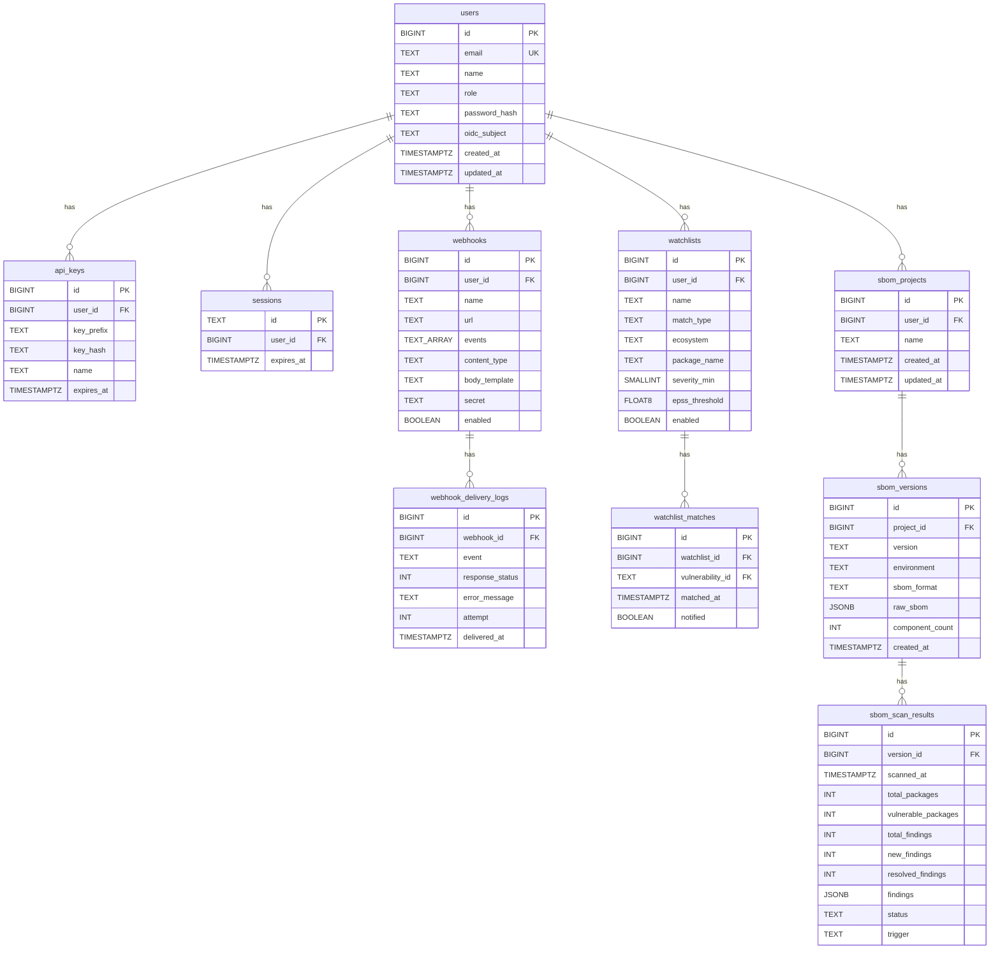
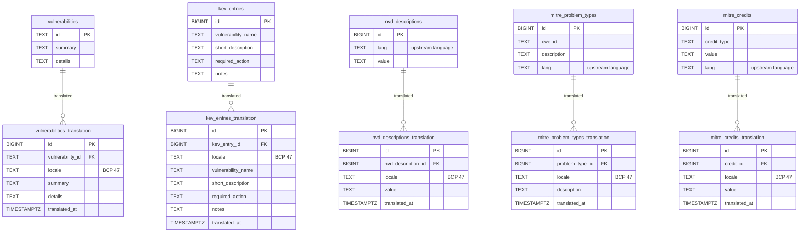

# Entity-Relationship Diagram (Proposed)

```mermaid
erDiagram
    vulnerabilities {
        TEXT id PK "Canonical ID (CVE-xxx or source-specific ID)"
        TEXT summary
        TEXT details
        TIMESTAMPTZ published
        TIMESTAMPTZ modified
        TIMESTAMPTZ withdrawn
    }

    vulnerability_aliases {
        BIGINT id PK "GENERATED ALWAYS AS IDENTITY"
        TEXT vulnerability_id FK "→ vulnerabilities(id) CASCADE"
        TEXT alias "e.g. GHSA-xxxx, GO-2024-0001"
    }

    alias_sources {
        BIGINT id PK "GENERATED ALWAYS AS IDENTITY"
        BIGINT alias_id FK "→ vulnerability_aliases(id) CASCADE"
        TEXT osv_id FK "→ osv_entries(osv_id) CASCADE"
    }

    vulnerability_summary {
        TEXT vulnerability_id PK, FK "→ vulnerabilities(id) CASCADE"
        SMALLINT severity_worst "5=CRITICAL,4=HIGH,3=MED,2=LOW,1=NONE"
        SMALLINT severity_best "same scale"
        JSONB scores_detail "per-source scores array"
        FLOAT8 epss_score "latest EPSS probability"
        FLOAT8 epss_percentile "latest EPSS percentile"
        BOOLEAN in_kev "in CISA KEV catalog"
        FLOAT8 lev_score "LEV probability"
        TEXT_ARRAY ecosystem_list "GIN indexed"
        TEXT_ARRAY cwe_list "GIN indexed"
        TIMESTAMPTZ computed_at
    }

    product_identifiers {
        BIGINT id PK "GENERATED ALWAYS AS IDENTITY"
        TEXT vulnerability_id FK "→ vulnerabilities(id) CASCADE"
        TEXT osv_entry_id FK "→ osv_entries(osv_id) CASCADE (nullable, OSV source only)"
        TEXT source "osv, nvd, mitre"
        TEXT purl_type "golang, npm, maven..."
        TEXT purl_namespace
        TEXT purl_name
        TEXT purl_version
        TEXT purl_qualifiers
        TEXT purl_subpath
        TEXT cpe_part "a, h, o"
        TEXT cpe_vendor
        TEXT cpe_product
        TEXT cpe_version
        TEXT cpe_update
        TEXT cpe_edition
        TEXT cpe_language
        TEXT cpe_sw_edition
        TEXT cpe_target_sw
        TEXT cpe_target_hw
        TEXT cpe_other
        TEXT ecosystem "Go, npm, PyPI..."
        TEXT name "package name"
        TEXT vendor "CPE/MITRE vendor"
        TEXT product "CPE/MITRE product"
        JSONB version_constraint "normalized version ranges"
    }

    purl_cpe_mapping {
        BIGINT id PK "GENERATED ALWAYS AS IDENTITY"
        TEXT purl_type "golang, npm, maven..."
        TEXT purl_name "package name in purl"
        TEXT cpe_vendor "CPE vendor"
        TEXT cpe_product "CPE product"
        FLOAT8 confidence "mapping confidence 0.0-1.0"
        TEXT source "nvd-cpe-dict, heuristic, manual"
    }

    osv_entries {
        TEXT osv_id PK "Normalized (DEBIAN-CVE-* etc.)"
        TEXT vulnerability_id FK "→ vulnerabilities(id) CASCADE"
        TEXT schema_version
        JSONB raw_json "Original OSV JSON (reversibility)"
        JSONB database_specific
    }

    osv_affected_packages {
        BIGINT id PK "GENERATED ALWAYS AS IDENTITY"
        TEXT osv_entry_id FK "→ osv_entries(osv_id) CASCADE"
        TEXT ecosystem
        TEXT name
        TEXT purl
        TEXT_ARRAY versions
        JSONB ecosystem_specific
        JSONB database_specific
    }

    osv_affected_ranges {
        BIGINT id PK "GENERATED ALWAYS AS IDENTITY"
        BIGINT affected_package_id FK "→ osv_affected_packages(id) CASCADE"
        TEXT range_type
        TEXT repo
        JSONB events
        JSONB database_specific
    }

    osv_severity {
        BIGINT id PK "GENERATED ALWAYS AS IDENTITY"
        TEXT osv_entry_id FK "→ osv_entries(osv_id) CASCADE"
        BIGINT affected_package_id FK "nullable → osv_affected_packages(id) CASCADE"
        TEXT severity_type
        TEXT score
        TEXT source
    }

    osv_references {
        BIGINT id PK "GENERATED ALWAYS AS IDENTITY"
        TEXT osv_entry_id FK "→ osv_entries(osv_id) CASCADE"
        TEXT reference_type
        TEXT url
    }

    osv_credits {
        BIGINT id PK "GENERATED ALWAYS AS IDENTITY"
        TEXT osv_entry_id FK "→ osv_entries(osv_id) CASCADE"
        TEXT name
        TEXT_ARRAY contact
        TEXT credit_type
    }

    nvd_entries {
        BIGINT id PK "GENERATED ALWAYS AS IDENTITY"
        TEXT cve_id UK
        TEXT vulnerability_id FK "→ vulnerabilities(id) CASCADE"
        TEXT source_identifier
        TEXT vuln_status
        TIMESTAMPTZ published
        TIMESTAMPTZ last_modified
        JSONB raw_json "Full NVD cve object (reversibility)"
    }

    nvd_descriptions {
        BIGINT id PK "GENERATED ALWAYS AS IDENTITY"
        BIGINT nvd_entry_id FK "→ nvd_entries(id) CASCADE"
        TEXT lang
        TEXT value
    }

    nvd_metrics {
        BIGINT id PK "GENERATED ALWAYS AS IDENTITY"
        BIGINT nvd_entry_id FK "→ nvd_entries(id) CASCADE"
        TEXT version "v2, v31, v40"
        TEXT source
        TEXT type "Primary / Secondary"
        JSONB cvss_data
        FLOAT8 base_score
        TEXT base_severity
        FLOAT8 exploitability_score
        FLOAT8 impact_score
    }

    nvd_weaknesses {
        BIGINT id PK "GENERATED ALWAYS AS IDENTITY"
        BIGINT nvd_entry_id FK "→ nvd_entries(id) CASCADE"
        TEXT source
        TEXT type
        TEXT cwe_id
    }

    nvd_configurations {
        BIGINT id PK "GENERATED ALWAYS AS IDENTITY"
        BIGINT nvd_entry_id FK "→ nvd_entries(id) CASCADE"
        TEXT operator
        BOOLEAN negate
        JSONB raw_nodes
    }

    nvd_cpe_matches {
        BIGINT id PK "GENERATED ALWAYS AS IDENTITY"
        BIGINT configuration_id FK "→ nvd_configurations(id) CASCADE"
        BOOLEAN vulnerable
        TEXT criteria
        TEXT match_criteria_id
        TEXT version_start_including
        TEXT version_start_excluding
        TEXT version_end_including
        TEXT version_end_excluding
        TEXT cpe_part "decomposed from criteria"
        TEXT cpe_vendor
        TEXT cpe_product
        TEXT cpe_version
        TEXT cpe_update
        TEXT cpe_edition
        TEXT cpe_language
        TEXT cpe_sw_edition
        TEXT cpe_target_sw
        TEXT cpe_target_hw
        TEXT cpe_other
    }

    nvd_references {
        BIGINT id PK "GENERATED ALWAYS AS IDENTITY"
        BIGINT nvd_entry_id FK "→ nvd_entries(id) CASCADE"
        TEXT url
        TEXT source
        TEXT_ARRAY tags
    }

    mitre_entries {
        BIGINT id PK "GENERATED ALWAYS AS IDENTITY"
        TEXT cve_id UK
        TEXT vulnerability_id FK "→ vulnerabilities(id) CASCADE"
        TEXT data_version
        TEXT state
        TEXT assigner_org_id
        TEXT assigner_short_name
        TIMESTAMPTZ date_reserved
        TIMESTAMPTZ date_published
        TIMESTAMPTZ date_updated
        JSONB raw_json "Full CVE Record (reversibility)"
    }

    mitre_containers {
        BIGINT id PK "GENERATED ALWAYS AS IDENTITY"
        BIGINT mitre_entry_id FK "→ mitre_entries(id) CASCADE"
        TEXT container_type "cna / adp"
        TEXT title
        TEXT provider_org_id
        TEXT provider_short_name
        TIMESTAMPTZ date_updated
    }

    mitre_affected {
        BIGINT id PK "GENERATED ALWAYS AS IDENTITY"
        BIGINT container_id FK "→ mitre_containers(id) CASCADE"
        TEXT vendor
        TEXT product
        TEXT default_status
        TEXT_ARRAY platforms
        TEXT_ARRAY modules
        TEXT package_url
    }

    mitre_affected_versions {
        BIGINT id PK "GENERATED ALWAYS AS IDENTITY"
        BIGINT affected_id FK "→ mitre_affected(id) CASCADE"
        TEXT version
        TEXT version_type
        TEXT status
        TEXT less_than
        TEXT less_than_or_equal
        JSONB changes
    }

    mitre_metrics {
        BIGINT id PK "GENERATED ALWAYS AS IDENTITY"
        BIGINT container_id FK "→ mitre_containers(id) CASCADE"
        TEXT format
        TEXT cvss_version
        FLOAT8 base_score
        TEXT base_severity
        TEXT vector_string
        JSONB cvss_data
        JSONB scenarios
    }

    mitre_problem_types {
        BIGINT id PK "GENERATED ALWAYS AS IDENTITY"
        BIGINT container_id FK "→ mitre_containers(id) CASCADE"
        TEXT cwe_id
        TEXT description
        TEXT lang
    }

    mitre_references {
        BIGINT id PK "GENERATED ALWAYS AS IDENTITY"
        BIGINT container_id FK "→ mitre_containers(id) CASCADE"
        TEXT url
        TEXT name
        TEXT_ARRAY tags
    }

    mitre_credits {
        BIGINT id PK "GENERATED ALWAYS AS IDENTITY"
        BIGINT container_id FK "→ mitre_containers(id) CASCADE"
        TEXT credit_type
        TEXT value
        TEXT lang
    }

    epss_scores {
        BIGINT id PK "GENERATED ALWAYS AS IDENTITY"
        TEXT cve_id
        TEXT vulnerability_id FK "→ vulnerabilities(id) CASCADE"
        FLOAT8 epss
        FLOAT8 percentile
        DATE score_date
        JSONB raw_json
    }

    epss_daily_stats {
        DATE score_date PK
        INTEGER score_count "NOT NULL"
        TIMESTAMPTZ updated_at "DEFAULT NOW()"
    }

    kev_entries {
        BIGINT id PK "GENERATED ALWAYS AS IDENTITY"
        TEXT cve_id UK
        TEXT vulnerability_id FK "→ vulnerabilities(id) CASCADE"
        TEXT vendor_project
        TEXT product
        TEXT vulnerability_name
        DATE date_added
        TEXT short_description
        TEXT required_action
        DATE due_date
        TEXT known_ransomware_campaign_use
        TEXT notes
        TEXT_ARRAY cwes
        JSONB raw_json
    }

    sync_state {
        TEXT source PK
        TEXT source_type "osv, nvd, mitre, epss, kev"
        TIMESTAMPTZ last_modified_at
        TIMESTAMPTZ last_synced_at
        BIGINT record_count
    }

    osv_ecosystems {
        TEXT name PK
        TIMESTAMPTZ created_at
    }

    eol_products {
        TEXT name PK "endoflife.date product name (e.g. nodejs, python)"
        TEXT label "NOT NULL, human-readable (e.g. Node.js)"
        TEXT category "framework, lang, os, server-app, etc."
        TEXT_ARRAY tags
        TEXT version_command "e.g. node --version"
        JSONB raw_json "Full product API response (reversibility)"
        TIMESTAMPTZ last_modified_at
        TIMESTAMPTZ last_synced_at "DEFAULT NOW()"
    }

    eol_releases {
        BIGINT id PK "GENERATED ALWAYS AS IDENTITY"
        TEXT product_name FK "→ eol_products(name) CASCADE"
        TEXT release_name "e.g. 22, 3.12, 24.04"
        TEXT label "e.g. 22 (LTS)"
        TEXT codename "e.g. Noble Numbat"
        DATE release_date
        BOOLEAN is_lts
        DATE lts_from
        BOOLEAN is_eoas "active support ended"
        DATE eoas_from
        BOOLEAN is_eol "end of life"
        DATE eol_from
        BOOLEAN is_eoes "extended support ended"
        DATE eoes_from
        BOOLEAN is_maintained
        TEXT latest_version
        DATE latest_version_date
        TEXT latest_version_link
    }

    eol_identifiers {
        BIGINT id PK "GENERATED ALWAYS AS IDENTITY"
        TEXT product_name FK "→ eol_products(name) CASCADE"
        TEXT identifier_type "purl or cpe"
        TEXT identifier "e.g. pkg:npm/node, cpe:2.3:a:nodejs:node.js"
    }

    ingest_jobs {
        BIGINT id PK "GENERATED ALWAYS AS IDENTITY"
        JSONB command_args "e.g. {ecosystem:Go, update:true}"
        TEXT source "osv, nvd, mitre, epss, kev, ghsa"
        TIMESTAMPTZ started_at
        TIMESTAMPTZ finished_at
        TEXT status "running, success, failed, partial"
        INT total_count
        INT success_count
        INT failure_count
        TEXT error_message "job-level error"
        TEXT error_stack "job-level stack trace"
    }

    ingest_failures {
        BIGINT id PK "GENERATED ALWAYS AS IDENTITY"
        BIGINT job_id FK "→ ingest_jobs(id) CASCADE"
        TEXT vuln_id "CVE-xxx or OSV-ID"
        TEXT error_type "parse_error, store_error, fetch_error"
        TEXT error_message
        TEXT error_stack "stack trace at failure point"
        TIMESTAMPTZ failed_at
    }

    users {
        BIGINT id PK "GENERATED ALWAYS AS IDENTITY"
        TEXT email UK "UNIQUE NOT NULL"
        TEXT name
        TEXT role "admin or viewer, DEFAULT viewer"
        TEXT password_hash "nullable, for local auth"
        TEXT oidc_subject "nullable, for OIDC"
        TIMESTAMPTZ created_at "DEFAULT NOW()"
        TIMESTAMPTZ updated_at "DEFAULT NOW()"
    }

    api_keys {
        BIGINT id PK "GENERATED ALWAYS AS IDENTITY"
        BIGINT user_id FK "→ users(id) CASCADE"
        TEXT key_prefix "first 8 chars for identification"
        TEXT key_hash "NOT NULL"
        TEXT name
        TIMESTAMPTZ created_at "DEFAULT NOW()"
        TIMESTAMPTZ expires_at
    }

    sessions {
        TEXT id PK "random token"
        BIGINT user_id FK "→ users(id) CASCADE"
        TIMESTAMPTZ created_at "DEFAULT NOW()"
        TIMESTAMPTZ expires_at "NOT NULL"
    }

    webhooks {
        BIGINT id PK "GENERATED ALWAYS AS IDENTITY"
        BIGINT user_id FK "→ users(id) CASCADE (nullable)"
        TEXT name "NOT NULL"
        TEXT url "NOT NULL"
        TEXT_ARRAY events "NOT NULL"
        TEXT content_type "NOT NULL DEFAULT 'application/json'"
        TEXT body_template "NOT NULL"
        TEXT secret "nullable, HMAC shared secret"
        BOOLEAN enabled "NOT NULL DEFAULT true"
        TIMESTAMPTZ created_at "DEFAULT NOW()"
        TIMESTAMPTZ updated_at "DEFAULT NOW()"
    }

    watchlists {
        BIGINT id PK "GENERATED ALWAYS AS IDENTITY"
        BIGINT user_id FK "→ users(id) CASCADE"
        TEXT name "NOT NULL"
        TEXT match_type "NOT NULL: package, purl, cpe, ecosystem"
        TEXT ecosystem "nullable, for package/ecosystem match"
        TEXT package_name "nullable, for package match"
        TEXT purl_pattern "nullable, for purl match"
        TEXT cpe_pattern "nullable, for cpe match"
        SMALLINT severity_min "nullable, 1-5 scale"
        FLOAT8 epss_threshold "nullable, 0.0-1.0"
        BOOLEAN enabled "NOT NULL DEFAULT true"
        TIMESTAMPTZ created_at "DEFAULT NOW()"
        TIMESTAMPTZ updated_at "DEFAULT NOW()"
    }

    webhook_delivery_logs {
        BIGINT id PK "GENERATED ALWAYS AS IDENTITY"
        BIGINT webhook_id FK "→ webhooks(id) CASCADE"
        TEXT event "NOT NULL"
        TEXT payload "nullable"
        INT response_status "nullable"
        TEXT response_body "nullable"
        TEXT error_message "nullable"
        INT attempt "NOT NULL DEFAULT 1"
        TIMESTAMPTZ delivered_at "DEFAULT NOW()"
        INT duration_ms "nullable"
    }

    watchlist_matches {
        BIGINT id PK "GENERATED ALWAYS AS IDENTITY"
        BIGINT watchlist_id FK "→ watchlists(id) CASCADE"
        TEXT vulnerability_id FK "→ vulnerabilities(id) CASCADE"
        TIMESTAMPTZ matched_at "DEFAULT NOW()"
        BOOLEAN notified "NOT NULL DEFAULT false"
        TIMESTAMPTZ notified_at "nullable"
    }

    sbom_projects {
        BIGINT id PK "GENERATED ALWAYS AS IDENTITY"
        BIGINT user_id FK "→ users(id) CASCADE"
        TEXT name "NOT NULL"
        TIMESTAMPTZ created_at "DEFAULT NOW()"
        TIMESTAMPTZ updated_at "DEFAULT NOW()"
    }

    sbom_versions {
        BIGINT id PK "GENERATED ALWAYS AS IDENTITY"
        BIGINT project_id FK "→ sbom_projects(id) CASCADE"
        TEXT version "NOT NULL"
        TEXT environment "nullable"
        TEXT sbom_format "NOT NULL"
        JSONB raw_sbom "NOT NULL"
        INT component_count "NOT NULL"
        TIMESTAMPTZ created_at "DEFAULT NOW()"
    }

    sbom_scan_results {
        BIGINT id PK "GENERATED ALWAYS AS IDENTITY"
        BIGINT version_id FK "→ sbom_versions(id) CASCADE"
        TIMESTAMPTZ scanned_at "DEFAULT NOW()"
        INT total_packages "NOT NULL"
        INT vulnerable_packages "NOT NULL"
        INT total_findings "NOT NULL"
        INT new_findings "NOT NULL DEFAULT 0"
        INT resolved_findings "NOT NULL DEFAULT 0"
        JSONB findings "NOT NULL"
        TEXT status "NOT NULL DEFAULT completed: completed, failed"
        TEXT trigger "NOT NULL DEFAULT manual: manual, ingest, api"
    }

    vulnerabilities ||--o{ vulnerability_aliases : "has"
    vulnerabilities ||--|| vulnerability_summary : "has"
    vulnerabilities ||--o{ product_identifiers : "has"
    vulnerabilities ||--o{ osv_entries : "has"
    vulnerabilities ||--o{ nvd_entries : "has"
    vulnerabilities ||--o{ mitre_entries : "has"
    vulnerabilities ||--o{ epss_scores : "has"
    vulnerabilities ||--o{ kev_entries : "has"
    vulnerability_aliases ||--o{ alias_sources : "sourced by"
    osv_entries ||--o{ osv_affected_packages : "has"
    osv_entries ||--o{ osv_severity : "top-level severity"
    osv_entries ||--o{ osv_references : "has"
    osv_entries ||--o{ osv_credits : "has"
    osv_affected_packages ||--o{ osv_affected_ranges : "has"
    osv_affected_packages ||--o{ osv_severity : "per-package severity"
    nvd_entries ||--o{ nvd_descriptions : "has"
    nvd_entries ||--o{ nvd_metrics : "has"
    nvd_entries ||--o{ nvd_weaknesses : "has"
    nvd_entries ||--o{ nvd_configurations : "has"
    nvd_configurations ||--o{ nvd_cpe_matches : "has"
    nvd_entries ||--o{ nvd_references : "has"
    mitre_entries ||--o{ mitre_containers : "has"
    mitre_containers ||--o{ mitre_affected : "has"
    mitre_containers ||--o{ mitre_metrics : "has"
    mitre_containers ||--o{ mitre_problem_types : "has"
    mitre_containers ||--o{ mitre_references : "has"
    mitre_containers ||--o{ mitre_credits : "has"
    mitre_affected ||--o{ mitre_affected_versions : "has"
    ingest_jobs ||--o{ ingest_failures : "has"
    users ||--o{ api_keys : "has"
    users ||--o{ sessions : "has"
    webhooks ||--o{ webhook_delivery_logs : "has"
    users ||--o{ webhooks : "has"
    users ||--o{ watchlists : "has"
    watchlists ||--o{ watchlist_matches : "has"
    vulnerabilities ||--o{ watchlist_matches : "has"
    users ||--o{ sbom_projects : "has"
    sbom_projects ||--o{ sbom_versions : "has"
    sbom_versions ||--o{ sbom_scan_results : "has"
    eol_products ||--o{ eol_releases : "has"
    eol_products ||--o{ eol_identifiers : "has"

    vulnerabilities_translation {
        BIGINT id PK "GENERATED ALWAYS AS IDENTITY"
        TEXT vulnerability_id FK "→ vulnerabilities(id) CASCADE"
        TEXT locale "BCP 47: ja, ko, zh-Hans, etc."
        TEXT summary
        TEXT details
        TIMESTAMPTZ translated_at "DEFAULT NOW()"
    }

    kev_entries_translation {
        BIGINT id PK "GENERATED ALWAYS AS IDENTITY"
        BIGINT kev_entry_id FK "→ kev_entries(id) CASCADE"
        TEXT locale "BCP 47"
        TEXT vulnerability_name
        TEXT short_description
        TEXT required_action
        TEXT notes
        TIMESTAMPTZ translated_at "DEFAULT NOW()"
    }

    nvd_descriptions_translation {
        BIGINT id PK "GENERATED ALWAYS AS IDENTITY"
        BIGINT nvd_description_id FK "→ nvd_descriptions(id) CASCADE"
        TEXT locale "BCP 47"
        TEXT value "NOT NULL"
        TIMESTAMPTZ translated_at "DEFAULT NOW()"
    }

    mitre_problem_types_translation {
        BIGINT id PK "GENERATED ALWAYS AS IDENTITY"
        BIGINT problem_type_id FK "→ mitre_problem_types(id) CASCADE"
        TEXT locale "BCP 47"
        TEXT description "NOT NULL"
        TIMESTAMPTZ translated_at "DEFAULT NOW()"
    }

    mitre_credits_translation {
        BIGINT id PK "GENERATED ALWAYS AS IDENTITY"
        BIGINT credit_id FK "→ mitre_credits(id) CASCADE"
        TEXT locale "BCP 47"
        TEXT value "NOT NULL"
        TIMESTAMPTZ translated_at "DEFAULT NOW()"
    }

    vulnerabilities ||--o{ vulnerabilities_translation : "translated"
    kev_entries ||--o{ kev_entries_translation : "translated"
    nvd_descriptions ||--o{ nvd_descriptions_translation : "translated"
    mitre_problem_types ||--o{ mitre_problem_types_translation : "translated"
    mitre_credits ||--o{ mitre_credits_translation : "translated"
```

---

## Domain-Specific Diagrams (分割図)

全体図が大きいため、ドメインごとに分割した図を以下に示します。

### Core Vulnerability & Aggregation


```mermaid
erDiagram
    vulnerabilities {
        TEXT id PK
        TEXT summary
        TEXT details
        TIMESTAMPTZ published
        TIMESTAMPTZ modified
        TIMESTAMPTZ withdrawn
    }

    vulnerability_aliases {
        BIGINT id PK
        TEXT vulnerability_id FK
        TEXT alias
    }

    alias_sources {
        BIGINT id PK
        BIGINT alias_id FK
        TEXT osv_id FK
    }

    vulnerability_summary {
        TEXT vulnerability_id PK, FK
        SMALLINT severity_worst
        SMALLINT severity_best
        JSONB scores_detail
        FLOAT8 epss_score
        FLOAT8 epss_percentile
        BOOLEAN in_kev
        FLOAT8 lev_score
        TEXT_ARRAY ecosystem_list
        TEXT_ARRAY cwe_list
        TIMESTAMPTZ computed_at
    }

    product_identifiers {
        BIGINT id PK
        TEXT vulnerability_id FK
        TEXT osv_entry_id FK
        TEXT source
        TEXT purl_type
        TEXT purl_namespace
        TEXT purl_name
        TEXT cpe_vendor
        TEXT cpe_product
        TEXT ecosystem
        TEXT name
        TEXT vendor
        TEXT product
        JSONB version_constraint
    }

    purl_cpe_mapping {
        BIGINT id PK
        TEXT purl_type
        TEXT purl_name
        TEXT cpe_vendor
        TEXT cpe_product
        FLOAT8 confidence
        TEXT source
    }

    epss_scores {
        BIGINT id PK
        TEXT cve_id
        TEXT vulnerability_id FK
        FLOAT8 epss
        FLOAT8 percentile
        DATE score_date
    }

    epss_daily_stats {
        DATE score_date PK
        INTEGER score_count
        TIMESTAMPTZ updated_at
    }

    vulnerabilities ||--o{ vulnerability_aliases : "has"
    vulnerabilities ||--|| vulnerability_summary : "has"
    vulnerabilities ||--o{ product_identifiers : "has"
    vulnerabilities ||--o{ epss_scores : "has"
    vulnerability_aliases ||--o{ alias_sources : "sourced by"
```

### OSV Data


```mermaid
erDiagram
    vulnerabilities {
        TEXT id PK
    }

    osv_entries {
        TEXT osv_id PK
        TEXT vulnerability_id FK
        TEXT schema_version
        JSONB raw_json
        JSONB database_specific
    }

    osv_affected_packages {
        BIGINT id PK
        TEXT osv_entry_id FK
        TEXT ecosystem
        TEXT name
        TEXT purl
        TEXT_ARRAY versions
    }

    osv_affected_ranges {
        BIGINT id PK
        BIGINT affected_package_id FK
        TEXT range_type
        TEXT repo
        JSONB events
    }

    osv_severity {
        BIGINT id PK
        TEXT osv_entry_id FK
        BIGINT affected_package_id FK
        TEXT severity_type
        TEXT score
    }

    osv_references {
        BIGINT id PK
        TEXT osv_entry_id FK
        TEXT reference_type
        TEXT url
    }

    osv_credits {
        BIGINT id PK
        TEXT osv_entry_id FK
        TEXT name
        TEXT credit_type
    }

    vulnerabilities ||--o{ osv_entries : "has"
    osv_entries ||--o{ osv_affected_packages : "has"
    osv_entries ||--o{ osv_severity : "top-level"
    osv_entries ||--o{ osv_references : "has"
    osv_entries ||--o{ osv_credits : "has"
    osv_affected_packages ||--o{ osv_affected_ranges : "has"
    osv_affected_packages ||--o{ osv_severity : "per-package"
```

### NVD Data


```mermaid
erDiagram
    vulnerabilities {
        TEXT id PK
    }

    nvd_entries {
        BIGINT id PK
        TEXT cve_id UK
        TEXT vulnerability_id FK
        TEXT source_identifier
        TEXT vuln_status
        TIMESTAMPTZ published
        TIMESTAMPTZ last_modified
        JSONB raw_json
    }

    nvd_descriptions {
        BIGINT id PK
        BIGINT nvd_entry_id FK
        TEXT lang
        TEXT value
    }

    nvd_metrics {
        BIGINT id PK
        BIGINT nvd_entry_id FK
        TEXT version
        TEXT source
        TEXT type
        JSONB cvss_data
        FLOAT8 base_score
        TEXT base_severity
    }

    nvd_weaknesses {
        BIGINT id PK
        BIGINT nvd_entry_id FK
        TEXT source
        TEXT type
        TEXT cwe_id
    }

    nvd_configurations {
        BIGINT id PK
        BIGINT nvd_entry_id FK
        TEXT operator
        BOOLEAN negate
        JSONB raw_nodes
    }

    nvd_cpe_matches {
        BIGINT id PK
        BIGINT configuration_id FK
        BOOLEAN vulnerable
        TEXT criteria
        TEXT cpe_vendor
        TEXT cpe_product
        TEXT cpe_version
    }

    nvd_references {
        BIGINT id PK
        BIGINT nvd_entry_id FK
        TEXT url
        TEXT source
        TEXT_ARRAY tags
    }

    nvd_descriptions_translation {
        BIGINT id PK
        BIGINT nvd_description_id FK
        TEXT locale "BCP 47"
        TEXT value
        TIMESTAMPTZ translated_at
    }

    vulnerabilities ||--o{ nvd_entries : "has"
    nvd_entries ||--o{ nvd_descriptions : "has"
    nvd_entries ||--o{ nvd_metrics : "has"
    nvd_entries ||--o{ nvd_weaknesses : "has"
    nvd_entries ||--o{ nvd_configurations : "has"
    nvd_configurations ||--o{ nvd_cpe_matches : "has"
    nvd_entries ||--o{ nvd_references : "has"
    nvd_descriptions ||--o{ nvd_descriptions_translation : "translated"
```

### MITRE Data


```mermaid
erDiagram
    vulnerabilities {
        TEXT id PK
    }

    mitre_entries {
        BIGINT id PK
        TEXT cve_id UK
        TEXT vulnerability_id FK
        TEXT state
        TEXT assigner_org_id
        TEXT assigner_short_name
        JSONB raw_json
    }

    mitre_containers {
        BIGINT id PK
        BIGINT mitre_entry_id FK
        TEXT container_type "cna / adp"
        TEXT title
        TEXT provider_org_id
        TEXT provider_short_name
    }

    mitre_affected {
        BIGINT id PK
        BIGINT container_id FK
        TEXT vendor
        TEXT product
        TEXT default_status
    }

    mitre_affected_versions {
        BIGINT id PK
        BIGINT affected_id FK
        TEXT version
        TEXT status
        TEXT less_than
    }

    mitre_metrics {
        BIGINT id PK
        BIGINT container_id FK
        TEXT format
        FLOAT8 base_score
        TEXT base_severity
    }

    mitre_problem_types {
        BIGINT id PK
        BIGINT container_id FK
        TEXT cwe_id
        TEXT description
        TEXT lang
    }

    mitre_references {
        BIGINT id PK
        BIGINT container_id FK
        TEXT url
        TEXT name
    }

    mitre_credits {
        BIGINT id PK
        BIGINT container_id FK
        TEXT credit_type
        TEXT value
        TEXT lang
    }

    mitre_problem_types_translation {
        BIGINT id PK
        BIGINT problem_type_id FK
        TEXT locale "BCP 47"
        TEXT description
        TIMESTAMPTZ translated_at
    }

    mitre_credits_translation {
        BIGINT id PK
        BIGINT credit_id FK
        TEXT locale "BCP 47"
        TEXT value
        TIMESTAMPTZ translated_at
    }

    vulnerabilities ||--o{ mitre_entries : "has"
    mitre_entries ||--o{ mitre_containers : "has"
    mitre_containers ||--o{ mitre_affected : "has"
    mitre_containers ||--o{ mitre_metrics : "has"
    mitre_containers ||--o{ mitre_problem_types : "has"
    mitre_containers ||--o{ mitre_references : "has"
    mitre_containers ||--o{ mitre_credits : "has"
    mitre_affected ||--o{ mitre_affected_versions : "has"
    mitre_problem_types ||--o{ mitre_problem_types_translation : "translated"
    mitre_credits ||--o{ mitre_credits_translation : "translated"
```

### KEV & EPSS


```mermaid
erDiagram
    vulnerabilities {
        TEXT id PK
    }

    kev_entries {
        BIGINT id PK
        TEXT cve_id UK
        TEXT vulnerability_id FK
        TEXT vendor_project
        TEXT product
        TEXT vulnerability_name
        DATE date_added
        TEXT short_description
        TEXT required_action
        DATE due_date
        TEXT known_ransomware_campaign_use
        TEXT notes
        TEXT_ARRAY cwes
        JSONB raw_json
    }

    kev_entries_translation {
        BIGINT id PK
        BIGINT kev_entry_id FK
        TEXT locale "BCP 47"
        TEXT vulnerability_name
        TEXT short_description
        TEXT required_action
        TEXT notes
        TIMESTAMPTZ translated_at
    }

    vulnerabilities ||--o{ kev_entries : "has"
    kev_entries ||--o{ kev_entries_translation : "translated"
```

### EOL (End of Life)


```mermaid
erDiagram
    eol_products {
        TEXT name PK
        TEXT label
        TEXT category
        TEXT_ARRAY tags
        TEXT version_command
        JSONB raw_json
        TIMESTAMPTZ last_modified_at
        TIMESTAMPTZ last_synced_at
    }

    eol_releases {
        BIGINT id PK
        TEXT product_name FK
        TEXT release_name
        TEXT label
        TEXT codename
        DATE release_date
        BOOLEAN is_lts
        BOOLEAN is_eol
        DATE eol_from
        BOOLEAN is_maintained
        TEXT latest_version
    }

    eol_identifiers {
        BIGINT id PK
        TEXT product_name FK
        TEXT identifier_type "purl or cpe"
        TEXT identifier
    }

    eol_products ||--o{ eol_releases : "has"
    eol_products ||--o{ eol_identifiers : "has"
```

### User, Auth & Notifications


```mermaid
erDiagram
    users {
        BIGINT id PK
        TEXT email UK
        TEXT name
        TEXT role
        TEXT password_hash
        TEXT oidc_subject
        TIMESTAMPTZ created_at
        TIMESTAMPTZ updated_at
    }

    api_keys {
        BIGINT id PK
        BIGINT user_id FK
        TEXT key_prefix
        TEXT key_hash
        TEXT name
        TIMESTAMPTZ expires_at
    }

    sessions {
        TEXT id PK
        BIGINT user_id FK
        TIMESTAMPTZ expires_at
    }

    webhooks {
        BIGINT id PK
        BIGINT user_id FK
        TEXT name
        TEXT url
        TEXT_ARRAY events
        TEXT content_type
        TEXT body_template
        TEXT secret
        BOOLEAN enabled
    }

    webhook_delivery_logs {
        BIGINT id PK
        BIGINT webhook_id FK
        TEXT event
        INT response_status
        TEXT error_message
        INT attempt
        TIMESTAMPTZ delivered_at
    }

    watchlists {
        BIGINT id PK
        BIGINT user_id FK
        TEXT name
        TEXT match_type
        TEXT ecosystem
        TEXT package_name
        SMALLINT severity_min
        FLOAT8 epss_threshold
        BOOLEAN enabled
    }

    watchlist_matches {
        BIGINT id PK
        BIGINT watchlist_id FK
        TEXT vulnerability_id FK
        TIMESTAMPTZ matched_at
        BOOLEAN notified
    }

    sbom_projects {
        BIGINT id PK
        BIGINT user_id FK
        TEXT name
        TIMESTAMPTZ created_at
        TIMESTAMPTZ updated_at
    }

    sbom_versions {
        BIGINT id PK
        BIGINT project_id FK
        TEXT version
        TEXT environment
        TEXT sbom_format
        JSONB raw_sbom
        INT component_count
        TIMESTAMPTZ created_at
    }

    sbom_scan_results {
        BIGINT id PK
        BIGINT version_id FK
        TIMESTAMPTZ scanned_at
        INT total_packages
        INT vulnerable_packages
        INT total_findings
        INT new_findings
        INT resolved_findings
        JSONB findings
        TEXT status
        TEXT trigger
    }

    users ||--o{ api_keys : "has"
    users ||--o{ sessions : "has"
    users ||--o{ webhooks : "has"
    users ||--o{ watchlists : "has"
    users ||--o{ sbom_projects : "has"
    webhooks ||--o{ webhook_delivery_logs : "has"
    watchlists ||--o{ watchlist_matches : "has"
    sbom_projects ||--o{ sbom_versions : "has"
    sbom_versions ||--o{ sbom_scan_results : "has"
```

### Translation (i18n)


```mermaid
erDiagram
    vulnerabilities {
        TEXT id PK
        TEXT summary
        TEXT details
    }

    vulnerabilities_translation {
        BIGINT id PK
        TEXT vulnerability_id FK
        TEXT locale "BCP 47"
        TEXT summary
        TEXT details
        TIMESTAMPTZ translated_at
    }

    kev_entries {
        BIGINT id PK
        TEXT vulnerability_name
        TEXT short_description
        TEXT required_action
        TEXT notes
    }

    kev_entries_translation {
        BIGINT id PK
        BIGINT kev_entry_id FK
        TEXT locale "BCP 47"
        TEXT vulnerability_name
        TEXT short_description
        TEXT required_action
        TEXT notes
        TIMESTAMPTZ translated_at
    }

    nvd_descriptions {
        BIGINT id PK
        TEXT lang "upstream language"
        TEXT value
    }

    nvd_descriptions_translation {
        BIGINT id PK
        BIGINT nvd_description_id FK
        TEXT locale "BCP 47"
        TEXT value
        TIMESTAMPTZ translated_at
    }

    mitre_problem_types {
        BIGINT id PK
        TEXT cwe_id
        TEXT description
        TEXT lang "upstream language"
    }

    mitre_problem_types_translation {
        BIGINT id PK
        BIGINT problem_type_id FK
        TEXT locale "BCP 47"
        TEXT description
        TIMESTAMPTZ translated_at
    }

    mitre_credits {
        BIGINT id PK
        TEXT credit_type
        TEXT value
        TEXT lang "upstream language"
    }

    mitre_credits_translation {
        BIGINT id PK
        BIGINT credit_id FK
        TEXT locale "BCP 47"
        TEXT value
        TIMESTAMPTZ translated_at
    }

    vulnerabilities ||--o{ vulnerabilities_translation : "translated"
    kev_entries ||--o{ kev_entries_translation : "translated"
    nvd_descriptions ||--o{ nvd_descriptions_translation : "translated"
    mitre_problem_types ||--o{ mitre_problem_types_translation : "translated"
    mitre_credits ||--o{ mitre_credits_translation : "translated"
```

---

## Design Principles

### `vulnerabilities` (Unified Master)
Source-agnostic normalized vulnerability records at the granularity displayed in Mayu's vulnerability listing.

- `id`: Uses CVE ID when available (extracted from aliases); otherwise uses the source-specific ID (e.g., GO-2024-XXXX) as-is. Multiple OSV entries sharing the same CVE are grouped under a single row.
- `modified`: Uses `GREATEST` on upsert so the most recent modification time across all contributing entries is retained.
- **No `source` column**: Source existence is determined by JOINing/EXISTS against source-specific tables (osv_entries, nvd_entries, mitre_entries, etc.).

### `vulnerability_aliases`
Cross-reference table for vulnerability identifiers (CVE ↔ GHSA ↔ OSV ID mappings).

- UNIQUE constraint: `(vulnerability_id, alias)` — each alias appears once per vulnerability regardless of how many sources contributed it.
- No `ordering` column: insertion order is tracked by the auto-generated `id`.

### `alias_sources` (Junction Table)
Tracks which OSV entry contributed each alias. Enables safe per-entry alias cleanup on reimport.

- When an OSV entry is reimported, its `alias_sources` rows are deleted. Any `vulnerability_aliases` rows with no remaining `alias_sources` are garbage-collected.
- UNIQUE constraint: `(alias_id, osv_id)` — an OSV entry contributes an alias at most once.

### `vulnerability_summary` (Computed Aggregation)
Pre-computed derived data for list views and filtering. Updated synchronously at the end of each import pipeline.

- **`severity_worst` / `severity_best`**: Normalized to a 5-level scale (5=CRITICAL, 4=HIGH, 3=MEDIUM, 2=LOW, 1=NONE). All scoring systems are converted to this scale.
- **`scores_detail`**: JSONB array preserving per-source raw scores. Each entry contains: `src` (source), `system` (scoring system name), `ver` (version), `score` (raw numeric score or null), `sev` (severity label), `normalized` (5-level value).
- **Severity filtering**: Uses range overlap on normalized levels. E.g., "MEDIUM or above" = `severity_worst >= 3`.
- **No `has_osv`/`has_nvd`/`has_mitre` flags**: Source existence is checked via EXISTS subqueries against source tables (adequate performance with indexed FKs).

#### Severity Normalization Rules

| System | Score Range | → Level |
|--------|------------|---------|
| CVSS (v2/v3/v4) | 9.0–10.0 | 5 (CRITICAL) |
| CVSS | 7.0–8.9 | 4 (HIGH) |
| CVSS | 4.0–6.9 | 3 (MEDIUM) |
| CVSS | 0.1–3.9 | 2 (LOW) |
| CVSS | 0.0 | 1 (NONE) |
| NISTIR 7864 (Drupal) | 20–25 | 5 (Highly Critical) |
| NISTIR 7864 | 15–19 | 4 (Critical) |
| NISTIR 7864 | 10–14 | 3 (Moderately Critical) |
| NISTIR 7864 | 5–9 | 2 (Less Critical) |
| NISTIR 7864 | 0–4 | 1 (Not Critical) |
| SSVC | Act | 5 |
| SSVC | Attend | 4 |
| SSVC | Track* | 3 |
| SSVC | Track | 2 |
| Label-only (GHSA etc.) | critical | 5 |
| Label-only | high | 4 |
| Label-only | medium/moderate | 3 |
| Label-only | low | 2 |
| Label-only | none/informational | 1 |

### `product_identifiers` (Unified Package/Product Search)
Aggregates package and product identification from all sources into a single searchable table.

- Populated during each source's import (OSV → purl/ecosystem/name, NVD → cpe/vendor/product, MITRE → vendor/product/package_url).
- Enables cross-source package search: query by purl, CPE, ecosystem+name, or vendor+product.
- `version_constraint`: Normalized version range info as JSONB for future version matching.
- CPE index uses `text_pattern_ops` for prefix-match (LIKE 'cpe:2.3:a:vendor:product:%').

### `purl_cpe_mapping` (Conversion Dictionary)
Bidirectional mapping between purl identifiers and CPE naming. Used to expand searches across naming conventions.

- Populated from: NVD CPE Dictionary (bulk), heuristic matching (OSV+NVD co-occurrence on same CVE), manual curation.
- `confidence`: 1.0 for exact matches from authoritative sources, lower for heuristic/fuzzy matches.

### `osv_entries` + `osv_*` Tables
OSV-specific detail tables.

- **osv_id normalization**: If the raw OSV `id` field is a bare `CVE-*` and the ecosystem has a defined OSV prefix (e.g., Debian → `DEBIAN`), mayu stores it as `{PREFIX}-{id}` (e.g., `DEBIAN-CVE-2024-1234`). The `raw_json` retains the original value for reversibility.
- Guard: if the id already has a non-CVE prefix, it is stored as-is (prevents double-prefixing if upstream fixes their data).

### `nvd_*` Tables
NVD-specific detail tables. Column details (CPE decomposition, CVSS vector parsing) to be refined separately.

- Upsert strategy: DELETE existing entry (CASCADE) + re-INSERT on reimport.
- `raw_json` stores the complete NVD `cve` object for reversibility.

### `mitre_*` Tables
MITRE CVE Record detail tables. Column details (CVSS vector decomposition) to be refined separately.

- Upsert strategy: DELETE existing entry (CASCADE) + re-INSERT on reimport.
- `raw_json` stores the complete CVE Record for reversibility.

### `epss_scores` Table
EPSS scores from the FIRST API.

- UNIQUE: `(cve_id, score_date)`.
- Upsert strategy: ON CONFLICT DO UPDATE for same-date re-import.

### `kev_entries` Table
CISA KEV catalog entries.

- UNIQUE: `(cve_id)`.
- Upsert strategy: ON CONFLICT DO UPDATE.

### `sync_state`
Per-source delta synchronization tracking. No FK relationships.

- `source`: Primary key identifying the sync source (e.g., ecosystem name for OSV, "NVD-native", "MITRE", "EPSS", "KEV").
- `source_type`: Categorizes the source (osv, nvd, mitre, epss, kev).

### `epss_daily_stats` (Aggregation Cache)
Per-date summary of EPSS score counts for fast coverage queries without scanning the full `epss_scores` table.

- Primary key: `score_date`.
- Updated on each EPSS ingest.

### `eol_products` + `eol_releases` + `eol_identifiers` Tables
Product lifecycle data from [endoflife.date](https://endoflife.date/) API v1.

- **eol_products**: One row per product (461+ products). Keyed by endoflife.date product slug (e.g., "nodejs", "angular").
- **eol_releases**: Release cycles with EOL dates, LTS status, maintenance status. UNIQUE on `(product_name, release_name)`.
- **eol_identifiers**: Maps purl and CPE identifiers to products. UNIQUE on `(identifier_type, identifier)`. Enables lookup from vulnerability package info to EOL status.
- Upsert strategy: ON CONFLICT DO UPDATE for all three tables.
- Sync: `mayu ingest --source eol` fetches all products; `--update` skips if synced within 24h.
- No FK to vulnerabilities: EOL data is linked at query time via purl/CPE matching against `product_identifiers` or `eol_identifiers`.

### CVE Canonicalization Logic
1. On ingest, the first `CVE-*` alias is extracted as the canonical ID.
2. If no CVE exists, the OSV ID (or source-specific ID) is used as canonical ID.
3. When a CVE is assigned later (entry updated with new alias), the old `vulnerabilities` row is migrated to the CVE ID and orphaned rows are cleaned up.
4. The source-specific ID is stored as an alias when the canonical ID differs (enabling reverse lookups).

### Migration Phases

| Phase | Content | Impact |
|-------|---------|--------|
| 1 | Drop `vulnerabilities.source`; add `vulnerability_summary` table + batch population | Additive (new table), minor column drop |
| 2 | Add `product_identifiers` table; populate from each importer | Additive + importer changes |
| 3 | Switch Search/Count queries to use `vulnerability_summary` + `product_identifiers` | Store layer refactor |
| 4 | Add `purl_cpe_mapping`; bulk-load from NVD CPE Dictionary | Additive + batch job |
| 5 | Add `alias_sources` junction table; refactor alias management | Schema change + importer refactor |
| 6 | osv_id normalization (Debian prefix etc.) | Importer change + data migration |
| 7 | Source-specific table column refinement (CPE decomposition, CVSS vector parsing) | Schema evolution |
| 8 | Add `*_translation` tables for i18n support | Additive (5 new tables) |

### Translation Tables (i18n)
Separate tables for mayu-generated translations, following the `{table_name}_translation` naming pattern.

- **Purpose**: Distinguish mayu-generated translations from upstream-provided multi-language data (e.g., NVD's `lang` column, MITRE's `lang` column).
- **`locale`**: BCP 47 language tags (`ja`, `ko`, `zh-Hans`, etc.). English (`en`) rows are not stored—original text is always in the source table.
- **`translated_at`**: Timestamp for freshness tracking. When the source text is updated, stale translations can be identified and re-generated.
- **UNIQUE constraint**: `(source_id, locale)` ensures one translation per language per source record.
- **NULL columns**: Partial translations allowed (e.g., `summary` translated but `details` still NULL).
- **CASCADE DELETE**: Translation rows are automatically deleted when the source record is removed.
