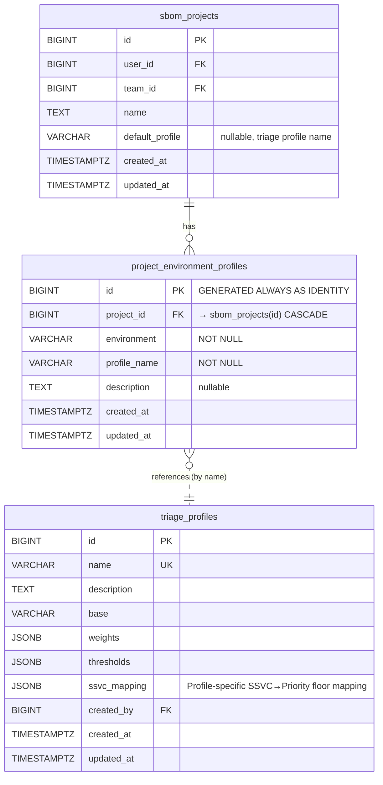

# Design: SSVC合成方式改善 & 環境プロフィールバインディング

## 背景と問題

### 問題1: SSVCマスキング

現在の `ResolvePriority()` は `max(Score-based, SSVC-based)` ロジックを使用している。

```go
func ResolvePriority(compositeScore float64, ssvcDecision ssvc.Decision, thresholds *Thresholds) PriorityLevel {
    scorePriority := PriorityFromScore(compositeScore, thresholds)
    ssvcPriority := PriorityFromSSVC(ssvcDecision)
    if PriorityRank(ssvcPriority) > PriorityRank(scorePriority) {
        return ssvcPriority
    }
    return scorePriority
}
```

**問題点:**

1. **SSVC→Priority マッピングがハードコード**: `PriorityFromSSVC()` は常に `DefaultSSVCMapping` (Act→Critical, Attend→High) を使用し、プロフィールの `SSVCMapping` フィールドを無視している
2. **max() はプロフィール差異を消す**: KEV=true の脆弱性は SSVC で必ず Act (→Critical) になり、internet-facing でも air-gapped でも同じ Critical になる
3. **Composite Score の差が最終結果に反映されない**: air-gapped プロフィール (KEV weight=0.05) と internet-facing (KEV weight=0.20) でスコアが異なっても、SSVC が Critical にオーバーライドする

**具体例 (CVE-2026-47928 — KEV登録済み、CVSS 7.8、EPSS 0.42):**

| プロフィール | Composite Score | Score→Priority | SSVC Decision | SSVC→Priority | max() 結果 |
|-------------|----------------|---------------|---------------|---------------|-----------|
| internet-facing | 0.78 | High | Act | Critical | **Critical** |
| air-gapped | 0.52 | Medium | Act | Critical | **Critical** |

→ スコアで High vs Medium の差があるのに、最終結果はどちらも Critical。プロフィールの意味がない。

**具体例 (CVE-2026-50160 — CVSS 9.1、EPSS 0.15、KEV無し、ExploitDB有り):**

| プロフィール | Composite Score | Score→Priority | SSVC Decision | SSVC→Priority | max() 結果 |
|-------------|----------------|---------------|---------------|---------------|-----------|
| internet-facing | 0.71 | High | Attend | High | **High** |
| internal-only | 0.58 | Medium | Attend | High | **High** |
| air-gapped | 0.55 | Medium | Attend | High | **High** |

→ internal-only/air-gapped ではスコアベースで Medium だが、SSVC Attend→High でオーバーライドされ全プロフィールで High。

### 問題2: SBOM Project × Environment → Profile バインディング

- `sbom_versions.environment` フィールドは存在するが、特定のプロフィールと紐付ける仕組みがない
- `triage_server_profile_bindings` テーブルは migration 000043 で作成済みだが、Go実装がスタブのまま
- `computeCrossProjectOverview()` は常に `DefaultProfile()` を使用し、プロジェクト/環境ごとのプロフィール差を反映しない

---

## 設計アプローチ

### Problem 1: 推奨方式 — **Option D+A ハイブリッド: プロフィール依存SSVCフロア**

各オプションの評価:

| Option | メリット | デメリット | 判定 |
|--------|--------|----------|------|
| A. Profile-dependent SSVC mapping | シンプル、既存フィールドを活用 | 4段階の離散値しか出せず、スコアの連続性を活かせない | △ |
| B. Weighted blend (α×Score + (1-α)×SSVC) | 連続的な合成が可能 | SSVCは4値の離散量で、ブレンドの直感性が低い。0.7×0.78 + 0.3×4/4 = 0.846 のような計算は意味が曖昧 | × |
| C. SSVC as bonus (+1 max) | スコアベースが主導権、SSVCは補助 | KEV=Critical の安全保証ができない | × |
| **D. SSVC as floor (profile-specific)** | **スコアベースが主、SSVCはセーフティネット。プロフィールごとにfloorを変えることで差異が明確に出る** | 単独だとSSVCの影響が弱すぎる可能性 | **◎** |
| E. D+A hybrid | Dのfloor + Aのマッピング変更を組み合わせ | 若干複雑 | ◎ |

**推奨: Option D+A ハイブリッド**

理由:
1. **スコアベースが主導**: Composite Score → Priority がベース結果になる（プロフィールの重みとしきい値が直接反映される）
2. **SSVCはセーフティフロア**: SSVC Decision がプロフィールごとに定義されたフロア（下限）として機能する
3. **プロフィール依存マッピング**: 既に `SSVCMapping` フィールドがプロフィール構造体に存在する。これを「このSSVC Decisionが出たとき、最低でもこのPriorityを保証する」というフロアマッピングとして再解釈する
4. **KEV安全保証**: internet-facing プロフィールでは Act→Critical (floor=Critical) を維持。air-gapped では Act→High にdowngradeすることで「ネットワーク到達不可なら即座対応不要」を表現可能

### 新しい `ResolvePriority` ロジック

```
Final Priority = max(Score-based Priority, SSVC Floor for this profile)
```

**変更点:**
- `SSVC Floor` は `DefaultSSVCMapping` ではなく **プロフィールの `SSVCMapping`** を参照する
- 各ビルトインプロフィールが **異なる SSVCMapping** を持つ（現在は全プロフィールが同一マッピング）

### 新しいビルトインプロフィールの SSVCMapping

| SSVC Decision | default | internet-facing | internal-only | air-gapped |
|---------------|---------|-----------------|---------------|------------|
| Act | Critical | Critical | High | High |
| Attend | High | High | Medium | Medium |
| Track* | Medium | Medium | Low | Low |
| Track | Low | Low | Low | Low |

**設計根拠:**
- **internet-facing**: 攻撃者が直接到達可能。Act=Critical, Attend=High を維持（現行と同じ）
- **internal-only**: ネットワーク境界あり。Act でも即座の Critical 対応は不要 → High floor
- **air-gapped**: 物理隔離環境。Exploitation Active でもリモート攻撃不可 → Act=High, Attend=Medium

---

## 具体例での比較 (改善後)

### CVE-2026-47928 (KEV登録済み、CVSS 7.8、EPSS 0.42、ExploitDB有り)

SSVC推定: Exploitation=Active (KEV), Automatable=No (EPSS < 0.5), TechnicalImpact=Partial → **Act**

| プロフィール | Composite Score | Score→Priority | SSVC=Act → Floor | **最終結果** | 旧結果 |
|-------------|----------------|---------------|------------------|------------|--------|
| internet-facing | 0.78 | High | Critical | **Critical** | Critical |
| default | 0.72 | High | Critical | **Critical** | Critical |
| internal-only | 0.52 | Medium | High | **High** | Critical |
| air-gapped | 0.45 | Medium | High | **High** | Critical |

→ **改善**: internal-only/air-gapped では Critical → High にdowngrade。プロフィールの意図が反映される。

### CVE-2026-50160 (CVSS 9.1、EPSS 0.15、KEV無し、ExploitDB有り)

SSVC推定: Exploitation=POC (ExploitDB), Automatable=No (EPSS < 0.5), TechnicalImpact=Total (CVSS≥7) → **Attend**

| プロフィール | Composite Score | Score→Priority | SSVC=Attend → Floor | **最終結果** | 旧結果 |
|-------------|----------------|---------------|---------------------|------------|--------|
| internet-facing | 0.71 | High | High | **High** | High |
| default | 0.65 | High | High | **High** | High |
| internal-only | 0.58 | Medium | Medium | **Medium** | High |
| air-gapped | 0.55 | Medium | Medium | **Medium** | High |

→ **改善**: internal-only/air-gapped では High → Medium にdowngrade。スコアベースの Medium がそのまま最終結果になる。

---

## 詳細設計

### Problem 1: SSVC合成方式の変更

#### Go コード変更

**`internal/triage/priority.go`** — `ResolvePriority` にプロフィールの SSVCMapping を渡す:

```go
// ResolvePriority determines the final priority level.
// The score-based priority is the base; the SSVC floor (from profile mapping) ensures
// a minimum priority when expert judgment indicates high risk.
func ResolvePriority(compositeScore float64, ssvcDecision ssvc.Decision, thresholds *Thresholds, ssvcMapping map[string]string) PriorityLevel {
    scorePriority := PriorityFromScore(compositeScore, thresholds)
    ssvcFloor := PriorityFromSSVCWithMapping(ssvcDecision, ssvcMapping)

    if PriorityRank(ssvcFloor) > PriorityRank(scorePriority) {
        return ssvcFloor
    }
    return scorePriority
}

// PriorityFromSSVCWithMapping maps an SSVC decision to a priority level using profile-specific mapping.
// Falls back to DefaultSSVCMapping if the mapping is nil or the decision is not found.
func PriorityFromSSVCWithMapping(decision ssvc.Decision, mapping map[string]string) PriorityLevel {
    if mapping != nil {
        if pStr, ok := mapping[string(decision)]; ok {
            return parsePriorityLevel(pStr)
        }
    }
    // Fallback to default
    if p, ok := DefaultSSVCMapping[decision]; ok {
        return p
    }
    return PriorityLow
}

// parsePriorityLevel converts a string to PriorityLevel.
func parsePriorityLevel(s string) PriorityLevel {
    switch strings.ToLower(s) {
    case "critical":
        return PriorityCritical
    case "high":
        return PriorityHigh
    case "medium":
        return PriorityMedium
    case "low":
        return PriorityLow
    default:
        return PriorityLow
    }
}
```

**`internal/triage/engine.go`** — `Triage()` メソッドの変更:

```go
func (e *Engine) Triage(ctx context.Context, input *TriageInput) (*TriageResult, error) {
    compositeScore, contributions := e.scorer.ComputeScore(input)
    ssvcDecision, ssvcMethod := EvaluateSSVC(input)

    // Use profile-specific SSVC mapping as floor
    priorityLevel := ResolvePriority(compositeScore, ssvcDecision, e.profile.Thresholds, e.profile.SSVCMapping)

    scorePriority := PriorityFromScore(compositeScore, e.profile.Thresholds)
    ssvcFloor := PriorityFromSSVCWithMapping(ssvcDecision, e.profile.SSVCMapping)
    resolutionMethod := determineResolutionMethod(scorePriority, ssvcFloor, priorityLevel)

    // ... rest unchanged
}
```

#### ビルトインプロフィールの SSVCMapping 更新

```go
func BuiltinTemplates() []Profile {
    return []Profile{
        {
            Name:        "default",
            Description: "General-purpose balanced profile",
            Weights:     DefaultExtendedWeights(),
            Thresholds:  DefaultThresholds(),
            SSVCMapping: map[string]string{
                "Act": "Critical", "Attend": "High", "Track*": "Medium", "Track": "Low",
            },
        },
        {
            Name:        "internet-facing",
            Description: "Internet-facing services: emphasizes EPSS, KEV, and ExploitDB",
            Weights: &ExtendedWeights{
                CVSS: 0.15, EPSS: 0.25, LEV: 0.15, KEV: 0.20,
                Patch: 0.05, Age: 0.03, ExploitDB: 0.12, Exploitability: 0.05,
            },
            Thresholds: &Thresholds{Critical: 0.80, High: 0.60, Medium: 0.35},
            SSVCMapping: map[string]string{
                "Act": "Critical", "Attend": "High", "Track*": "Medium", "Track": "Low",
            },
        },
        {
            Name:        "internal-only",
            Description: "Internal systems: emphasizes CVSS and patch availability",
            Weights: &ExtendedWeights{
                CVSS: 0.30, EPSS: 0.10, LEV: 0.10, KEV: 0.10,
                Patch: 0.15, Age: 0.08, ExploitDB: 0.10, Exploitability: 0.07,
            },
            Thresholds: &Thresholds{Critical: 0.90, High: 0.70, Medium: 0.45},
            SSVCMapping: map[string]string{
                "Act": "High", "Attend": "Medium", "Track*": "Low", "Track": "Low",
            },
        },
        {
            Name:        "air-gapped",
            Description: "Air-gapped environments: de-emphasizes KEV/EPSS, focuses on CVSS and patch",
            Weights: &ExtendedWeights{
                CVSS: 0.35, EPSS: 0.05, LEV: 0.05, KEV: 0.05,
                Patch: 0.20, Age: 0.10, ExploitDB: 0.10, Exploitability: 0.10,
            },
            Thresholds: &Thresholds{Critical: 0.90, High: 0.70, Medium: 0.45},
            SSVCMapping: map[string]string{
                "Act": "High", "Attend": "Medium", "Track*": "Low", "Track": "Low",
            },
        },
    }
}
```

#### バリデーション追加 (`internal/triage/validate.go`)

```go
// ValidateSSVCMapping validates a profile's SSVC mapping.
func ValidateSSVCMapping(mapping map[string]string) []error {
    if mapping == nil {
        return nil // optional field
    }

    var errs []error
    validDecisions := map[string]bool{"Act": true, "Attend": true, "Track*": true, "Track": true}
    validPriorities := map[string]bool{"Critical": true, "High": true, "Medium": true, "Low": true}

    for decision, priority := range mapping {
        if !validDecisions[decision] {
            errs = append(errs, fmt.Errorf("invalid SSVC decision %q in ssvc_mapping", decision))
        }
        if !validPriorities[strings.Title(strings.ToLower(priority))] {
            errs = append(errs, fmt.Errorf("invalid priority %q for SSVC decision %q", priority, decision))
        }
    }

    // Monotonicity check: Act ≥ Attend ≥ Track* ≥ Track
    ordered := []string{"Act", "Attend", "Track*", "Track"}
    for i := 0; i < len(ordered)-1; i++ {
        p1, ok1 := mapping[ordered[i]]
        p2, ok2 := mapping[ordered[i+1]]
        if ok1 && ok2 {
            if PriorityRank(parsePriorityLevel(p1)) < PriorityRank(parsePriorityLevel(p2)) {
                errs = append(errs, fmt.Errorf("ssvc_mapping must be monotonic: %s (%s) < %s (%s)", ordered[i], p1, ordered[i+1], p2))
            }
        }
    }

    return errs
}
```

#### DB スキーマ変更: Problem 1 では不要

`triage_profiles` テーブルには既に `ssvc_mapping JSONB` カラムが存在する。
ビルトインプロフィールはコード定義のため migration 不要。

---

### Problem 2: SBOM Project × Environment → Profile バインディング

#### 設計方針

既存の `triage_server_profile_bindings` テーブルを **再利用・修正** する。
現状のテーブルは `project_id` に FK がなく、server_label/environment が冗長な設計。
これを project_id + environment の組み合わせでプロフィールをバインドするよう再設計する。

**キー決定:**
- バインディングの粒度は `(project_id, environment)` — 同一プロジェクト内で environment ごとに異なるプロフィールを適用
- `sbom_versions.environment` がバインディングのキーになる
- environment が NULL / 未設定の sbom_version にはプロジェクトレベルのデフォルトプロフィールを適用

#### Migration SQL

**`migrations/000046_refactor_environment_profile_bindings.up.sql`:**

```sql
-- Drop the old unused table (no data has ever been written by the application)
DROP TABLE IF EXISTS triage_server_profile_bindings;

-- New table: project-level environment-to-profile bindings
CREATE TABLE project_environment_profiles (
    id BIGINT GENERATED ALWAYS AS IDENTITY PRIMARY KEY,
    project_id BIGINT NOT NULL REFERENCES sbom_projects(id) ON DELETE CASCADE,
    environment VARCHAR(255) NOT NULL,
    profile_name VARCHAR(255) NOT NULL,
    description TEXT,
    created_at TIMESTAMPTZ DEFAULT NOW(),
    updated_at TIMESTAMPTZ DEFAULT NOW(),
    UNIQUE(project_id, environment)
);

CREATE INDEX idx_pep_project ON project_environment_profiles(project_id);

-- Project-level default profile (used when no environment-specific binding exists)
ALTER TABLE sbom_projects ADD COLUMN default_profile VARCHAR(255);

COMMENT ON TABLE project_environment_profiles IS
    'Maps SBOM project environments to triage profiles. '
    'When a project has an sbom_version with environment="production", '
    'the profile_name in this table determines which triage profile to use.';

COMMENT ON COLUMN sbom_projects.default_profile IS
    'Default triage profile for this project. Used when no environment-specific binding exists. '
    'NULL means use the system default profile.';
```

**`migrations/000046_refactor_environment_profile_bindings.down.sql`:**

```sql
ALTER TABLE sbom_projects DROP COLUMN IF EXISTS default_profile;
DROP TABLE IF EXISTS project_environment_profiles;

-- Restore original table (for rollback compatibility)
CREATE TABLE triage_server_profile_bindings (
    id BIGSERIAL PRIMARY KEY,
    project_id BIGINT NOT NULL,
    server_label VARCHAR(255) NOT NULL,
    environment VARCHAR(100),
    profile_name VARCHAR(255) NOT NULL,
    description TEXT,
    created_at TIMESTAMP WITH TIME ZONE DEFAULT NOW(),
    updated_at TIMESTAMP WITH TIME ZONE DEFAULT NOW(),
    UNIQUE(project_id, server_label)
);
CREATE INDEX idx_triage_spb_project ON triage_server_profile_bindings(project_id);
CREATE INDEX idx_triage_spb_server ON triage_server_profile_bindings(server_label);
```

#### プロフィール解決の優先順位

```
1. API クエリパラメータ ?profile=xxx (明示指定 — 最優先)
2. project_environment_profiles テーブル (project_id + environment)
3. sbom_projects.default_profile (プロジェクトデフォルト)
4. システムデフォルト ("default" プロフィール)
```

```go
// ResolveProfileForProjectEnv determines the triage profile for a project+environment context.
func (s *Server) resolveProfileForProjectEnv(ctx context.Context, projectID int64, environment string, explicitProfile string) *triage.Profile {
    // 1. Explicit override (query param)
    if explicitProfile != "" {
        if p := s.resolveTriageProfileWithStore(ctx, explicitProfile); p != nil {
            return p
        }
    }

    // 2. Environment-specific binding
    if environment != "" {
        binding, err := s.store.GetProjectEnvironmentProfile(ctx, projectID, environment)
        if err == nil && binding != nil {
            if p := s.resolveTriageProfileWithStore(ctx, binding.ProfileName); p != nil {
                return p
            }
        }
    }

    // 3. Project default profile
    project, err := s.sbomStore.GetProject(ctx, projectID)
    if err == nil && project != nil && project.DefaultProfile != "" {
        if p := s.resolveTriageProfileWithStore(ctx, project.DefaultProfile); p != nil {
            return p
        }
    }

    // 4. System default
    return triage.DefaultProfile()
}
```

#### Store インターフェース追加

```go
// internal/store/store.go に追加

type ProjectEnvironmentProfile struct {
    ID          int64     `json:"id"`
    ProjectID   int64     `json:"project_id"`
    Environment string    `json:"environment"`
    ProfileName string    `json:"profile_name"`
    Description string    `json:"description,omitempty"`
    CreatedAt   time.Time `json:"created_at"`
    UpdatedAt   time.Time `json:"updated_at"`
}

// ProjectEnvironmentProfileStore defines persistence operations for environment-profile bindings.
type ProjectEnvironmentProfileStore interface {
    UpsertProjectEnvironmentProfile(ctx context.Context, binding *ProjectEnvironmentProfile) error
    GetProjectEnvironmentProfile(ctx context.Context, projectID int64, environment string) (*ProjectEnvironmentProfile, error)
    ListProjectEnvironmentProfiles(ctx context.Context, projectID int64) ([]ProjectEnvironmentProfile, error)
    DeleteProjectEnvironmentProfile(ctx context.Context, projectID int64, environment string) error
}
```

---

#### API エンドポイント設計

##### 環境プロフィールバインディング CRUD

**PUT `/api/v1/sbom/projects/{id}/environments/{env}/profile`**

プロジェクトの環境にプロフィールをバインドする (upsert)。

Request:
```json
{
  "profile_name": "internet-facing",
  "description": "Production environment uses internet-facing profile"
}
```

Response (200):
```json
{
  "project_id": 1,
  "environment": "production",
  "profile_name": "internet-facing",
  "description": "Production environment uses internet-facing profile",
  "created_at": "2026-08-08T14:00:00Z",
  "updated_at": "2026-08-08T14:00:00Z"
}
```

**DELETE `/api/v1/sbom/projects/{id}/environments/{env}/profile`**

環境バインディングを削除する。

Response (200):
```json
{
  "message": "environment profile binding removed"
}
```

**GET `/api/v1/sbom/projects/{id}/environments`**

プロジェクトの全環境バインディングを取得する。

Response (200):
```json
{
  "project_id": 1,
  "default_profile": "default",
  "environments": [
    {
      "environment": "production",
      "profile_name": "internet-facing",
      "description": "Production servers"
    },
    {
      "environment": "staging",
      "profile_name": "default",
      "description": null
    },
    {
      "environment": "development",
      "profile_name": "internal-only",
      "description": "Dev environment"
    }
  ]
}
```

**PUT `/api/v1/sbom/projects/{id}/default-profile`**

プロジェクトデフォルトプロフィールを設定する。

Request:
```json
{
  "profile_name": "internal-only"
}
```

Response (200):
```json
{
  "project_id": 1,
  "default_profile": "internal-only",
  "message": "project default profile updated"
}
```

##### 既存エンドポイントへの影響

**GET `/api/v1/sbom/projects/{id}/triage`**

変更: `?profile=` が未指定の場合、環境バインディング → プロジェクトデフォルト → システムデフォルトの順で解決する。

レスポンスに `profile_resolution` フィールドを追加:

```json
{
  "project_id": "1",
  "profile_used": "internet-facing",
  "profile_resolution": "environment",
  "environment": "production",
  "summary": { ... },
  "results": [ ... ]
}
```

`profile_resolution` の値:
- `"explicit"` — クエリパラメータで明示指定
- `"environment"` — 環境バインディングから解決
- `"project_default"` — プロジェクトデフォルトから解決
- `"system_default"` — システムデフォルト（"default"プロフィール）

**GET `/api/v1/triage/overview`**

変更: 各プロジェクト/環境の組み合わせに対して、バインドされたプロフィールを使ってトリアージを実行する。

```go
// 改善後の computeCrossProjectOverview (疑似コード)
for _, proj := range projects {
    latestVer := getLatestVersion(proj.ID)
    
    // ★ 環境に基づいてプロフィールを解決
    profile := resolveProfileForProjectEnv(ctx, proj.ID, latestVer.Environment, "")
    engine := triage.NewEngine(profile)
    
    results := engine.TriageBatch(ctx, inputs)
    // ...
}
```

レスポンスの `server_breakdown` にプロフィール情報を追加:

```json
{
  "vulnerability_id": "CVE-2026-47928",
  "org_priority_level": "Critical",
  "max_composite_score": 0.78,
  "server_breakdown": [
    {
      "project_id": 1,
      "project_name": "web-app",
      "environment": "production",
      "profile_used": "internet-facing",
      "priority_level": "Critical",
      "composite_score": 0.78
    },
    {
      "project_id": 1,
      "project_name": "web-app",
      "environment": "staging",
      "priority_level": "High",
      "profile_used": "default",
      "composite_score": 0.72
    },
    {
      "project_id": 2,
      "project_name": "internal-api",
      "environment": "production",
      "profile_used": "internal-only",
      "priority_level": "High",
      "composite_score": 0.52
    }
  ]
}
```

---

## 後方互換性への影響

### Problem 1: SSVC 合成方式変更

| 項目 | 影響 | 対策 |
|------|------|------|
| `default` プロフィールの結果 | **変化なし** — default の SSVCMapping は現行と同一 (Act→Critical, Attend→High) | — |
| `internet-facing` プロフィールの結果 | **変化なし** — SSVCMapping は現行と同一 | — |
| `internal-only` プロフィールの結果 | **変化あり** — Act→High (旧:Critical), Attend→Medium (旧:High) | ドキュメント明記 |
| `air-gapped` プロフィールの結果 | **変化あり** — 同上 | ドキュメント明記 |
| `ResolvePriority()` の関数シグネチャ | 引数追加 (`ssvcMapping map[string]string`) | テスト全修正 |
| カスタムプロフィール (DB保存) | `ssvc_mapping` が NULL の場合は DefaultSSVCMapping にフォールバック | 既存データそのまま動作 |
| REST API レスポンス | `resolution_method` の値 `"ssvc_override"` は `"ssvc_floor"` に名称変更 | API v1 内で変更（semver minor 互換） |

**安全策**: `default` および `internet-facing` プロフィールでは Act→Critical を維持するため、「KEVに入った脆弱性が突然 downgrade される」リスクはない。明示的に `internal-only` や `air-gapped` を選択したユーザーのみ影響を受ける。

### Problem 2: 環境プロフィールバインディング

| 項目 | 影響 | 対策 |
|------|------|------|
| `triage_server_profile_bindings` テーブル削除 | **スタブ API のみ使用、データなし** — 影響なし | migration down で復元可能 |
| `sbom_projects` に `default_profile` カラム追加 | NULL許容 — 既存行は影響なし | ALTER ADD COLUMN (nullable) |
| 既存 API `/sbom/projects/{id}/servers` | 廃止 → 新 `/sbom/projects/{id}/environments` に移行 | 旧エンドポイントを deprecated として残す (1リリース) |
| `computeCrossProjectOverview` の結果 | バインディング未設定時は `DefaultProfile()` を使用 — **現行と同一動作** | — |
| `handleGetProjectTriage` の結果 | `?profile=` 未指定 かつ バインディング未設定 → `DefaultProfile()` — **現行と同一** | — |

---

## 設定例

### カスタムプロフィール YAML (ファイルベース)

```yaml
name: "dmz-servers"
description: "DMZ servers with strict security posture"
base: "internet-facing"
weights:
  cvss: 0.15
  epss: 0.25
  lev: 0.15
  kev: 0.20
  patch: 0.05
  age: 0.03
  exploitdb: 0.12
  exploitability: 0.05
thresholds:
  critical: 0.75
  high: 0.55
  medium: 0.30
ssvc_mapping:
  Act: "Critical"
  Attend: "Critical"    # DMZではAttendもCritical扱い
  "Track*": "High"
  Track: "Medium"
```

### カスタムプロフィール作成 (API)

```bash
curl -X POST http://localhost:8080/api/v1/triage/profiles \
  -H "Content-Type: application/json" \
  -H "X-API-Key: $MAYU_API_KEY" \
  -d '{
    "name": "dmz-servers",
    "description": "DMZ servers with strict security posture",
    "base": "internet-facing",
    "thresholds": {"critical": 0.75, "high": 0.55, "medium": 0.30},
    "ssvc_mapping": {
      "Act": "Critical",
      "Attend": "Critical",
      "Track*": "High",
      "Track": "Medium"
    }
  }'
```

### 環境バインディング設定 (API)

```bash
# Production → internet-facing
curl -X PUT http://localhost:8080/api/v1/sbom/projects/1/environments/production/profile \
  -H "Content-Type: application/json" \
  -H "X-API-Key: $MAYU_API_KEY" \
  -d '{"profile_name": "internet-facing", "description": "Public-facing production"}'

# Staging → default
curl -X PUT http://localhost:8080/api/v1/sbom/projects/1/environments/staging/profile \
  -H "Content-Type: application/json" \
  -H "X-API-Key: $MAYU_API_KEY" \
  -d '{"profile_name": "default"}'

# Development → internal-only
curl -X PUT http://localhost:8080/api/v1/sbom/projects/1/environments/development/profile \
  -H "Content-Type: application/json" \
  -H "X-API-Key: $MAYU_API_KEY" \
  -d '{"profile_name": "internal-only"}'

# プロジェクトデフォルト設定
curl -X PUT http://localhost:8080/api/v1/sbom/projects/1/default-profile \
  -H "Content-Type: application/json" \
  -H "X-API-Key: $MAYU_API_KEY" \
  -d '{"profile_name": "default"}'

# バインディング一覧確認
curl http://localhost:8080/api/v1/sbom/projects/1/environments \
  -H "X-API-Key: $MAYU_API_KEY"
```

### Cross-Project Overview での結果確認

```bash
# 環境ごとに異なるプロフィールが適用される
curl http://localhost:8080/api/v1/triage/overview \
  -H "X-API-Key: $MAYU_API_KEY" | jq '.entries[0].server_breakdown'
```

---

## テスト戦略

### Unit Tests

1. **`priority_test.go`**:
   - `ResolvePriority` の新シグネチャで全既存テストを更新
   - 各ビルトインプロフィールの SSVCMapping でのフロア動作を検証
   - カスタム SSVCMapping (NULL, 部分指定, 完全指定) のフォールバック検証
   - Monotonicity バリデーションのテスト

2. **`engine_test.go`**:
   - 同一 TriageInput に対して異なるプロフィールで異なる結果が出ることを検証
   - KEV脆弱性が internet-facing で Critical、air-gapped で High になることを検証

3. **`validate_test.go`**:
   - `ValidateSSVCMapping` の各パターン (有効、無効Decision、無効Priority、非Monotonic)

### Integration Tests

1. **環境プロフィールバインディング Store テスト**:
   - CRUD 操作 (Upsert, Get, List, Delete)
   - UNIQUE 制約のテスト (同一 project+environment で upsert)
   - CASCADE 動作 (プロジェクト削除時のバインディング削除)

2. **API エンドポイントテスト**:
   - PUT/DELETE/GET `/environments/{env}/profile`
   - プロフィール解決の優先順位チェーン (explicit > environment > project_default > system)
   - Overview API での環境別プロフィール適用

---

## 実装フェーズ

| フェーズ | 内容 | 影響範囲 |
|---------|------|---------|
| 1 | `ResolvePriority` シグネチャ変更 + ビルトイン SSVCMapping 差別化 | `internal/triage/priority.go`, `engine.go`, 全テスト |
| 2 | SSVCMapping バリデーション追加 | `internal/triage/validate.go` |
| 3 | Migration 000046 作成 (テーブル再構築 + カラム追加) | `migrations/` |
| 4 | Store 実装 (ProjectEnvironmentProfileStore) | `internal/store/` |
| 5 | API ハンドラ実装 (環境バインディング CRUD) | `internal/server/triage.go` |
| 6 | `handleGetProjectTriage` でのプロフィール解決統合 | `internal/server/triage.go` |
| 7 | `computeCrossProjectOverview` での環境別プロフィール適用 | `internal/server/triage.go` |
| 8 | 旧 API (`/servers/*`) の deprecated 化 + ドキュメント更新 | `internal/server/server.go`, docs |

---

## 代替案の検討

### SSVC合成: Option B (Weighted Blend) を不採用とした理由

`α×ScorePriority + (1-α)×SSVCPriority` のブレンドは一見エレガントだが:
- PriorityLevel は4値の離散量 (1-4)。ブレンド後に再度離散化するため情報損失が大きい
- 例: `0.7×3(High) + 0.3×4(Critical) = 3.3` → 切り上げで Critical? 切り捨てで High? → 曖昧
- ユーザーにとって「なぜこの Priority になったか」の説明が困難

### SSVC合成: Option C (SSVC as bonus +1 max) を不採用とした理由

- KEV登録済み脆弱性がスコアベースで Medium の場合、+1 で High にしかならない
- internet-facing 環境では KEV = Critical を保証したい → +1制限では不十分
- 安全保証のための例外ルールが必要になり、シンプルさが失われる

### 環境バインディング: 既存テーブル修正 vs 新テーブルの判断

既存 `triage_server_profile_bindings` を修正する案も検討したが:
- `server_label` / `environment` の冗長性が設計上の問題
- `project_id` に FK がない
- 実データが一切入っていない (スタブ実装のみ)
- **結論**: 旧テーブルを DROP して新設計で CREATE が最もクリーン

---

## ERD 更新 (追加分)


