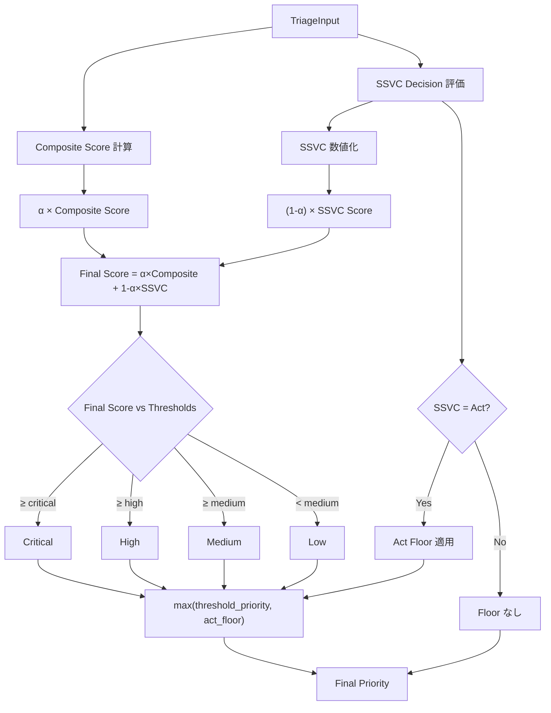
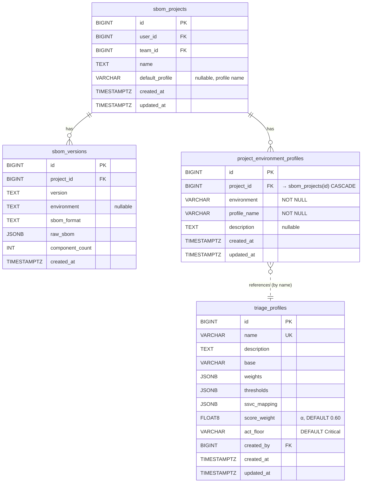
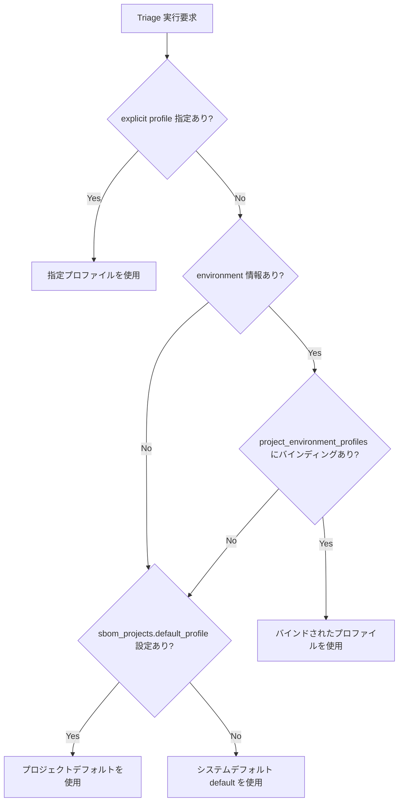
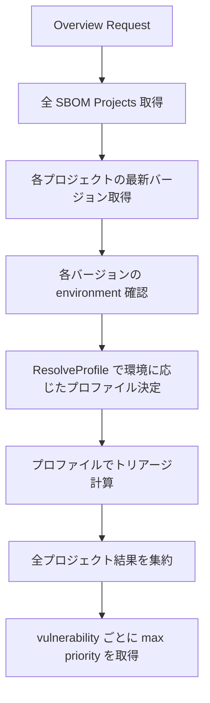

# Triage Engine v2 設計書

## 1. 概要

### 変更内容

Triage Engine v2 は、脆弱性の優先度決定ロジックを根本的に再設計する。

**現行 (v1):** スコアベース優先度とSSVCベース優先度の `max()` を取る方式
```
Final Priority = max(PriorityFromScore(composite), PriorityFromSSVC(ssvc_decision))
```

**新方式 (v2):** 加重平均 + Act フロアによるハイブリッド方式
```
Final Score = α × Composite Score + (1-α) × SSVC Score
Final Priority = PriorityFromScore(Final Score, thresholds)
                 → Act Floor 適用 (SSVC=Act の場合)
```

### 変更理由

1. **v1 の問題点**: `max()` 方式では SSVC=Act が常に Critical を返し、スコアの低い脆弱性でも最高優先度になる。逆に SSVC=Track でもスコアが高ければ Critical になり、SSVC の抑制効果が働かない。
2. **v2 の利点**: 加重平均により、スコアとSSVCの両方が最終優先度に影響する。α の調整でプロファイルごとにスコア重視/SSVC重視のバランスを制御できる。Act フロアにより SSVC=Act の脆弱性は環境に応じた最低保証を維持する。

### 後方互換性

**後方互換性は維持しない。** v2 への移行により既存のトリアージ結果は変更される。

---

## 2. 計算ロジック仕様

### 計算フロー図



### 2.1 SSVC 数値化

SSVC Decision を 0.0〜1.0 のスコアに変換する:

| SSVC Decision | SSVC Score |
|---------------|------------|
| Act           | 1.00       |
| Attend        | 0.75       |
| Track*        | 0.50       |
| Track         | 0.25       |
| None / 未設定 | 0.00       |

### 2.2 Composite Score 計算

既存の重み付きスコア計算は変更なし:

```
Composite Score = Σ(weight_i × normalized_signal_i)
```

8つのシグナル: `cvss`, `epss`, `lev`, `kev`, `patch`, `age`, `exploitdb`, `exploitability`

重みの合計は 1.0 でなければならない。

### 2.3 加重平均計算 (Final Score)

```
Final Score = α × Composite Score + (1 - α) × SSVC Score
```

- `α` (score_weight): プロファイルごとに定義される 0.0〜1.0 の値
- α が大きい → Composite Score の影響が大きい (スコア重視)
- α が小さい → SSVC Score の影響が大きい (SSVC重視)

### 2.4 閾値判定

Final Score を閾値と比較して Priority Level を決定する:

```
if Final Score ≥ thresholds.critical → Critical
else if Final Score ≥ thresholds.high → High
else if Final Score ≥ thresholds.medium → Medium
else → Low
```

### 2.5 Act フロア適用

SSVC Decision が `Act` の場合、プロファイルに定義された `act_floor` を最低保証として適用する:

```
if ssvc_decision == Act:
    final_priority = max(threshold_priority, act_floor)
```

| プロファイル | Act Floor |
|-------------|-----------|
| internet-facing | Critical |
| default | Critical |
| internal-only | High |
| air-gapped | High |

### 2.6 SSVC データなしの場合

SSVC Decision が `None` または未設定の場合:
- SSVC Score = 0.0
- Act Floor は適用されない
- `Final Score = α × Composite Score + (1-α) × 0.0 = α × Composite Score`
- 結果として純粋にスコアベースの判定となるが、α 倍されるため閾値を超えにくくなる

### 2.7 Resolution Method

最終的な優先度の決定方法を示す `resolution_method` フィールド:

| resolution_method | 条件 |
|-------------------|------|
| `score_dominant` | Act Floor なし、かつ threshold_priority が SSVC 単独判定より高い |
| `ssvc_dominant` | Act Floor なし、かつ SSVC Score が最終スコアを引き上げた |
| `act_floor` | SSVC=Act により Act Floor が適用された |

判定ロジック:
```
if ssvc_decision == Act AND act_floor > threshold_priority:
    resolution_method = "act_floor"
else if α × composite_score > (1-α) × ssvc_score:
    resolution_method = "score_dominant"
else:
    resolution_method = "ssvc_dominant"
```


---

## 3. プロファイル定義の更新

### 新しい Profile 構造体

```go
type Profile struct {
    Name        string            `yaml:"name" json:"name"`
    Description string            `yaml:"description" json:"description"`
    Base        string            `yaml:"base,omitempty" json:"base,omitempty"`
    ScoreWeight float64           `yaml:"score_weight" json:"score_weight"` // α (0.0-1.0)
    ActFloor    PriorityLevel     `yaml:"act_floor" json:"act_floor"`       // Act時の最低保証
    Weights     *ExtendedWeights  `yaml:"weights" json:"weights"`
    Thresholds  *Thresholds       `yaml:"thresholds" json:"thresholds"`
    SSVCMapping map[string]string `yaml:"ssvc_mapping,omitempty" json:"ssvc_mapping,omitempty"`
}
```

### 4プロファイル定義

#### default (α = 0.60)

```yaml
name: default
description: "General-purpose balanced profile"
score_weight: 0.60
act_floor: Critical
weights:
  cvss: 0.20
  epss: 0.20
  lev: 0.15
  kev: 0.15
  patch: 0.08
  age: 0.05
  exploitdb: 0.10
  exploitability: 0.07
thresholds:
  critical: 0.85
  high: 0.65
  medium: 0.40
```

#### internet-facing (α = 0.50)

```yaml
name: internet-facing
description: "Internet-facing services: emphasizes EPSS, KEV, and ExploitDB"
score_weight: 0.50
act_floor: Critical
weights:
  cvss: 0.15
  epss: 0.25
  lev: 0.15
  kev: 0.20
  patch: 0.05
  age: 0.03
  exploitdb: 0.12
  exploitability: 0.05
thresholds:
  critical: 0.80
  high: 0.60
  medium: 0.35
```

#### internal-only (α = 0.70)

```yaml
name: internal-only
description: "Internal systems: emphasizes CVSS and patch availability"
score_weight: 0.70
act_floor: High
weights:
  cvss: 0.30
  epss: 0.10
  lev: 0.10
  kev: 0.10
  patch: 0.15
  age: 0.08
  exploitdb: 0.10
  exploitability: 0.07
thresholds:
  critical: 0.90
  high: 0.70
  medium: 0.45
```

#### air-gapped (α = 0.80)

```yaml
name: air-gapped
description: "Air-gapped environments: de-emphasizes KEV/EPSS, focuses on CVSS and patch"
score_weight: 0.80
act_floor: High
weights:
  cvss: 0.35
  epss: 0.05
  lev: 0.05
  kev: 0.05
  patch: 0.20
  age: 0.10
  exploitdb: 0.10
  exploitability: 0.10
thresholds:
  critical: 0.90
  high: 0.70
  medium: 0.45
```


---

## 4. 計算例

以下は 8 件の CVE を 4 つのプロファイルで計算した結果を示す。

### 入力データ

| CVE | CVSS | EPSS | LEV | KEV | Patch | Age | ExploitDB | Exploitability | SSVC |
|-----|------|------|-----|-----|-------|-----|-----------|----------------|------|
| CVE-2024-3400 | 1.000 | 0.99999 | 1.000 | 1.0 | 0.0 | 0.934 | 0.0 | 1.000 | Act |
| CVE-2023-35082 | 1.000 | 0.99999 | 1.000 | 1.0 | 1.0 | 1.000 | 0.0 | 1.000 | Act |
| CVE-2017-0145 | 0.930 | 0.89850 | 1.000 | 1.0 | 1.0 | 1.000 | 0.0 | 1.000 | Act |
| CVE-2026-50160 | 1.000 | 0.08600 | 0.016 | 0.0 | 0.0 | 0.535 | 0.0 | 1.000 | Attend |
| CVE-2026-47928 | 1.000 | 0.08300 | 0.071 | 0.0 | 1.0 | 0.611 | 0.0 | 1.000 | Track* |
| CVE-2021-45105 | 0.590 | 0.99999 | 1.000 | 0.0 | 0.0 | 1.000 | 0.0 | 0.564 | Track |
| CVE-2026-46595 | 1.000 | 0.00500 | 0.004 | 0.0 | 0.0 | 0.653 | 0.0 | 1.000 | Attend |
| CVE-2026-46599 | 0.750 | 0.00400 | 0.003 | 0.0 | 0.0 | 0.635 | 0.0 | 1.000 | Attend |

### default プロファイル (α=0.60, thresholds: C≥0.85, H≥0.65, M≥0.40, act_floor=Critical)

| CVE | Composite | SSVC Score | Final Score | Threshold判定 | Act Floor | **最終Priority** | Method |
|-----|-----------|------------|-------------|--------------|-----------|-----------------|--------|
| CVE-2024-3400 | 0.81670 | 1.00 | 0.89002 | Critical | Applied | **Critical** | score_dominant |
| CVE-2023-35082 | 0.90000 | 1.00 | 0.94000 | Critical | Applied | **Critical** | score_dominant |
| CVE-2017-0145 | 0.86570 | 1.00 | 0.91942 | Critical | Applied | **Critical** | score_dominant |
| CVE-2026-50160 | 0.31635 | 0.75 | 0.48981 | Medium | - | **Medium** | ssvc_dominant |
| CVE-2026-47928 | 0.40780 | 0.50 | 0.44468 | Medium | - | **Medium** | score_dominant |
| CVE-2021-45105 | 0.55748 | 0.25 | 0.43449 | Medium | - | **Medium** | score_dominant |
| CVE-2026-46595 | 0.30425 | 0.75 | 0.48255 | Medium | - | **Medium** | ssvc_dominant |
| CVE-2026-46599 | 0.25300 | 0.75 | 0.45180 | Medium | - | **Medium** | ssvc_dominant |

### internet-facing プロファイル (α=0.50, thresholds: C≥0.80, H≥0.60, M≥0.35, act_floor=Critical)

| CVE | Composite | SSVC Score | Final Score | Threshold判定 | Act Floor | **最終Priority** | Method |
|-----|-----------|------------|-------------|--------------|-----------|-----------------|--------|
| CVE-2024-3400 | 0.82802 | 1.00 | 0.91401 | Critical | Applied | **Critical** | ssvc_dominant |
| CVE-2023-35082 | 0.88000 | 1.00 | 0.94000 | Critical | Applied | **Critical** | ssvc_dominant |
| CVE-2017-0145 | 0.84413 | 1.00 | 0.92206 | Critical | Applied | **Critical** | ssvc_dominant |
| CVE-2026-50160 | 0.23995 | 0.75 | 0.49497 | Medium | - | **Medium** | ssvc_dominant |
| CVE-2026-47928 | 0.29973 | 0.50 | 0.39987 | Medium | - | **Medium** | ssvc_dominant |
| CVE-2021-45105 | 0.54670 | 0.25 | 0.39835 | Medium | - | **Medium** | score_dominant |
| CVE-2026-46595 | 0.22144 | 0.75 | 0.48572 | Medium | - | **Medium** | ssvc_dominant |
| CVE-2026-46599 | 0.18300 | 0.75 | 0.46650 | Medium | - | **Medium** | ssvc_dominant |

### internal-only プロファイル (α=0.70, thresholds: C≥0.90, H≥0.70, M≥0.45, act_floor=High)

| CVE | Composite | SSVC Score | Final Score | Threshold判定 | Act Floor | **最終Priority** | Method |
|-----|-----------|------------|-------------|--------------|-----------|-----------------|--------|
| CVE-2024-3400 | 0.74472 | 1.00 | 0.82130 | High | Applied | **High** | score_dominant |
| CVE-2023-35082 | 0.90000 | 1.00 | 0.93000 | Critical | Applied | **Critical** | score_dominant |
| CVE-2017-0145 | 0.86885 | 1.00 | 0.90819 | Critical | Applied | **Critical** | score_dominant |
| CVE-2026-50160 | 0.42300 | 0.75 | 0.52110 | Medium | - | **Medium** | score_dominant |
| CVE-2026-47928 | 0.58428 | 0.50 | 0.55900 | Medium | - | **Medium** | score_dominant |
| CVE-2021-45105 | 0.49648 | 0.25 | 0.42254 | Low | - | **Low** | score_dominant |
| CVE-2026-46595 | 0.42314 | 0.75 | 0.52120 | Medium | - | **Medium** | score_dominant |
| CVE-2026-46599 | 0.34650 | 0.75 | 0.46755 | Medium | - | **Medium** | score_dominant |

### air-gapped プロファイル (α=0.80, thresholds: C≥0.90, H≥0.70, M≥0.45, act_floor=High)

| CVE | Composite | SSVC Score | Final Score | Threshold判定 | Act Floor | **最終Priority** | Method |
|-----|-----------|------------|-------------|--------------|-----------|-----------------|--------|
| CVE-2024-3400 | 0.69340 | 1.00 | 0.75472 | High | Applied | **High** | score_dominant |
| CVE-2023-35082 | 0.90000 | 1.00 | 0.92000 | Critical | Applied | **Critical** | score_dominant |
| CVE-2017-0145 | 0.87043 | 1.00 | 0.89634 | High | Applied | **High** | score_dominant |
| CVE-2026-50160 | 0.50860 | 0.75 | 0.55688 | Medium | - | **Medium** | score_dominant |
| CVE-2026-47928 | 0.71880 | 0.50 | 0.67504 | Medium | - | **Medium** | score_dominant |
| CVE-2021-45105 | 0.46290 | 0.25 | 0.42032 | Low | - | **Low** | score_dominant |
| CVE-2026-46595 | 0.51575 | 0.75 | 0.56260 | Medium | - | **Medium** | score_dominant |
| CVE-2026-46599 | 0.42635 | 0.75 | 0.49108 | Medium | - | **Medium** | score_dominant |

### プロファイル間比較サマリ

| CVE | SSVC | default | internet-facing | internal-only | air-gapped |
|-----|------|---------|-----------------|---------------|------------|
| CVE-2024-3400 | Act | Critical | Critical | High | High |
| CVE-2023-35082 | Act | Critical | Critical | Critical | Critical |
| CVE-2017-0145 | Act | Critical | Critical | Critical | High |
| CVE-2026-50160 | Attend | Medium | Medium | Medium | Medium |
| CVE-2026-47928 | Track* | Medium | Medium | Medium | Medium |
| CVE-2021-45105 | Track | Medium | Medium | Low | Low |
| CVE-2026-46595 | Attend | Medium | Medium | Medium | Medium |
| CVE-2026-46599 | Attend | Medium | Medium | Medium | Medium |

**考察:**
- SSVC=Act の CVE は Act Floor により、internet-facing/default では Critical、internal-only/air-gapped では High が最低保証される。
- CVE-2024-3400 は Patch=0.0 のため Composite が低く、air-gapped/internal-only では Threshold だけでは Critical に達しないが、Act Floor により High が保証される。
- CVE-2021-45105 は SSVC=Track(0.25) のため SSVC Score の寄与が小さく、internal-only/air-gapped では Medium 閾値を下回って Low になる。
- α が大きいプロファイル (air-gapped=0.80) ほど Composite Score の影響が大きく、SSVC=Act でもスコアが十分でなければ閾値を超えない（Act Floor で救済される）。


---

## 5. DB Schema 変更

### マイグレーション概要

| 変更 | 内容 |
|------|------|
| `triage_server_profile_bindings` → `project_environment_profiles` | テーブルリネーム＋スキーマ変更 |
| `triage_profiles` にカラム追加 | `score_weight`, `act_floor` |
| `sbom_projects` にカラム追加 | `default_profile` |

### Migration SQL (Up)

```sql
-- 000046_triage_v2_redesign.up.sql

-- 1. Add score_weight and act_floor to triage_profiles
ALTER TABLE triage_profiles
    ADD COLUMN score_weight DOUBLE PRECISION NOT NULL DEFAULT 0.60,
    ADD COLUMN act_floor VARCHAR(20) NOT NULL DEFAULT 'Critical';

-- Add constraint for score_weight range
ALTER TABLE triage_profiles
    ADD CONSTRAINT chk_score_weight CHECK (score_weight >= 0.0 AND score_weight <= 1.0);

-- Add constraint for act_floor values
ALTER TABLE triage_profiles
    ADD CONSTRAINT chk_act_floor CHECK (act_floor IN ('Critical', 'High', 'Medium', 'Low'));

-- 2. Create project_environment_profiles (replacement for triage_server_profile_bindings)
CREATE TABLE project_environment_profiles (
    id BIGINT GENERATED ALWAYS AS IDENTITY PRIMARY KEY,
    project_id BIGINT NOT NULL REFERENCES sbom_projects(id) ON DELETE CASCADE,
    environment VARCHAR(100) NOT NULL,
    profile_name VARCHAR(255) NOT NULL,
    description TEXT,
    created_at TIMESTAMPTZ NOT NULL DEFAULT NOW(),
    updated_at TIMESTAMPTZ NOT NULL DEFAULT NOW(),
    UNIQUE(project_id, environment)
);

CREATE INDEX idx_pep_project ON project_environment_profiles(project_id);
CREATE INDEX idx_pep_environment ON project_environment_profiles(environment);

-- 3. Add default_profile to sbom_projects
ALTER TABLE sbom_projects
    ADD COLUMN default_profile VARCHAR(255);

-- 4. Migrate data from old table to new table
INSERT INTO project_environment_profiles (project_id, environment, profile_name, description, created_at, updated_at)
SELECT project_id, COALESCE(environment, server_label), profile_name, description, created_at, updated_at
FROM triage_server_profile_bindings
WHERE environment IS NOT NULL
ON CONFLICT (project_id, environment) DO NOTHING;

-- 5. Drop old table
DROP TABLE IF EXISTS triage_server_profile_bindings;
```

### Migration SQL (Down)

```sql
-- 000046_triage_v2_redesign.down.sql

-- 1. Recreate old table
CREATE TABLE triage_server_profile_bindings (
    id BIGSERIAL PRIMARY KEY,
    project_id BIGINT NOT NULL,
    server_label VARCHAR(255) NOT NULL,
    environment VARCHAR(100),
    profile_name VARCHAR(255) NOT NULL,
    description TEXT,
    created_at TIMESTAMP WITH TIME ZONE DEFAULT NOW(),
    updated_at TIMESTAMP WITH TIME ZONE DEFAULT NOW(),
    UNIQUE(project_id, server_label)
);

CREATE INDEX idx_triage_spb_project ON triage_server_profile_bindings(project_id);
CREATE INDEX idx_triage_spb_server ON triage_server_profile_bindings(server_label);

-- 2. Migrate data back
INSERT INTO triage_server_profile_bindings (project_id, server_label, environment, profile_name, description, created_at, updated_at)
SELECT project_id, environment, environment, profile_name, description, created_at, updated_at
FROM project_environment_profiles;

-- 3. Drop new table
DROP TABLE IF EXISTS project_environment_profiles;

-- 4. Remove default_profile from sbom_projects
ALTER TABLE sbom_projects DROP COLUMN IF EXISTS default_profile;

-- 5. Remove columns from triage_profiles
ALTER TABLE triage_profiles DROP CONSTRAINT IF EXISTS chk_act_floor;
ALTER TABLE triage_profiles DROP CONSTRAINT IF EXISTS chk_score_weight;
ALTER TABLE triage_profiles DROP COLUMN IF EXISTS act_floor;
ALTER TABLE triage_profiles DROP COLUMN IF EXISTS score_weight;
```

### 新しい ERD (関連テーブル)




---

## 6. プロファイル解決ロジック

トリアージ実行時に使用するプロファイルの解決順序:

```
1. Explicit (API/CLIで明示指定)
   ↓ (なければ)
2. Environment Binding (project_environment_profiles テーブル)
   ↓ (なければ)
3. Project Default (sbom_projects.default_profile)
   ↓ (なければ)
4. System Default (built-in "default" profile)
```

### 解決フロー図



### 新しい ResolveProfile 関数

```go
type ResolveOpts struct {
    ExplicitProfile string  // API/CLI で明示指定されたプロファイル名
    ProjectID       int64   // SBOM プロジェクト ID
    Environment     string  // 環境名 (production, staging, etc.)
}

type EnvironmentBindingStore interface {
    GetBindingByEnvironment(projectID int64, environment string) (*EnvironmentProfileBinding, error)
    ListBindingsByProject(projectID int64) ([]EnvironmentProfileBinding, error)
    CreateBinding(binding *EnvironmentProfileBinding) error
    UpdateBinding(binding *EnvironmentProfileBinding) error
    DeleteBinding(projectID int64, environment string) error
}

type ProjectStore interface {
    GetDefaultProfile(projectID int64) (string, error)
}

func (e *Engine) ResolveProfile(opts *ResolveOpts, bindingStore EnvironmentBindingStore, projectStore ProjectStore) (*Profile, string) {
    // 1. Explicit
    if opts.ExplicitProfile != "" {
        if p := findProfileByName(opts.ExplicitProfile); p != nil {
            return p, "explicit"
        }
    }

    // 2. Environment binding
    if bindingStore != nil && opts.ProjectID > 0 && opts.Environment != "" {
        binding, err := bindingStore.GetBindingByEnvironment(opts.ProjectID, opts.Environment)
        if err == nil && binding != nil {
            if p := findProfileByName(binding.ProfileName); p != nil {
                return p, "environment"
            }
        }
    }

    // 3. Project default
    if projectStore != nil && opts.ProjectID > 0 {
        profileName, err := projectStore.GetDefaultProfile(opts.ProjectID)
        if err == nil && profileName != "" {
            if p := findProfileByName(profileName); p != nil {
                return p, "project_default"
            }
        }
    }

    // 4. System default
    return e.profile, "system_default"
}
```

---

## 7. API 設計

### 変更されるエンドポイント

#### プロファイル CRUD (既存エンドポイントの更新)

**GET `/api/v1/triage/profiles`** — レスポンスに `score_weight`, `act_floor` を追加

```json
{
  "profiles": [
    {
      "name": "default",
      "description": "General-purpose balanced profile",
      "score_weight": 0.60,
      "act_floor": "Critical",
      "weights": { "cvss": 0.20, "epss": 0.20, ... },
      "thresholds": { "critical": 0.85, "high": 0.65, "medium": 0.40 },
      "builtin": true
    }
  ]
}
```

**POST `/api/v1/triage/profiles`** — リクエストに `score_weight`, `act_floor` を追加

```json
{
  "name": "custom-profile",
  "description": "Custom profile for team X",
  "base": "internet-facing",
  "score_weight": 0.55,
  "act_floor": "High",
  "weights": { ... },
  "thresholds": { ... }
}
```

#### 環境プロファイルバインディング (新規エンドポイント)

**PUT `/api/v1/sbom/projects/{id}/environments/{environment}/profile`**

サーバーベースのバインディングを環境ベースに変更。

Request:
```json
{
  "profile_name": "internet-facing",
  "description": "Production environment binding"
}
```

Response (200):
```json
{
  "id": 1,
  "project_id": 42,
  "environment": "production",
  "profile_name": "internet-facing",
  "description": "Production environment binding",
  "created_at": "2026-08-09T00:00:00Z",
  "updated_at": "2026-08-09T00:00:00Z"
}
```

**GET `/api/v1/sbom/projects/{id}/environments`**

プロジェクトの全環境バインディングを一覧。

Response (200):
```json
{
  "bindings": [
    {
      "id": 1,
      "project_id": 42,
      "environment": "production",
      "profile_name": "internet-facing",
      "description": "Production environment binding"
    },
    {
      "id": 2,
      "project_id": 42,
      "environment": "staging",
      "profile_name": "default",
      "description": null
    }
  ]
}
```

**DELETE `/api/v1/sbom/projects/{id}/environments/{environment}/profile`**

バインディングを削除。

Response: 204 No Content

#### プロジェクトデフォルトプロファイル

**PUT `/api/v1/sbom/projects/{id}/default-profile`**

Request:
```json
{
  "profile_name": "internal-only"
}
```

Response (200):
```json
{
  "project_id": 42,
  "default_profile": "internal-only"
}
```

**DELETE `/api/v1/sbom/projects/{id}/default-profile`**

プロジェクトデフォルトをクリア（システムデフォルトにフォールバック）。

Response: 204 No Content

#### 削除されるエンドポイント

| エンドポイント | 理由 |
|--------------|------|
| PUT `/api/v1/sbom/projects/{id}/servers/{label}/profile` | 環境ベースに置き換え |
| GET `/api/v1/sbom/projects/{id}/servers` | 環境ベースに置き換え |
| DELETE `/api/v1/sbom/projects/{id}/servers/{label}/profile` | 環境ベースに置き換え |

### Triage Result レスポンスの変更

`resolution_method` の値が変更される:

| v1 | v2 |
|----|----|
| `combined_max` | (廃止) |
| `score_based` | `score_dominant` |
| `ssvc_override` | `ssvc_dominant` |
| — | `act_floor` (新規) |

`final_score` フィールドが追加される:

```json
{
  "vulnerability_id": "CVE-2024-3400",
  "priority_level": "Critical",
  "composite_score": 0.81670,
  "ssvc_score": 1.0,
  "final_score": 0.89002,
  "ssvc_decision": "Act",
  "resolution_method": "score_dominant",
  "profile_used": "default",
  "profile_source": "environment"
}
```

---

## 8. Overview 集計への影響

### 現行の問題

`GET /api/v1/triage/overview` は全プロジェクトのトリアージ結果を集計するが、現在は **default プロファイル固定** で計算している。環境ごとに異なるプロファイルが設定されていても反映されない。

### 新しい Overview ロジック



### 変更点

1. **プロファイル解決**: 各 `sbom_versions.environment` を使って `project_environment_profiles` からプロファイルを解決
2. **環境なしの場合**: `sbom_projects.default_profile` → system default の順でフォールバック
3. **ServerTriageEntry の更新**: `ProfileUsed` フィールドに実際に使用されたプロファイル名が入る

### 更新後の擬似コード

```go
func (h *TriageHandler) handleOverview(ctx context.Context, userID int64) (*OverviewResponse, error) {
    projects := h.store.ListSBOMProjects(userID)

    entriesByVuln := map[string][]ServerTriageEntry{}

    for _, project := range projects {
        version := h.store.GetLatestVersion(project.ID)
        if version == nil {
            continue
        }

        // Resolve profile per environment
        profile, source := h.engine.ResolveProfile(&ResolveOpts{
            ProjectID:   project.ID,
            Environment: version.Environment,
        }, h.bindingStore, h.projectStore)

        // Create engine with resolved profile
        engine := NewEngine(profile)

        scan := h.store.GetLatestScan(version.ID)
        inputs := buildTriageInputs(scan.Findings)

        results, _ := engine.TriageBatch(ctx, inputs)

        for _, result := range results {
            entry := ServerTriageEntry{
                ProjectID:   project.ID,
                ProjectName: project.Name,
                Environment: version.Environment,
                ProfileUsed: profile.Name,
                TriageResult: result,
            }
            entriesByVuln[result.VulnerabilityID] = append(
                entriesByVuln[result.VulnerabilityID], entry,
            )
        }
    }

    return AggregateCrossProjectBatch(entriesByVuln), nil
}
```

---

## 9. 移行手順

### Step 1: DB マイグレーション

```bash
mayu migrate up  # 000046_triage_v2_redesign.up.sql を適用
```

### Step 2: Profile 構造体の更新

1. `internal/triage/profile.go` に `ScoreWeight`, `ActFloor` フィールドを追加
2. `BuiltinTemplates()` を更新して各プロファイルに α と act_floor を設定
3. `DefaultProfile()` を更新

### Step 3: 計算ロジックの実装

1. `internal/triage/priority.go`:
   - `ResolvePriority()` を新ロジックに書き換え
   - SSVC 数値化関数 `SSVCToScore(decision) float64` を追加
   - Act Floor 適用ロジックを追加
2. `internal/triage/engine.go`:
   - `Triage()` を更新して Final Score 計算を組み込む
   - `TriageResult` に `SSVCScore`, `FinalScore` フィールドを追加
   - `resolution_method` の新しい値を使用

### Step 4: プロファイルバインディングの更新

1. `internal/triage/profile_binding.go`:
   - `ServerProfileBinding` → `EnvironmentProfileBinding` にリネーム
   - `BindingStore` → `EnvironmentBindingStore` にリネーム
   - `ResolveProfile()` を新しい解決順序に更新
2. `internal/store/` に `EnvironmentBindingStore` の PostgreSQL 実装を追加

### Step 5: API ハンドラの更新

1. `internal/server/`:
   - サーバーベースのエンドポイントを削除
   - 環境ベースのエンドポイントを追加
   - プロファイル CRUD に `score_weight`, `act_floor` を追加
   - Triage レスポンスに `final_score`, `ssvc_score` を追加
2. OpenAPI spec を更新

### Step 6: Overview の更新

1. `internal/triage/overview.go`:
   - `AggregateCrossProject` で environment を使ったプロファイル解決を追加
2. Overview ハンドラで `EnvironmentBindingStore` を注入

### Step 7: テスト

1. 新しい計算ロジックの unit test (上記計算例をテストケースとして使用)
2. プロファイル解決の unit test (4段階の優先度)
3. API integration test
4. Overview の integration test

### Step 8: BuiltinTemplates マイグレーション

- 既存の `triage_profiles` テーブルにユーザーが保存したカスタムプロファイルに対して:
  - `score_weight` は DEFAULT 0.60 で自動設定
  - `act_floor` は DEFAULT 'Critical' で自動設定
  - ユーザーへの通知は不要（後方互換性要件なし）

---

## 10. 後方互換性 (Breaking Changes)

後方互換性は**維持しない**。以下が破壊的変更となる:

### 計算結果の変更

| 項目 | v1 | v2 |
|------|----|----|
| 優先度計算方式 | `max(score_priority, ssvc_priority)` | `α × composite + (1-α) × ssvc_score` + thresholds + act_floor |
| 同一入力での出力 | 変わる | 変わる |

**影響**: 既存のトリアージ結果が再計算時に異なる優先度になる可能性がある。特に SSVC=Act で Composite Score が低い脆弱性は、v1 では Critical だったものが v2 では Act Floor (High) になるケースがある。

### API Breaking Changes

| 変更 | 影響 |
|------|------|
| `PUT /api/v1/sbom/projects/{id}/servers/{label}/profile` 廃止 | クライアントが環境ベース API に移行必要 |
| `GET /api/v1/sbom/projects/{id}/servers` 廃止 | 同上 |
| `DELETE /api/v1/sbom/projects/{id}/servers/{label}/profile` 廃止 | 同上 |
| `resolution_method` の値変更 | `combined_max` → 廃止、`score_based` → `score_dominant`、`ssvc_override` → `ssvc_dominant` |
| Triage レスポンスに新フィールド追加 | `final_score`, `ssvc_score` — 追加のみなので既存クライアントには影響小 |

### DB Breaking Changes

| 変更 | 影響 |
|------|------|
| `triage_server_profile_bindings` テーブル削除 | 直接 SQL で参照している場合は修正必要 |
| `project_environment_profiles` テーブル新規作成 | — |
| `triage_profiles` にカラム追加 | 既存のカスタムプロファイルに DEFAULT 値が設定される |
| `sbom_projects` にカラム追加 | NULL 許容のため既存データに影響なし |

### CLI Breaking Changes

該当なし（CLI はプロファイル指定に `--profile` フラグを使用しており、変更不要）。

### Web UI への影響

- トリアージ結果表示に `final_score`, `ssvc_score` を追加表示
- プロファイル設定画面に `score_weight`, `act_floor` の入力を追加
- サーバーバインディング UI を環境バインディング UI に置き換え
- Overview ダッシュボードの数値が変更される（再計算による）

