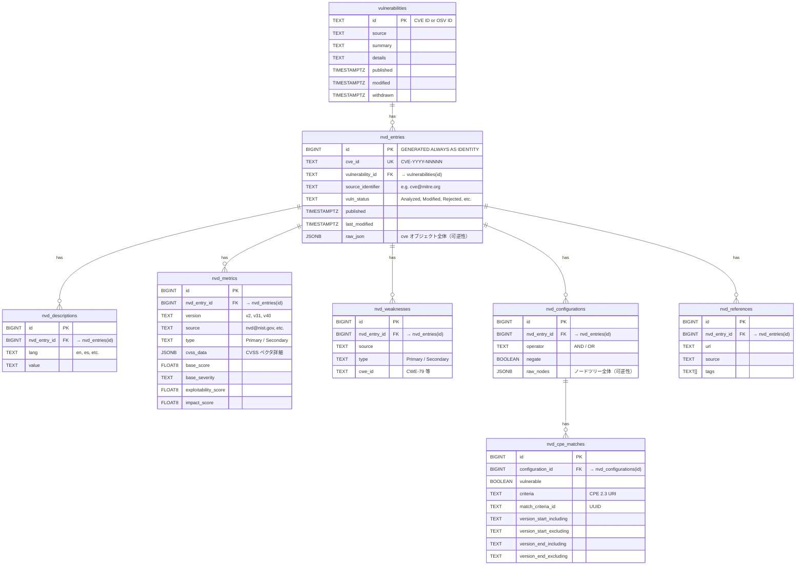

# NVD JSON Feed 2.0 ネイティブ取り込み — 実装計画

## Problem Statement

NVD の全CVE（367,000件超）をJSON Feed 2.0から直接取り込み、OSVと同様に可逆的に保存して `vulnerabilities` テーブルで紐付ける。

OSV.dev が変換・エクスポートしているデータ（`gs://cve-osv-conversion/osv-output/`）はNVD全体の約25%（OSSに関連し、Gitリポジトリ＋バージョン情報が解決可能なCVEのみ）しかカバーしていない。クローズドソース製品を含む全CVEを横断検索可能にするには、NVDのネイティブデータを直接取り込む必要がある。

## Requirements

1. NVD JSON Feed 2.0（年別gz）からの全件取り込み
2. 可逆性：`nvd_entries.raw_json` に `cve` オブジェクトをそのまま JSONB で保存
3. `nvd_` プレフィックスのテーブル群で正規化（検索用）
4. `vulnerabilities` テーブルと CVE ID で紐付け（既存OSVデータとマージ）
5. configurations（CPEツリー）は JSONB と正規化テーブルの両方で保持
6. 差分更新：modified フィード優先、8日以上空いたら年別再取り込み
7. CLI: `mayu ingest --source nvd --native`
8. META ファイルの sha256 比較で更新判定

## Design Decisions

| 決定事項 | 選択 | 理由 |
|---------|------|------|
| configurations の格納方針 | JSONB + 正規化テーブル両方 | OSVと同パターン。raw_jsonで可逆性、正規化テーブルでCPE検索 |
| 差分更新戦略 | modified フィード優先 + 8日超で年別再取り込み | modified フィードは2時間更新で過去8日分。通常運用はこれで十分 |
| CLI コマンド | `--source nvd --native` フラグ | 既存 `--source nvd`（OSV変換データ）との共存 |
| vulnerabilities テーブル | 現状維持（summary/details/modified 等を保持） | raw_json で可逆性は担保済み。将来ハブ化する余地は残す |
| raw_json の粒度 | `cve` オブジェクト単位（フィードのラッパーは除外） | 1レコード = 1CVE。OSVと同粒度 |
| NVD API 2.0 | 今回は対象外 | 不安定なため JSON Feed 2.0 のみ使用 |

## Data Source

### NVD JSON Feed 2.0

| フィード | URL パターン | 更新頻度 | 用途 |
|---------|-------------|---------|------|
| 年別 | `https://nvd.nist.gov/feeds/json/cve/2.0/nvdcve-2.0-{year}.json.gz` | 1日1回 | 初回フルインポート |
| modified | `https://nvd.nist.gov/feeds/json/cve/2.0/nvdcve-2.0-modified.json.gz` | 2時間ごと | 差分更新（過去8日分） |
| recent | `https://nvd.nist.gov/feeds/json/cve/2.0/nvdcve-2.0-recent.json.gz` | 2時間ごと | 新規追加の確認 |
| META | `*.meta` | 対応するフィードと同時 | sha256 による更新判定 |

### NVD CVE 2.0 スキーマ構造

```json
{
  "resultsPerPage": 2000,
  "startIndex": 0,
  "totalResults": 28000,
  "format": "NVD_CVE",
  "version": "2.0",
  "timestamp": "2024-01-01T00:00:00.000",
  "vulnerabilities": [
    {
      "cve": {
        "id": "CVE-2024-1234",
        "sourceIdentifier": "cve@mitre.org",
        "vulnStatus": "Analyzed",
        "published": "2024-01-15T10:00:00.000",
        "lastModified": "2024-02-01T14:30:00.000",
        "descriptions": [
          { "lang": "en", "value": "..." },
          { "lang": "es", "value": "..." }
        ],
        "metrics": {
          "cvssMetricV31": [...],
          "cvssMetricV40": [...],
          "cvssMetricV2": [...]
        },
        "weaknesses": [
          { "source": "nvd@nist.gov", "type": "Primary", "description": [{"lang": "en", "value": "CWE-79"}] }
        ],
        "configurations": [
          { "operator": "AND", "negate": false, "nodes": [...] }
        ],
        "references": [
          { "url": "https://...", "source": "cve@mitre.org", "tags": ["Patch", "Third Party Advisory"] }
        ]
      }
    }
  ]
}
```

### META ファイル形式

```
lastModifiedDate:2026-07-19T10:00:00-04:00
size:14108373
zipSize:1002849
gzSize:1002709
sha256:D7F1385C8423826AA903B78BCA5AD29B33253B47C093CC3E3BA0F5DB49BD2D2A
```

## Architecture

```
┌──────────────────────────────────────────────────────────────────┐
│  CLI: mayu ingest --source nvd --native [--update]               │
└────────────────────┬─────────────────────────────────────────────┘
                     │
┌────────────────────▼─────────────────────────────────────────────┐
│  internal/ingest/nvdfeed.go (Pipeline Orchestrator)              │
│                                                                  │
│  フルインポート:                                                  │
│    for year in 2002..current:                                    │
│      META取得 → sha256比較 → 変更あればgzダウンロード → パース → 格納 │
│                                                                  │
│  差分更新 (--update):                                             │
│    modified META取得 → sha256比較 → 変更あればgz取得 → パース → 格納 │
│    ※ last_synced_at から8日超経過 → フルインポートにフォールバック    │
└───────┬────────────────────┬────────────────────┬────────────────┘
        │                    │                    │
┌───────▼──────┐  ┌──────────▼──────┐  ┌─────────▼─────────┐
│ Fetcher      │  │ Parser          │  │ Store             │
│ nvdfeed.go   │  │ nvd.go          │  │ nvd.go            │
│              │  │                 │  │                   │
│ - META解析   │  │ - Feed JSON解析  │  │ - vulnerabilities │
│ - gz DL+展開 │  │ - CVEエントリ抽出│  │ - nvd_entries     │
│ - sha256比較 │  │ - raw_json保持   │  │ - nvd_* 子テーブル │
└──────────────┘  └─────────────────┘  └───────────────────┘
```

## DB Schema

### 新規テーブル



### インデックス

| テーブル | カラム | 種別 | 目的 |
|---------|--------|------|------|
| nvd_entries | cve_id | UNIQUE | CVE ID ルックアップ |
| nvd_entries | vulnerability_id | INDEX | vulnerabilities JOIN |
| nvd_entries | last_modified | INDEX | 日付フィルタ・ソート |
| nvd_entries | vuln_status | INDEX | ステータスフィルタ |
| nvd_metrics | nvd_entry_id | INDEX | JOINパフォーマンス |
| nvd_metrics | base_score | INDEX | スコアフィルタ |
| nvd_weaknesses | cwe_id | INDEX | CWEフィルタ |
| nvd_configurations | nvd_entry_id | INDEX | JOINパフォーマンス |
| nvd_cpe_matches | criteria | INDEX | CPE検索 |
| nvd_cpe_matches | configuration_id | INDEX | JOINパフォーマンス |
| nvd_descriptions | nvd_entry_id | INDEX | JOINパフォーマンス |
| nvd_references | nvd_entry_id | INDEX | JOINパフォーマンス |

## Task Breakdown

### Task 1: NVD 2.0 スキーマの Go モデル定義

- **ファイル:** `internal/model/nvd.go`, `internal/model/nvd_test.go`
- **内容:**
  - NVD JSON Feed 2.0 の CVE エントリを Go 構造体で定義
  - フィード全体のラッパー構造体（`NVDFeedResponse`）
  - 個別CVEエントリ（`NVDCVEItem`, `NVDCVE`）
  - サブ構造体: `NVDMetrics`, `NVDCVSSMetricV31`, `NVDCVSSMetricV40`, `NVDCVSSMetricV2`, `NVDWeakness`, `NVDConfiguration`, `NVDNode`, `NVDCPEMatch`, `NVDReference`, `NVDLangString`
  - `cvssData` はバージョンにより構造が異なるため `json.RawMessage` で保持
  - `RawJSON json.RawMessage` フィールド（OSVの `ParseVulnerability` と同パターン）
  - `ParseNVDEntry(data []byte) (*NVDCVE, error)` 関数
- **テスト:** JSON往復変換テスト（サンプルNVD CVEデータ使用）
- **完了条件:** `go test ./internal/model/...` でNVDモデルのroundtripテストが通る

### Task 2: NVD テーブル群のマイグレーション作成

- **ファイル:** `migrations/000008_create_nvd_tables.up.sql`, `migrations/000008_create_nvd_tables.down.sql`
- **内容:**
  - テーブル作成: `nvd_entries`, `nvd_descriptions`, `nvd_metrics`, `nvd_weaknesses`, `nvd_configurations`, `nvd_cpe_matches`, `nvd_references`
  - FK制約: `nvd_entries.vulnerability_id → vulnerabilities(id) ON DELETE CASCADE`
  - 各子テーブルの FK: `nvd_entry_id → nvd_entries(id) ON DELETE CASCADE`
  - インデックス作成（上記テーブル参照）
  - DOWN マイグレーション: 全テーブル DROP
- **テスト:** `make migrate-up` → `make migrate-down` → `make migrate-up` がエラーなく通る
- **完了条件:** マイグレーションが正常に適用・ロールバックできる

### Task 3: NVD Feed Fetcher の実装

- **ファイル:** `internal/fetcher/nvdfeed.go`, `internal/fetcher/nvdfeed_test.go`
- **内容:**
  - `NVDFeedMeta` 構造体（lastModifiedDate, size, gzSize, sha256）
  - `FetchNVDMeta(ctx, year) (*NVDFeedMeta, error)` — METAファイル取得・パース
  - `FetchNVDFeed(ctx, year) ([]byte, error)` — 年別gz ダウンロード＋gunzip
  - `FetchNVDModifiedFeed(ctx) ([]byte, error)` — modified.json.gz 取得
  - `FetchNVDRecentFeed(ctx) ([]byte, error)` — recent.json.gz 取得
  - URL生成ヘルパー（年 → フィードURL, META URL）
  - sha256 比較ロジック（`sync_state` の前回値と比較）
- **テスト:** `net/http/httptest` でモックサーバーを使ったテスト
- **完了条件:** モックフィードから META 解析 → gz 取得 → JSON バイト返却が動作

### Task 4: NVD JSON パーサーの実装

- **ファイル:** `internal/parser/nvd.go`, `internal/parser/nvd_test.go`
- **内容:**
  - `ParseNVDFeed(data []byte) (*NVDFeedResult, error)` — フィードJSONをパースし、個別CVEエントリのスライスを返す
  - 各CVEの `raw_json` を個別に保持（`cve` オブジェクト単位で compact JSON 化）
  - バリデーション: CVE ID 形式チェック、必須フィールド（id, published, lastModified, descriptions）
  - エラーハンドリング: 個別エントリのパース失敗はスキップしてエラーリストに記録
  - `NVDFeedResult` 構造体: `Entries []*model.NVDCVE`, `Errors []ParseError`
- **テスト:** `testdata/nvd_sample.json` を用意してパーステスト
- **完了条件:** サンプルフィードをパースして正しい件数・内容のエントリが取得できる

### Task 5: NVD データストア層の実装

- **ファイル:** `internal/store/nvd.go`, `internal/store/nvd_test.go`
- **内容:**
  - `Store` インターフェースに追加: `UpsertNVDBatch(ctx, entries []*model.NVDCVE) error`
  - `vulnerabilities` テーブルへの UPSERT:
    - id = CVE ID, source = 'nvd'
    - summary = 英語 description（COALESCE で OSV 側優先）
    - modified = GREATEST(既存, lastModified)
    - published = COALESCE(既存, published)
  - `nvd_entries` UPSERT: cve_id で既存レコードを検出し、DELETE → INSERT（子テーブル CASCADE 削除）
  - 子テーブルへのバルク INSERT: descriptions, metrics, weaknesses, configurations, cpe_matches, references
  - バッチサイズ制御、デッドロックリトライ（OSVと同パターン）
- **テスト:** 統合テスト — Insert → SELECT で raw_json ラウンドトリップ確認
- **完了条件:** NVDエントリの挿入・更新・既存OSVデータとのマージが動作

### Task 6: NVD 取り込みパイプラインの統合

- **ファイル:** `internal/ingest/nvdfeed.go`, `internal/ingest/nvdfeed_test.go`
- **内容:**
  - `ImportNVDNative(ctx) (*Stats, error)` — フルインポート
    - 年リスト生成（2002 ～ 現在の年）
    - 各年: META取得 → sha256比較 → 変更あれば gz DL → パース → バッチ格納
    - プログレスコールバック（年ごとの進捗）
  - `UpdateNVDNative(ctx) (*Stats, error)` — 差分更新
    - `sync_state` の last_synced_at チェック
    - 8日超経過 → `ImportNVDNative` にフォールバック
    - 8日以内 → modified フィード取得 → パース → UPSERT
  - `sync_state` 更新: source = "NVD-native", sha256 をメタデータとして保持
  - プログレス報告
  - エラーハンドリング: 年別ファイルで失敗しても他の年は継続
- **テスト:** モックHTTP + 実PostgreSQL で統合テスト
- **完了条件:** フルインポート・差分インポートが end-to-end で動作

### Task 7: CLI コマンド統合 (`--source nvd --native`)

- **ファイル:** `cmd/mayu/main.go`
- **内容:**
  - `--native` フラグ追加（`ingest` サブコマンド）
  - 分岐ロジック:
    - `--source nvd` → 従来の OSV 変換データ取り込み（既存処理）
    - `--source nvd --native` → NVD Feed パイプライン（フルインポート）
    - `--source nvd --native --update` → NVD Feed 差分更新
  - プログレス表示（年別ファイルの進捗、ダウンロード件数、格納件数）
  - エラー表示・終了コード
- **テスト:** フラグパースのユニットテスト + 実行時の E2E テスト（モック or 小さいフィード）
- **完了条件:** `./bin/mayu ingest --source nvd --native` でNVDデータがDBに取り込まれる

### Task 8: ドキュメント・ERD 更新

- **ファイル:** `.kiro/steering/erd.md`, `README.md`, `README_ja.md`, `docs/PLAN.md`
- **内容:**
  - `.kiro/steering/erd.md`: `nvd_*` テーブル群を追加
  - `README.md` / `README_ja.md`:
    - Data Sources テーブルに NVD (JSON Feed 2.0 native) 行を追加
    - CLI Reference の `mayu ingest` テーブルに `--native` フラグ追加
    - 使用例追加: `mayu ingest --source nvd --native`
  - `docs/PLAN.md`: Phase 6a のチェックリスト更新
- **完了条件:** ドキュメントが最新の実装を反映している

## Implementation Order

```
Task 1 (Model) ─────┐
                     ├─→ Task 4 (Parser) ─────┐
Task 2 (Migration) ──┤                         ├─→ Task 6 (Pipeline) → Task 7 (CLI) → Task 8 (Docs)
                     ├─→ Task 5 (Store) ───────┘
Task 3 (Fetcher) ────┘
```

- Task 1, 2, 3 は並行着手可能
- Task 4 は Task 1 に依存
- Task 5 は Task 1, 2 に依存
- Task 6 は Task 3, 4, 5 に依存
- Task 7 は Task 6 に依存
- Task 8 は全タスク完了後

## Sync State 設計

NVD ネイティブ取り込みの `sync_state` レコード:

| カラム | 値 |
|--------|-----|
| source | `"NVD-native"` |
| last_modified_at | 最後に処理した modified フィードの `lastModifiedDate` |
| record_count | DB内のNVDエントリ総数 |

追加メタデータ（sha256 等）は `sync_state` テーブルにカラム追加するか、別途管理テーブルを検討。
最小限の実装としては、`last_modified_at` の日付を見て8日超経過かどうかで差分/フル判定を行う。

## Risk & Considerations

| リスク | 対策 |
|--------|------|
| 年別フィードの合計サイズが大きい（~150MB gz） | 1ファイルずつ逐次処理。メモリに全件溜めない |
| 初回取り込みに時間がかかる | 年ごとのプログレス表示、中断再開対応（処理済み年をスキップ） |
| NVDのフィード形式が将来変更される可能性 | raw_json 保持で互換性リスクを軽減 |
| 既存OSVデータとのCVE IDコンフリクト | UPSERT + COALESCE でOSV側情報を優先 |
| JSON Feed 2.0 が将来廃止される可能性 | 現時点では安定稼働中。廃止されたら API 2.0 に切り替え |
| 367,000件のバッチ挿入パフォーマンス | バッチサイズ制御 + 並列ワーカー（OSVと同パターン） |
