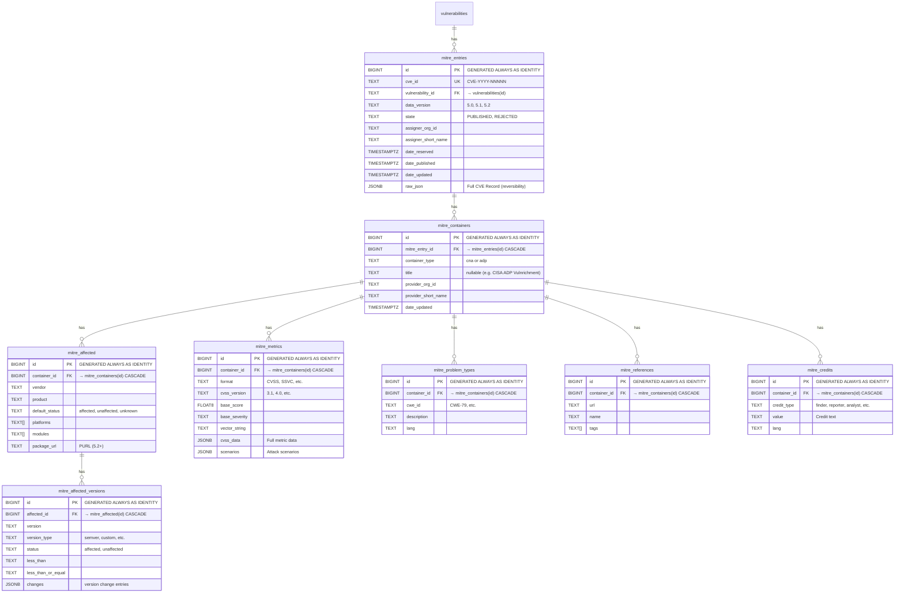

# Implementation Plan: MITRE CVE (cvelistV5) データ取り込み

## Problem Statement

NVD CVEでカバーしきれないCVE情報をMITRE公式のCVE Record（CVE JSON 5.0/5.1/5.2形式）から取り込む。CVEProject/cvelistV5 GitHub Releasesからのbaseline zip（一括）とdelta zip（差分）によるインポートをサポートする。

## Requirements

- `mayu ingest --source mitre` でbaseline zip（全CVE）を一括インポート
- `mayu ingest --source mitre --update` でdelta zip（hourly差分）を差分更新
- 前回同期が1日以上前なら自動でbaseline zipへフォールバック
- CVE JSON 5.0/5.1/5.2のCNA Container + ADP Container[]を完全に正規化テーブルへ展開
- raw_jsonを保持して可逆性を保証
- `vulnerabilities`テーブルはCOALESCE方式（既存NVD/OSVデータを優先、欠落分をMITREから補完）
- git不要、HTTP downloadのみで動作

## Background

### データソース

- GitHub Releases: `https://github.com/CVEProject/cvelistV5/releases`
- Baseline zip: `{YYYY-MM-DD}_all_CVEs_at_midnight.zip` (毎日0:00Z更新、全CVE含む)
- Delta zip: `{YYYY-MM-DD}_delta_CVEs_at_{HH}00Z.zip` (毎時更新、midnight以降の差分)
- Release tag形式: `cve_{YYYY-MM-DD}_{HH}00Z`
- Download URL: `https://github.com/CVEProject/cvelistV5/releases/download/{tag}/{filename}`

### CVE Record構造 (CVE JSON 5.x)

```json
{
  "dataType": "CVE_RECORD",
  "dataVersion": "5.1",
  "cveMetadata": {
    "cveId": "CVE-2024-0011",
    "assignerOrgId": "d6c1279f-00f6-4ef7-9217-f89ffe703ec0",
    "state": "PUBLISHED",
    "assignerShortName": "palo_alto",
    "dateReserved": "2023-11-09T18:56:10.434Z",
    "datePublished": "2024-02-14T17:32:34.809Z",
    "dateUpdated": "2024-08-01T17:41:15.533Z"
  },
  "containers": {
    "cna": {
      "affected": [...],
      "descriptions": [...],
      "metrics": [...],
      "problemTypes": [...],
      "references": [...],
      "credits": [...],
      "solutions": [...],
      "workarounds": [...],
      "exploits": [...]
    },
    "adp": [
      {
        "title": "CISA ADP Vulnrichment",
        "providerMetadata": {...},
        "affected": [...],
        "metrics": [...],
        "references": [...]
      }
    ]
  }
}
```

### Zip内部構造

各CVEは `cves/{YYYY}/{NNNNxxx}/CVE-{YYYY}-{NNNN}.json` のパスで格納。

### 既存NVDとの差異

| 観点 | NVD JSON Feed 2.0 | MITRE cvelistV5 |
|------|-------------------|-----------------|
| 配布形式 | 年別gzipファイル + modified feed | GitHub Releases (baseline + delta zip) |
| データフォーマット | NVD CVE 2.0 独自スキーマ | CVE JSON 5.x (CNA/ADP containers) |
| CPE/Configuration | あり（構造化） | なし（CNA提供のaffectedのみ） |
| CVSS | NVD独自評価 + CNA評価 | CNA評価 + CISA ADP評価 |
| CWE | NVD分類 | CNA分類 + CISA ADP分類 |
| SSVC | なし | CISA ADP提供 |
| solutions/workarounds | なし | CNA提供 |

## Proposed Solution

### アーキテクチャ

既存のNVD native実装パターン（fetcher → parser → store）に従う:

```
CLI (--source mitre)
  → Ingester.ImportMITRE() / UpdateMITRE()
    → Fetcher.StreamMITREBaselineZip() / FetchMITREDeltaZip()
    → Parser.ParseMITRERecord()
    → Store.UpsertMITREBatch()
```

### DB スキーマ設計



### vulnerabilities テーブルとの連携

```sql
INSERT INTO vulnerabilities (id, source, summary, details, published, modified, withdrawn)
VALUES ($1, 'mitre', $2, NULL, $3, $4, NULL)
ON CONFLICT (id) DO UPDATE SET
    summary = COALESCE(NULLIF(vulnerabilities.summary, ''), EXCLUDED.summary),
    published = COALESCE(vulnerabilities.published, EXCLUDED.published),
    modified = GREATEST(EXCLUDED.modified, vulnerabilities.modified)
```

既存データ(NVD/OSV)を優先し、欠落している場合のみMITREデータで補完する。

### 差分更新ロジック

```
UpdateMITRE(ctx):
  1. sync_state から "MITRE" の last_modified_at 取得
  2. last_modified_at が nil or 1日以上前 → ImportMITRE() にフォールバック
  3. 最新の midnight release tag を特定
  4. last_modified_at 以降の delta zip(s) を特定・ダウンロード
  5. 各delta zip 内のCVE JSONをパース & upsert
  6. sync_state 更新
```

## Task Breakdown

### Task 1: MITRE CVE Model定義

**File:** `internal/model/mitre.go`

**Objective:** CVE JSON 5.x のGo構造体を定義する

**Implementation:**
- トップレベル構造: `MITRECVERecord` (dataType, dataVersion, cveMetadata, containers)
- `MITRECVEMetadata` (cveId, state, assignerOrgId, assignerShortName, dateReserved, datePublished, dateUpdated)
- `MITREContainers` (CNA `MITRECNAContainer`, ADP `[]MITREADPContainer`)
- CNA/ADP共通フィールドを構造体として共有（affected, descriptions, metrics, problemTypes, references, credits）
- `MITREAffected` (vendor, product, defaultStatus, versions[], platforms[], modules[], packageUrl)
- `MITREAffectedVersion` (version, versionType, status, lessThan, lessThanOrEqual, changes)
- `MITREMetric` (format, scenarios, cvssV3_1/cvssV4_0をjson.RawMessage)
- `MITRETime` カスタム型（RFC3339 + ミリ秒付き等の複数フォーマット対応）
- RawJSONフィールドで元JSONを保持
- `ParseMITREEntry([]byte) (*MITRECVERecord, error)` — パース + RawJSON保持

**Tests:** `internal/model/mitre_test.go`
- 各構造体のJSON Unmarshal/Marshalテスト
- 実際のCVEサンプル（testdata/）でのパーステスト
- datePublished/dateUpdatedの各種タイムスタンプフォーマット対応テスト

---

### Task 2: MITRE Fetcher

**File:** `internal/fetcher/mitre.go`

**Objective:** GitHub Releasesからbaseline zip / delta zipをダウンロードする機能を実装

**Implementation:**
- `StreamMITREBaselineZip(ctx) (<-chan ZipEntry, <-chan error, error)` — baseline zipのストリーミング展開
  - GitHub Releases APIで最新midnight tagを特定: `GET /repos/CVEProject/cvelistV5/releases`
  - midnight tag パターン: `cve_{YYYY-MM-DD}_0000Z`
  - Asset filename: `{YYYY-MM-DD}_all_CVEs_at_midnight.zip`
- `FetchMITREDeltaZips(ctx, since time.Time) ([][]byte, error)` — 指定時刻以降のdelta zip(s)をダウンロード
  - midnight以降の各hourly releaseからdelta assetを取得
  - Asset filename: `{YYYY-MM-DD}_delta_CVEs_at_{HH}00Z.zip`
- `FindLatestMITREMidnightRelease(ctx) (tag string, date string, error)` — 最新midnight release特定
- GitHub API rate limit考慮（認証なしで60req/h、必要に応じてtoken対応）

**Tests:** `internal/fetcher/mitre_test.go`
- httptest.Serverを使ったGitHub Releases APIレスポンスモック
- zip展開ストリーミングテスト
- midnight tag特定ロジックのテスト

---

### Task 3: MITRE Parser

**File:** `internal/parser/mitre.go`

**Objective:** 個別CVE JSONファイルをパースし、バリデーションする

**Implementation:**
- `ParseMITRERecord(data []byte) (*model.MITRECVERecord, error)` — 単一CVEレコードをパース
- バリデーション:
  - cveId必須、CVE-YYYY-NNNN+ フォーマット確認
  - state == "PUBLISHED" のみ処理（REJECTED/RESERVEDはスキップ扱い）
  - datePublished存在確認
- CNA containerのdescriptionsから英語テキスト抽出（summary用）
- metricsからCVSSスコア抽出（v3.1, v4.0対応）
- problemTypesからCWE ID抽出
- ADP containerも同様にパース
- RawJSON保持（ParseNVDEntryと同パターン）
- `MITREParseResult` 型（NVDParseResultと同様にEntries + Errors）

**Tests:** `internal/parser/mitre_test.go`
- testdata/にCVE JSON 5.x サンプルを配置
- 正常系テスト（PUBLISHED状態のレコード）
- スキップ系テスト（REJECTED, RESERVED状態）
- 不完全データ（descriptions欠落等）のエラーハンドリングテスト
- ADP container付きレコードのパーステスト

---

### Task 4: DBマイグレーション

**Files:**
- `migrations/000009_create_mitre_tables.up.sql`
- `migrations/000009_create_mitre_tables.down.sql`

**Objective:** MITRE用テーブル群を作成

**Implementation (up.sql):**
```sql
BEGIN;

CREATE TABLE mitre_entries (
    id                  BIGINT GENERATED ALWAYS AS IDENTITY PRIMARY KEY,
    cve_id              TEXT NOT NULL,
    vulnerability_id    TEXT NOT NULL REFERENCES vulnerabilities(id) ON DELETE CASCADE,
    data_version        TEXT NOT NULL,
    state               TEXT NOT NULL,
    assigner_org_id     TEXT,
    assigner_short_name TEXT,
    date_reserved       TIMESTAMPTZ,
    date_published      TIMESTAMPTZ NOT NULL,
    date_updated        TIMESTAMPTZ,
    raw_json            JSONB NOT NULL,
    CONSTRAINT mitre_entries_cve_id_unique UNIQUE (cve_id)
);

CREATE TABLE mitre_containers (
    id                  BIGINT GENERATED ALWAYS AS IDENTITY PRIMARY KEY,
    mitre_entry_id      BIGINT NOT NULL REFERENCES mitre_entries(id) ON DELETE CASCADE,
    container_type      TEXT NOT NULL,  -- 'cna' or 'adp'
    title               TEXT,
    provider_org_id     TEXT,
    provider_short_name TEXT,
    date_updated        TIMESTAMPTZ
);

CREATE TABLE mitre_affected (
    id              BIGINT GENERATED ALWAYS AS IDENTITY PRIMARY KEY,
    container_id    BIGINT NOT NULL REFERENCES mitre_containers(id) ON DELETE CASCADE,
    vendor          TEXT,
    product         TEXT,
    default_status  TEXT,
    platforms       TEXT[],
    modules         TEXT[],
    package_url     TEXT
);

CREATE TABLE mitre_affected_versions (
    id                  BIGINT GENERATED ALWAYS AS IDENTITY PRIMARY KEY,
    affected_id         BIGINT NOT NULL REFERENCES mitre_affected(id) ON DELETE CASCADE,
    version             TEXT,
    version_type        TEXT,
    status              TEXT NOT NULL,
    less_than           TEXT,
    less_than_or_equal  TEXT,
    changes             JSONB
);

CREATE TABLE mitre_metrics (
    id              BIGINT GENERATED ALWAYS AS IDENTITY PRIMARY KEY,
    container_id    BIGINT NOT NULL REFERENCES mitre_containers(id) ON DELETE CASCADE,
    format          TEXT NOT NULL,
    cvss_version    TEXT,
    base_score      FLOAT8,
    base_severity   TEXT,
    vector_string   TEXT,
    cvss_data       JSONB,
    scenarios       JSONB
);

CREATE TABLE mitre_problem_types (
    id              BIGINT GENERATED ALWAYS AS IDENTITY PRIMARY KEY,
    container_id    BIGINT NOT NULL REFERENCES mitre_containers(id) ON DELETE CASCADE,
    cwe_id          TEXT,
    description     TEXT NOT NULL,
    lang            TEXT NOT NULL DEFAULT 'en'
);

CREATE TABLE mitre_references (
    id              BIGINT GENERATED ALWAYS AS IDENTITY PRIMARY KEY,
    container_id    BIGINT NOT NULL REFERENCES mitre_containers(id) ON DELETE CASCADE,
    url             TEXT NOT NULL,
    name            TEXT,
    tags            TEXT[]
);

CREATE TABLE mitre_credits (
    id              BIGINT GENERATED ALWAYS AS IDENTITY PRIMARY KEY,
    container_id    BIGINT NOT NULL REFERENCES mitre_containers(id) ON DELETE CASCADE,
    credit_type     TEXT,
    value           TEXT NOT NULL,
    lang            TEXT NOT NULL DEFAULT 'en'
);

-- Indexes
CREATE INDEX idx_mitre_entries_vulnerability_id ON mitre_entries (vulnerability_id);
CREATE INDEX idx_mitre_entries_date_updated ON mitre_entries (date_updated DESC);
CREATE INDEX idx_mitre_entries_state ON mitre_entries (state);
CREATE INDEX idx_mitre_containers_entry_id ON mitre_containers (mitre_entry_id);
CREATE INDEX idx_mitre_containers_type ON mitre_containers (container_type);
CREATE INDEX idx_mitre_affected_container_id ON mitre_affected (container_id);
CREATE INDEX idx_mitre_affected_product ON mitre_affected (vendor, product);
CREATE INDEX idx_mitre_affected_versions_affected_id ON mitre_affected_versions (affected_id);
CREATE INDEX idx_mitre_metrics_container_id ON mitre_metrics (container_id);
CREATE INDEX idx_mitre_metrics_base_score ON mitre_metrics (base_score);
CREATE INDEX idx_mitre_problem_types_container_id ON mitre_problem_types (container_id);
CREATE INDEX idx_mitre_problem_types_cwe_id ON mitre_problem_types (cwe_id);
CREATE INDEX idx_mitre_references_container_id ON mitre_references (container_id);
CREATE INDEX idx_mitre_credits_container_id ON mitre_credits (container_id);

COMMIT;
```

**Implementation (down.sql):**
```sql
BEGIN;
DROP TABLE IF EXISTS mitre_credits CASCADE;
DROP TABLE IF EXISTS mitre_references CASCADE;
DROP TABLE IF EXISTS mitre_problem_types CASCADE;
DROP TABLE IF EXISTS mitre_metrics CASCADE;
DROP TABLE IF EXISTS mitre_affected_versions CASCADE;
DROP TABLE IF EXISTS mitre_affected CASCADE;
DROP TABLE IF EXISTS mitre_containers CASCADE;
DROP TABLE IF EXISTS mitre_entries CASCADE;
COMMIT;
```

**Tests:** `make migrate-up` / `make migrate-down` の往復確認

---

### Task 5: MITRE Store

**File:** `internal/store/mitre.go`

**Objective:** パース済みMITREデータをDBに格納する

**Implementation:**
- `UpsertMITREBatch(ctx, entries []*model.MITRECVERecord) error` — バッチupsert
- 各エントリの処理フロー:
  1. `vulnerabilities` へCOALESCEでupsert（既存NVD/OSV summaryを優先）
  2. 既存 `mitre_entries` を DELETE（CASCADE で子テーブルクリア）
  3. `mitre_entries` INSERT → id取得
  4. `mitre_containers` INSERT (CNA 1件 + ADP 0〜N件) → 各container id取得
  5. 各container配下:
     - `mitre_affected` + `mitre_affected_versions` INSERT
     - `mitre_metrics` INSERT
     - `mitre_problem_types` INSERT
     - `mitre_references` INSERT
     - `mitre_credits` INSERT
- Deadlock retry ロジック（NVD store.goの `maxRetries = 5` と同パターン）
- バルクINSERT（NVDと同様の動的SQL組み立て）

**Tests:** `internal/store/mitre_test.go`
- integration test（`//go:build integration`）
- 新規CVEのupsert動作確認
- 既存CVE（NVDで取り込み済み）へのCOALESCE動作確認
- 同一CVE IDの再インポートで既存データが正しく置換されることの確認

---

### Task 6: MITRE Ingest Orchestrator

**File:** `internal/ingest/mitre.go`

**Objective:** Fetcher → Parser → Store のパイプラインを結合する

**Implementation:**
- `ImportMITRE(ctx) (*Stats, error)` — フルインポート:
  ```
  1. StreamMITREBaselineZipでzipストリーミング
  2. 各エントリを ParseMITRERecord でパース
  3. state=="PUBLISHED" のみ処理（REJECTED/RESERVEDはスキップ）
  4. バッチ蓄積 → UpsertMITREBatch 呼び出し
  5. sync_state更新 (source="MITRE", last_modified_at=now)
  6. Stats返却
  ```
- `UpdateMITRE(ctx) (*Stats, error)` — デルタ更新:
  ```
  1. sync_stateから "MITRE" のlast_modified_at取得
  2. nil or 1日以上前 → ImportMITRE() へフォールバック
  3. 最新midnight release tagを特定
  4. last_modified_at以降のdelta zip(s)を特定・ダウンロード
  5. 各zip内のCVE JSONをパース & バッチupsert
  6. sync_state更新
  7. Stats返却
  ```
- Progress報告（既存パターン踏襲: "download", "parse", "store" フェーズ）
- `storeMITREBatches` ヘルパー（storeNVDBatchesと同パターン、type assertion使用）
- エラーハンドリング: 個別CVEのパースエラーはログしてスキップ、全体は続行

**Tests:** `internal/ingest/mitre_test.go`
- モックfetcher/storeを使った単体テスト
- フォールバックロジックのテスト（1日以上前 → full import）
- 途中キャンセル（context cancel）のテスト

---

### Task 7: CLI統合 + ドキュメント更新

**Files:**
- `cmd/mayu/main.go`
- `README.md`
- `README_ja.md`
- `.kiro/steering/erd.md`
- `.kiro/steering/project.md`

**Objective:** `mayu ingest --source mitre` コマンドを追加し、ドキュメントを更新

**CLI Implementation:**
- `runIngest` 関数に `--source mitre` 分岐追加:
  ```go
  case "mitre":
      if *update {
          stats, err = ing.UpdateMITRE(ctx)
      } else {
          stats, err = ing.ImportMITRE(ctx)
      }
  ```
- 出力メッセージ:
  ```
  === Importing MITRE CVE (cvelistV5 GitHub Releases) ===
  ```

**README更新内容:**
- Data Sources テーブルに追加:
  ```
  | [MITRE CVE (cvelistV5)](https://github.com/CVEProject/cvelistV5) | ✅ Supported | `mayu ingest --source mitre` |
  ```
- CLI Reference `mayu ingest` の `--source` 説明に `mitre` 追加
- 使用例追加:
  ```bash
  # Import MITRE CVE data from cvelistV5 GitHub Releases (full)
  ./bin/mayu ingest --source mitre

  # Delta update from hourly releases
  ./bin/mayu ingest --source mitre --update
  ```
- Roadmap の Phase 6 に反映

**Steering docs更新:**
- `.kiro/steering/erd.md` に mitre_* テーブル群のERDとDesign Principles追加
- `.kiro/steering/project.md` のData Sourcesテーブルに MITRE CVE 追加

**Tests:** `cmd/mayu/main_test.go`
- `--source mitre` フラグのパース確認
- `--source mitre --update` の組み合わせ確認

---

## Implementation Order

```
Task 1 (Model) ─────┐
                     ├──→ Task 3 (Parser) ──┐
Task 4 (Migration) ──┤                      ├──→ Task 6 (Orchestrator) ──→ Task 7 (CLI + Docs)
                     ├──→ Task 5 (Store) ───┘
Task 2 (Fetcher) ───┘
```

- Task 1, 2, 4 は並行開発可能
- Task 3 は Task 1 に依存
- Task 5 は Task 1, 4 に依存
- Task 6 は Task 2, 3, 5 に依存
- Task 7 は Task 6 に依存

## Estimated CVE Record Count

- cvelistV5 には約27万件のCVE Recordが含まれる（2024年時点）
- baseline zip は約 500MB〜1GB
- delta zip は数百KB〜数十MB（変更量に依存）

## Notes

- GitHub API rate limit: 認証なし60 req/h。baseline zipのdownloadはAPI呼び出し不要（直接asset URL）。delta取得時のrelease一覧取得でAPIを使用する。将来的にGITHUB_TOKEN環境変数による認証対応を検討。
- CVE JSON 5.x にはdataVersion フィールドがあるため、スキーマバージョン間の差異は実行時に判別可能。5.0/5.1/5.2 いずれも同じパーサーで処理する（上位互換）。
- REJECTED状態のCVEはスキップする。将来的にREJECTED CVEの tracked 対応が必要になった場合は、state カラムを活用して後から拡張可能。
